# Dashboard System Architecture

The SveltyCMS dashboard provides a powerful, customizable monitoring interface built on a modular widget system. It offers real-time system metrics, security monitoring, content management insights, and enterprise-grade audit logging capabilities.

This document outlines the complete dashboard architecture, widget system, and integration patterns.

---

## System Overview

The dashboard is built on a flexible, grid-based widget system that allows administrators and users to create personalized monitoring interfaces tailored to their specific needs.

### Core Architecture

```mermaid
%%{ init: { 'theme': 'neutral' } }%%
graph TD
    subgraph "🖥️ Dashboard Frontend"
        A["Dashboard Page (+page.svelte)"]
        B["Widget Registry System"]
        C["Grid Layout Engine"]
        D["Drag & Drop System"]
    end

    subgraph "🔧 Widget Layer"
        E["BaseWidget.svelte"]
        F["Individual Widgets"]
        G["Widget Metadata"]
        H["Widget State Management"]
    end

    subgraph "📊 Data Sources"
        I["System Metrics APIs"]
        J["Audit Log Service"]
        K["Content APIs"]
        L["Security Services"]
    end

    subgraph "💾 Persistence"
        M["System Preferences"]
        N["User Preferences"]
        O["Widget Configurations"]
    end

    A --> B
    A --> C
    A --> D
    B --> E
    E --> F
    F --> G
    F --> H
    F --> I
    F --> J
    F --> K
    F --> L
    H --> M
    H --> N
    H --> O
```



---

## Widget Architecture

### Base Widget System

All dashboard widgets extend the `BaseWidget.svelte` component, which provides:

- **Standardized Layout**: Consistent header, content area, and controls
- **State Management**: Persistent widget configuration and data caching
- **Auto-refresh**: Configurable polling intervals for live data
- **Error Handling**: Graceful error states and retry mechanisms
- **Accessibility**: Full keyboard navigation and screen reader support

### Widget Registration

Widgets are automatically discovered and registered using Vite's glob import system:

```typescript
// Automatic widget discovery in +page.svelte
async function loadWidgetRegistry() {
	const modules = import.meta.glob('./widgets/*.svelte');
	const registry = {};

	for (const path in modules) {
		const name = path.split('/').pop()?.replace('.svelte', '');
		const module = await modules[path]();

		registry[name] = {
			component: module.default,
			name: module.widgetMeta?.name || name,
			description: module.widgetMeta?.description || '',
			icon: module.widgetMeta?.icon || 'mdi:widgets',
			widgetMeta: module.widgetMeta
		};
	}

	return registry;
}
```

### Widget Metadata Schema

Each widget exports metadata for dashboard integration:

```typescript
export const widgetMeta = {
	name: 'Widget Display Name',
	icon: 'mdi:icon-name',
	description: 'Brief description for widget picker',
	defaultSize: { w: 2, h: 2 }, // Grid units
	category: 'monitoring' | 'logs' | 'content' | 'static'
};
```

---

## Available Widget Categories

### 1. System Monitoring Widgets

Real-time system performance and health monitoring:

#### **CPUWidget.svelte**

- **Purpose**: Live CPU usage monitoring with historical trends
- **Features**: Multi-core visualization, load average, temperature alerts
- **Refresh**: 2-second intervals for real-time monitoring
- **Size**: 2x2 grid units (default)

#### **MemoryWidget.svelte**

- **Purpose**: RAM and swap usage tracking
- **Features**: Used/available memory, swap utilization, memory pressure alerts
- **Refresh**: 5-second intervals
- **Size**: 2x2 grid units

#### **DiskWidget.svelte**

- **Purpose**: Storage usage and I/O performance
- **Features**: Multiple disk monitoring, free space alerts, I/O statistics
- **Refresh**: 30-second intervals (storage changes slowly)
- **Size**: 2x2 grid units

#### **CacheMonitorWidget.svelte**

- **Purpose**: Application cache performance monitoring
- **Features**: Hit/miss ratios, cache size, eviction statistics
- **Refresh**: 10-second intervals
- **Size**: 2x1 grid units

#### **SystemHealthWidget.svelte**

- **Purpose**: Overall system health status
- **Features**: Aggregate health score, service status, uptime tracking
- **Refresh**: 15-second intervals
- **Size**: 3x1 grid units

### 2. Security & Audit Widgets

Enterprise-grade security monitoring and compliance tracking:

#### **AuditLogWidget.svelte** ⭐ _New_

- **Purpose**: Real-time audit log monitoring and security event tracking
- **Features**:
  - **Admin View**: System-wide security statistics, suspicious activity alerts
  - **User View**: Personal activity log, security notifications
  - **Event Filtering**: By type (auth, security, data), severity, time range
  - **Real-time Alerts**: Critical security events with immediate notifications
  - **Compliance Ready**: Structured logging for regulatory requirements
- **Refresh**: 10-second intervals for security-critical monitoring
- **Size**: 3x3 grid units (accommodates rich security data)
- **Role-Based**: Dynamically adapts content based on user permissions

#### **SecurityWidget.svelte**

- **Purpose**: Advanced threat monitoring and incident response
- **Features**: Threat level indicators, blocked IPs, CSP violations
- **Refresh**: 5-second intervals for threat detection
- **Size**: 3x3 grid units

### 3. Content Management Widgets

Content and media monitoring for editorial workflows:

#### **Last5ContentWidget.svelte**

- **Purpose**: Recent content creation and editing activity
- **Features**: Collection-based content listing, author attribution
- **Refresh**: Manual refresh (content changes less frequently)
- **Size**: 2x3 grid units

#### **Last5MediaWidget.svelte**

- **Purpose**: Recent media uploads and management
- **Features**: Thumbnail previews, upload statistics, storage usage
- **Refresh**: Manual refresh
- **Size**: 2x3 grid units

### 4. System Information Widgets

Operational insights and system communication:

#### **LogsWidget.svelte**

- **Purpose**: Application log monitoring and debugging
- **Features**: Log level filtering, real-time log streaming
- **Refresh**: 5-second intervals
- **Size**: 3x2 grid units

#### **SystemMessagesWidget.svelte**

- **Purpose**: Important system announcements and notifications
- **Features**: Administrative messages, maintenance notifications
- **Refresh**: 60-second intervals
- **Size**: 3x1 grid units

#### **UserOnlineWidget.svelte**

- **Purpose**: Active user sessions and concurrent usage
- **Features**: Online user count, session duration statistics
- **Refresh**: 30-second intervals
- **Size**: 2x1 grid units

#### **PerformanceWidget.svelte**

- **Purpose**: Application performance metrics and optimization insights
- **Features**: Response times, throughput, performance trends
- **Refresh**: 15-second intervals
- **Size**: 3x2 grid units

#### **UnifiedMetricsWidget.svelte**

- **Purpose**: Consolidated system metrics overview
- **Features**: Multi-metric dashboard, customizable thresholds
- **Refresh**: 10-second intervals
- **Size**: 4x2 grid units

---

## Grid System & Customization

### Responsive Grid Layout

The dashboard uses a 4-column responsive grid system:

- **Desktop (>1200px)**: 4 columns, full widget functionality
- **Tablet (768-1200px)**: 3 columns, condensed layouts
- **Mobile (<768px)**: 1 column, stacked vertically

### Drag & Drop System

Users can customize their dashboard through intuitive drag-and-drop:

```typescript
// Drag and drop implementation highlights
let dragState = $state({
	item: null,
	element: null,
	offset: { x: 0, y: 0 },
	isActive: false,
	gridPosition: { row: number, col: number }
});

function handleDragStart(event, widget) {
	dragState.item = widget;
	dragState.isActive = true;
	// Calculate grid position and visual feedback
}

function handleDrop(event) {
	// Update widget positions in systemPreferences
	// Persist new layout configuration
}
```

### Widget Sizing

Widgets support flexible sizing within the grid:

- **Minimum Size**: 1x1 grid unit
- **Maximum Size**: 4x4 grid units
- **Responsive Scaling**: Automatic size adjustment on smaller screens
- **Aspect Ratio**: Maintained during resize operations

---

## Data Flow & Performance

### Widget Data Loading

Each widget follows a standardized data loading pattern:

```typescript
// Widget data loading lifecycle
async function loadWidgetData() {
	isLoading = true;
	error = null;

	try {
		// 1. Check cache (if enabled)
		const cachedData = getCache(cacheKey);
		if (cachedData && !isExpired(cachedData)) {
			return cachedData.data;
		}

		// 2. Fetch fresh data
		const response = await fetch(endpoint);
		const data = await response.json();

		// 3. Update cache
		setCache(cacheKey, data, cacheTTL);

		return data;
	} catch (err) {
		// 4. Handle errors with retry logic
		error = err.message;
		scheduleRetry();
	} finally {
		isLoading = false;
	}
}
```

### Performance Optimizations

- **Lazy Loading**: Widgets load components only when visible
- **Smart Caching**: Configurable TTL caching per widget category
- **Debounced Refresh**: Prevents excessive API calls during rapid interactions
- **Progressive Enhancement**: Core functionality works without JavaScript

### Widget Categories & Defaults

Widgets are categorized for optimal performance configuration:

```typescript
export const WIDGET_DEFAULTS = {
	// Real-time monitoring (no cache, frequent updates)
	monitoring: {
		showRefreshButton: true,
		cacheKey: undefined,
		retryCount: 3,
		retryDelay: 1000
	},

	// Activity logs (auto-poll, moderate caching)
	logs: {
		showRefreshButton: false,
		cacheKey: undefined,
		retryCount: 2,
		retryDelay: 1000
	},

	// Content listings (cached, manual refresh)
	content: {
		showRefreshButton: false,
		cacheKey: (id: string) => `content-${id}`,
		cacheTTL: 120000, // 2 minutes
		retryCount: 3,
		retryDelay: 1000
	}
};
```

---

## Audit Log Widget Deep Dive

The new **AuditLogWidget** represents the latest advancement in dashboard security monitoring:

### Role-Based Functionality

#### **Administrator View**

```typescript
// Admin users see comprehensive security overview
if (isAdmin && !showPersonalOnly) {
	// System-wide statistics
	const stats = await getAuditStatistics(7); // Last 7 days

	// Suspicious activity detection
	const suspicious = await getSuspiciousActivities(5);

	// All system events
	const events = await queryAuditLogs({ limit: 10 });
}
```

#### **Regular User View**

```typescript
// Regular users see personal activity only
const personalEvents = await queryAuditLogs({
	actorId: currentUser.id,
	limit: 10
});
```

### Security Event Categories

The widget intelligently categorizes and displays events:

- **Authentication Events**: Login attempts, 2FA changes, password resets
- **Security Events**: Unauthorized access, privilege escalation, suspicious activity
- **Data Operations**: Exports, imports, sensitive data access
- **System Events**: Configuration changes, administrative actions

### Real-Time Alerting

Critical security events trigger immediate visual alerts:

```typescript
// Suspicious activity alert system
if (suspiciousEvents.length > 0) {
	// Show prominent alert banner
	// Highlight critical events in timeline
	// Trigger browser notifications (if permitted)
}
```

### Integration Points

The audit widget seamlessly integrates with:

- **User Management System**: Profile changes, role modifications
- **Authentication Service**: Login events, 2FA status
- **Content Management**: Data access, export operations
- **API Gateway**: Token usage, rate limiting events

---

## Customization & Extension

### Adding New Widgets

1. **Create Widget File**: `src/routes/(app)/dashboard/widgets/MyWidget.svelte`
2. **Export Metadata**: Include `widgetMeta` object
3. **Extend BaseWidget**: Use provided component infrastructure
4. **Auto-Registration**: Widget appears automatically in picker

### Widget Development Best Practices

```typescript
// Example widget structure
<script lang="ts" module>
  export const widgetMeta = {
    name: 'My Custom Widget',
    icon: 'mdi:chart-line',
    description: 'Custom monitoring widget',
    defaultSize: { w: 2, h: 2 }
  };
</script>

<script lang="ts">
  // Widget logic, data loading, state management
</script>

<BaseWidget {label} {size} {onSizeChange}>
  {#snippet children()}
    <!-- Widget content -->
  {/snippet}
</BaseWidget>
```

### Configuration Persistence

Widget configurations are automatically persisted:

```typescript
// System preferences store widget layouts
systemPreferences: {
	preferences: [
		{
			id: 'widget-123',
			component: 'AuditLogWidget',
			size: { w: 3, h: 3 },
			position: { x: 0, y: 0 },
			config: { showPersonalOnly: false }
		}
	];
}
```

---

## Security Considerations

### Widget Security Model

- **Permission-Based Rendering**: Widgets respect user role limitations
- **Data Isolation**: Users can only access authorized data
- **Secure Endpoints**: All widget APIs protected by authentication
- **XSS Prevention**: All user content properly sanitized

### Audit Trail Integration

All dashboard interactions are logged through the audit system:

- Widget additions/removals
- Configuration changes
- Data access patterns
- Security threshold breaches

---

## Future Enhancements

### Planned Features

1. **Custom Widget Builder**: Visual widget creation interface
2. **Alert Management**: Sophisticated notification routing
3. **Export Capabilities**: Dashboard screenshot and data export
4. **Mobile App**: Dedicated mobile dashboard application
5. **Third-Party Integrations**: Webhook support for external monitoring

### Performance Improvements

1. **WebSocket Integration**: Real-time data streaming
2. **Service Worker Caching**: Offline capability and performance
3. **CDN Integration**: Optimized asset delivery
4. **Micro-frontend Architecture**: Independent widget deployment

---

## Conclusion

The SveltyCMS dashboard system provides a powerful, flexible foundation for monitoring and managing all aspects of the CMS platform. With the addition of comprehensive audit logging capabilities, administrators and users have unprecedented visibility into system operations, security events, and content management activities.

The modular widget architecture ensures the dashboard can evolve with changing requirements while maintaining optimal performance and user experience across all device types and user roles.
