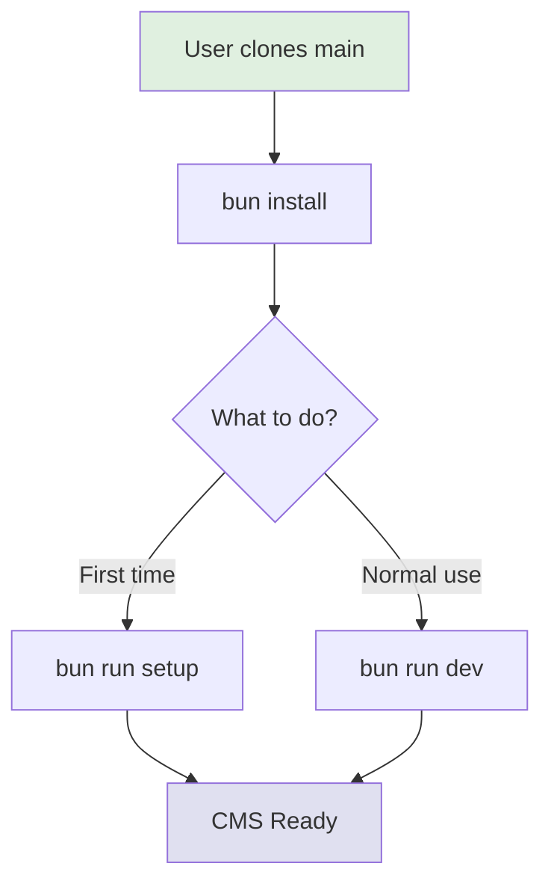
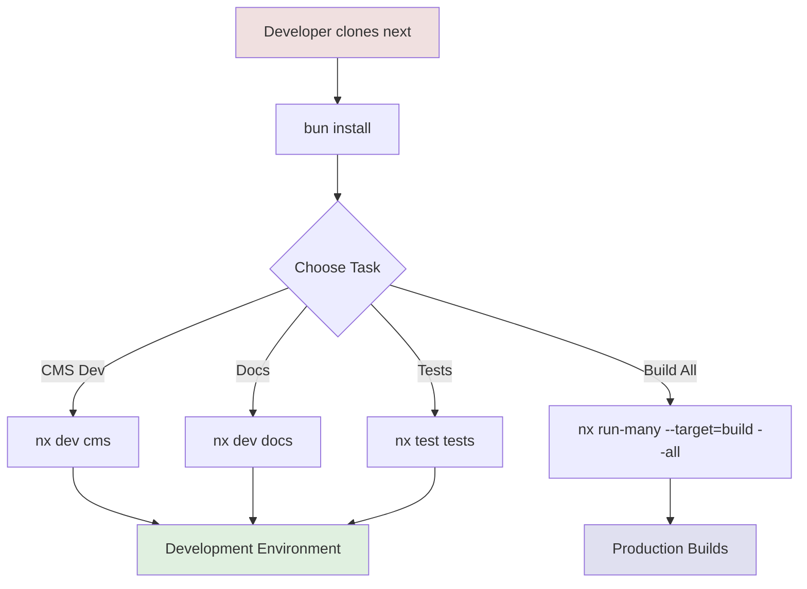
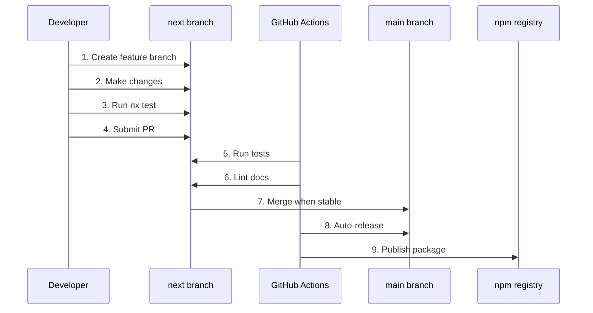

# SveltyCMS Dual-Branch Strategy

This document explains the dual-branch strategy for SveltyCMS, which separates end-user simplicity from developer power.

---

## Branch Structure

### `main` Branch - End Users (Production)

**Target**: CMS users who want a simple, ready-to-use CMS

**Contains**:

- ✅ `apps/cms/` - Main CMS application
- ✅ `apps/setup/` - Setup wizard
- ✅ `apps/shared-theme/` - Shared UI theme
- ✅ Root configuration files

**Excluded from main**:

- ❌ `apps/docs/` - Documentation site
- ❌ `apps/tests/` - Test suites
- ❌ `apps/scripts/` - Development scripts
- ❌ NX monorepo tooling
- ❌ Development workflows

**User Experience**:

```bash
git clone https://github.com/SveltyCMS/SveltyCMS.git
cd SveltyCMS
bun install
bun run dev
```

### `next` Branch - Developers (Full Monorepo)

**Target**: Open source contributors and advanced developers

**Contains**:

- ✅ `apps/cms/` - CMS application
- ✅ `apps/setup/` - Setup wizard (standalone)
- ✅ `apps/shared-theme/` - Shared theme
- ✅ `apps/docs/` - Documentation site (SvelteKit + MDX)
- ✅ `apps/tests/` - Test suites (Bun, Playwright)
- ✅ `apps/scripts/` - Utility scripts
- ✅ Full NX monorepo setup
- ✅ All development workflows
- ✅ CI/CD configurations

**Developer Experience**:

```bash
git clone -b next https://github.com/SveltyCMS/SveltyCMS.git
cd SveltyCMS
bun install

# Use NX for all operations
nx dev cms
nx dev docs
nx test tests
nx run scripts:bundle-stats
```

---

## Workspace Structure

```
SveltyCMS/                           # Workspace root
├── apps/
│   ├── cms/                         # Main CMS (both branches)
│   ├── setup/                       # Setup wizard (both branches)
│   ├── shared-theme/                # Shared UI theme (both branches)
│   ├── docs/                        # Documentation (next only)
│   ├── tests/                       # Test suites (next only)
│   └── scripts/                     # Utility scripts (next only)
├── .github/                         # CI/CD workflows
│   └── workflows/
│       ├── auto-release.yaml        # Runs on both branches
│       ├── playwright.yml           # next only
│       └── docs-lint.yml            # next only
├── nx.json                          # NX config (next only)
├── package.json                     # Workspaces configured per branch
└── README.md                        # Branch-specific instructions
```

---

## Package.json Workspaces

### Main Branch

```json
{
	"workspaces": ["apps/cms", "apps/setup", "apps/shared-theme"]
}
```

### Next Branch

```json
{
	"workspaces": ["apps/cms", "apps/setup", "apps/shared-theme", "apps/docs", "apps/tests", "apps/scripts"]
}
```

---

## NX Projects (next branch only)

All apps are NX projects with proper `project.json`:

| Project          | Description                                   | Port |
| ---------------- | --------------------------------------------- | ---- |
| **cms**          | Main CMS application                          | 5173 |
| **setup**        | Standalone setup wizard                       | 5173 |
| **shared-theme** | Shared Tailwind v4 + Skeleton v4 theme        | N/A  |
| **docs**         | SvelteKit documentation with MDX              | 5174 |
| **tests**        | Bun and Playwright tests                      | N/A  |
| **scripts**      | Utility scripts (bundle-stats, check-mongodb) | N/A  |

---

## Shared Theme Strategy

All apps use the same theme from `apps/shared-theme/`:

**Shared Dependencies** (in shared-theme):

- Tailwind CSS v4
- Skeleton Labs v4
- ParaglideJS (i18n)
- Shared color palette
- Typography settings
- Component presets

**Apps Import Theme**:

```typescript
// In apps/cms/tailwind.config.ts
import sharedConfig from '../shared-theme/tailwind.config';

export default {
	...sharedConfig,
	content: ['./src/**/*.{html,js,svelte,ts}', '../shared-theme/**/*.{html,js,svelte,ts}']
};
```

---

## Release Strategy

### Main Branch Releases

- **Semantic versioning** based on commits
- **Auto-release** via GitHub Actions
- **Clean structure** - Only production code
- **Simple updates**: Users just `git pull`

### Next Branch Development

- **All features** developed here first
- **Full testing** with NX
- **Documentation** updates
- **Merge to main** when stable

---

## Migration Path

### From main to next (for developers)

```bash
# Switch to development branch
git fetch origin
git checkout next
bun install

# Run multiple apps
nx run-many --target=dev --projects=cms,docs
```

### From next to main (for releases)

```bash
# Merge tested changes to production
git checkout main
git merge next --no-ff

# GitHub Actions auto-releases
# Semantic versioning based on commit messages
```

---

## File Organization Rules

### Must be in Both Branches

- `apps/cms/` - Core CMS
- `apps/setup/` - Setup wizard
- `apps/shared-theme/` - UI theme
- `package.json` - Dependencies
- `.github/workflows/auto-release.yaml` - Release automation

### Next Branch Only

- `apps/docs/` - Documentation
- `apps/tests/` - Tests
- `apps/scripts/` - Dev scripts
- `nx.json` - NX configuration
- `.github/workflows/playwright.yml`
- `.github/workflows/docs-lint.yml`

---

## Benefits

### For End Users (main)

- ✅ Simple structure
- ✅ Fast clone/install
- ✅ No dev tooling overhead
- ✅ Clear documentation
- ✅ Easy updates
- ✅ ~500KB smaller (no setup embedded in CMS)

### For Developers (next)

- ✅ Full NX monorepo benefits
- ✅ Comprehensive testing
- ✅ Documentation site
- ✅ Utility scripts
- ✅ Advanced workflows
- ✅ Better DX (Developer Experience)

---

## Commands Summary

### Main Branch (Users)

```bash
# Start CMS
bun run dev

# Build for production
bun run build

# Preview production build
bun run preview
```

### Next Branch (Developers)

#### CMS Development

```bash
nx dev cms              # Start CMS dev server
nx build cms            # Build CMS for production
nx preview cms          # Preview CMS build
```

#### Setup Wizard (Standalone)

```bash
nx dev setup            # Start setup wizard (port 5173)
nx build setup          # Build setup wizard
```

#### Documentation

```bash
nx dev docs             # Start docs site (port 5174)
nx build docs           # Build docs site
```

#### Testing

```bash
nx test tests           # Run all tests
nx run tests:test:bun   # Run Bun tests only
nx run tests:test:playwright  # Run Playwright tests only
```

#### Utilities

```bash
nx run scripts:bundle-stats      # Analyze bundle size
nx run scripts:check-mongodb     # Check MongoDB connection
```

#### Multiple Projects

```bash
# Build all projects
nx run-many --target=build --all

# Dev mode for CMS + docs
nx run-many --target=dev --projects=cms,docs

# Test all projects
nx run-many --target=test --all
```

---

## Architecture Diagrams

### Main Branch (Simple)



### Next Branch (Full Monorepo)



---

## Contributing Workflow



---

## Contributing

1. **Fork** the repository
2. **Checkout** the `next` branch
3. **Create** a feature branch from `next`
4. **Make** changes
5. **Test** with NX commands
6. **Update** documentation if needed
7. **Submit** PR to `next` branch

Changes are merged to `main` during releases.

---

## Branch Protection Rules

### Main Branch

- ✅ Requires PR reviews
- ✅ Requires status checks
- ✅ Auto-release on merge
- ✅ Protected from force push

### Next Branch

- ✅ Requires PR reviews
- ✅ Requires tests to pass
- ✅ Allows force push (for maintainers)
- ✅ Continuous integration

---

## Questions?

- **Main branch issues**: Use for CMS bugs and user-facing features
- **Next branch issues**: Use for dev tooling, docs, tests, monorepo structure
- **Discussions**: For questions, ideas, and feature requests
- **Documentation**: Check `apps/docs/` in next branch

---

## Related Documentation

- [NX Migration Complete](./nx-migration-complete.mdx)
- [Standalone Setup Migration](./standalone-setup-migration.mdx)
- [Contributing Documentation](../contributing/contributing-docs.mdx)
- [Initialization Workflow](./initialization-workflow.mdx)

---

## Summary

**Main**: Simple CMS for users  
**Next**: Full monorepo for developers  
**Result**: Best of both worlds! 🚀

This dual-branch strategy allows SveltyCMS to:

- Remain accessible to end users who want simplicity
- Provide powerful development tools for contributors
- Keep bundle sizes optimized (standalone setup wizard)
- Maintain comprehensive testing and documentation
- Scale development without complicating deployment
