---

title: Setup Wizard Architecture (Standalone)
description: Understanding the standalone setup wizard in the NX monorepo

---

# Setup Wizard Architecture (Standalone)

## Overview

SveltyCMS uses a **standalone setup wizard** (separate application) to collect initial configuration before the CMS can operate. This architectural decision **significantly reduces the CMS bundle size** by separating first-time setup concerns from the main application.

## Architecture Decision: Standalone Setup App ✅

### Current Implementation

The setup wizard is a **completely separate SvelteKit application** located at `apps/setup/`.

**Key Benefits:**

- **Reduced CMS bundle size**: ~500KB savings (setup routes, components, and logic removed)
- **Faster CMS boot**: No conditional plugin loading or setup checks
- **Production ready**: Setup routes never exposed in production CMS
- **Security**: Setup can be disabled entirely by not deploying the setup app
- **Cleaner separation**: Setup concerns completely isolated from CMS
- **Independent deployment**: Setup can run on different server/domain if needed

**Trade-offs:**

- Requires running two apps during initial setup
- Cross-app file writes (setup → CMS config directory)
- User must manually switch between apps

### Why This Approach?

1. **Bundle Size**: Setup wizard with all UI components, validation, and database testing adds ~500KB to the CMS bundle. This code is only needed once but would be loaded on every CMS boot.

2. **Security**: In production, the CMS should never expose setup routes. With embedded setup, this requires careful route guards and build configurations. With standalone setup, just don't deploy the setup app.

3. **Maintainability**: Setup concerns (DB drivers, initial seeding, wizard UI) are completely separate from CMS concerns (content management, collections, media).

4. **Performance**: CMS boots faster without setup detection logic and conditional plugin loading.

## How It Works

### Architecture Diagram

```mermaid
graph TB
    subgraph "First-Time Setup Flow"
        A1[User: cd apps/setup] --> A2[bun run dev]
        A2 --> A3[Setup Wizard Opens :5173]
        A3 --> A4[User: Fill DB Config]
        A4 --> A5[Test Connection]
        A5 --> A6[User: Select Language]
        A6 --> A7[Seed Database]
        A7 --> A8[User: Create Admin]
        A8 --> A9[Write: ../cms/config/private.ts]
        A9 --> A10[Setup Complete! ✅]
        A10 --> A11[User: Stop Setup, cd ../cms]
        A11 --> A12[bun run dev]
        A12 --> A13[CMS Boots :5173]
    end

    style A3 fill:#e0e0f0,stroke:#333,stroke-width:2px
    style A9 fill:#f0e0e0,stroke:#333,stroke-width:2px
    style A13 fill:#e0f0e0,stroke:#333,stroke-width:2px
```



### Setup Flow

```
┌──────────────────────────────────────────────────────┐
│ Phase 1: Run Setup Wizard                           │
├──────────────────────────────────────────────────────┤
│ $ cd apps/setup                                      │
│ $ bun run dev                                        │
│   → Opens http://localhost:5173                     │
│   → Browser shows setup wizard                      │
└──────────────────────────────────────────────────────┘
                        ↓
┌──────────────────────────────────────────────────────┐
│ Phase 2: User Completes Wizard                      │
├──────────────────────────────────────────────────────┤
│ 1. Database Configuration                            │
│    - MongoDB/PostgreSQL/MySQL                        │
│    - Host, port, database name                       │
│    - Credentials                                     │
│ 2. Test Connection                                   │
│    - Validates connection                            │
│    - Installs DB driver if needed                    │
│ 3. System Language                                   │
│    - Select default language                         │
│ 4. Seed Database                                     │
│    - Creates collections                             │
│    - Seeds settings/themes                           │
│ 5. Admin User                                        │
│    - Create first admin account                      │
└──────────────────────────────────────────────────────┘
                        ↓
┌──────────────────────────────────────────────────────┐
│ Phase 3: Setup Writes CMS Config                    │
├──────────────────────────────────────────────────────┤
│ Setup writes to: apps/cms/config/private.ts         │
│                                                      │
│ Contents:                                            │
│ - DB_TYPE, DB_HOST, DB_PORT, DB_NAME               │
│ - DB_USER, DB_PASSWORD                              │
│ - JWT_SECRET_KEY (generated)                        │
│ - ENCRYPTION_KEY (generated)                        │
│ - MULTI_TENANT flag                                 │
└──────────────────────────────────────────────────────┘
                        ↓
┌──────────────────────────────────────────────────────┐
│ Phase 4: Switch to CMS                              │
├──────────────────────────────────────────────────────┤
│ $ cd apps/cms                                        │
│ $ bun run dev                                        │
│   → Detects config/private.ts exists                │
│   → Boots normally                                   │
│   → Opens http://localhost:5173                     │
│   → User logs in with admin credentials             │
└──────────────────────────────────────────────────────┘
```

## File Structure

### Setup App Structure

```
apps/setup/
├── src/
│   ├── routes/
│   │   ├── +page.svelte              # Main wizard UI
│   │   ├── +page.server.ts           # Server-side validation
│   │   ├── DatabaseConfig.svelte     # Step 1: DB config
│   │   ├── AdminConfig.svelte        # Step 2: Admin user
│   │   └── api/
│   │       ├── test-database/+server.ts   # Test DB connection
│   │       ├── seed/+server.ts            # Seed database
│   │       └── complete/+server.ts        # Finalize setup
│   └── lib/
│       └── utils/
│           └── writeConfig.ts        # Write to ../cms/config/private.ts
├── vite.config.ts                    # Port 5173, @cms alias
├── package.json                      # @sveltycms/setup-wizard
└── project.json                      # NX config: setup-wizard

```

### CMS App Structure (After Setup)

```
apps/cms/
├── config/
│   ├── private.ts                    # ✅ Created by setup wizard
│   ├── roles.ts                      # User roles (pre-existing)
│   └── collections/                  # Collection schemas (pre-existing)
├── compiledCollections/              # Auto-generated
├── logs/                             # CMS-specific logs
├── src/
│   └── routes/
│       └── (app)/                    # CMS routes (NO /setup route!)
└── vite.config.ts                    # Simplified (no setup plugin)
```

### Cross-App File Writing

The setup wizard writes to the CMS app's config directory:

```typescript
// apps/setup/src/lib/utils/writeConfig.ts

import path from 'path';
import { promises as fs } from 'fs';

export async function writePrivateConfig(config) {
	// Resolve path to CMS config directory
	const cmsConfigPath = path.resolve(
		process.cwd(), // apps/setup
		'../cms/config/private.ts' // → apps/cms/config/private.ts
	);

	const content = `
export const privateEnv = createPrivateConfig({
  DB_TYPE: '${config.dbType}',
  DB_HOST: '${config.dbHost}',
  // ... rest of config
});
`;

	await fs.writeFile(cmsConfigPath, content, 'utf8');
}
```

## Port Strategy

### Development

- **Setup Wizard**: Port 5173 (runs first)
- **CMS**: Port 5173 (after setup completes and wizard is stopped)

OR run both simultaneously:

- **Setup Wizard**: Port 5173
- **CMS**: Port 5174 (manually specify if both running)

```bash
# Option 1: Sequential (recommended)
cd apps/setup && bun run dev      # :5173
# Complete setup, then Ctrl+C
cd apps/cms && bun run dev        # :5173

# Option 2: Simultaneous (testing)
cd apps/setup && bun run dev      # :5173
cd apps/cms && bun run dev --port 5174  # :5174
```

### Production

- **Setup Wizard**: Not deployed (or deployed to admin subdomain)""|''|`)/.test(configContent);
const hasDbHost = !/DB_HOST:\s*(""|''|`)/.test(configContent);
  const hasDbName = !/DB_NAME:\s\*(""|''|``)/.test(configContent);

      return hasJwtSecret && hasDbHost && hasDbName;

  }

````

### `isSetupCompleteAsync()` - Async Validation

Called from `hooks.server.ts` to verify database has admin users.

```typescript
export async function isSetupCompleteAsync(): Promise<boolean> {
	// 1. First check config file
	if (!isSetupComplete()) return false;

	// 2. Check if admin users exist in database
	const result = await dbAdapter.auth.getAllUsers({ limit: 1 });
	return result.success && result.data && result.data.length > 0;
}
````

## Vite Plugins

### `setupWizardPlugin()` - First-Time Mode

Activated when `private.ts` is missing or empty.

**Responsibilities:**

1. Create `apps/cms/config/` directory if missing
2. Write empty `private.ts` template with schema
3. Open `/setup` route in browser after server starts
4. Initialize collections structure (placeholder files)

**Key Code:**

```typescript
function setupWizardPlugin(): Plugin {
	let wasPrivateConfigMissing = false;

	return {
		name: 'svelty-cms-setup-wizard',
		async buildStart() {
			wasPrivateConfigMissing = !existsSync(paths.privateConfig);

			if (wasPrivateConfigMissing) {
				await fs.mkdir(paths.configDir, { recursive: true });
				await fs.writeFile(paths.privateConfig, templateContent);
			}

			await initializeCollectionsStructure();
		},
		configureServer(server) {
			// Open browser to /setup after server starts
			server.listen = function (...args) {
				const result = originalListen.apply(this, args);
				result.then(() => {
					setTimeout(() => openUrl('http://localhost:5173/setup'), 1000);
				});
				return result;
			};
		}
	};
}
```

### `cmsWatcherPlugin()` - Normal Mode

Activated when `private.ts` exists with valid credentials.

**Responsibilities:**

1. Watch for changes to collections, roles, widgets
2. Recompile collections on change
3. Register collection models in database
4. Trigger HMR for instant updates
5. Regenerate TypeScript types

**Key Code:**

```typescript
function cmsWatcherPlugin(): Plugin {
	return {
		name: 'svelty-cms-watcher',
		configureServer(server) {
			server.watcher.on('all', async (event, file) => {
				// Collection changed - recompile
				if (file.startsWith(paths.userCollections)) {
					await compile({ userCollections, compiledCollections });
					await registerModelsInDatabase();
					server.ws.send({ type: 'full-reload' });
				}

				// Roles changed - reload
				if (file === paths.roles) {
					const { roles } = await server.ssrLoadModule('./config/roles.ts');
					setLoadedRoles(roles);
					server.ws.send({ type: 'full-reload' });
				}
			});
		}
	};
}
```

## NX Workspace Considerations

### Path Resolution

All paths are **relative to the CMS app root** (`apps/cms/`), not the workspace root.

```typescript
// ✅ CORRECT (NX monorepo)
const paths = {
	configDir: path.resolve(CWD, './config'),
	privateConfig: path.resolve(CWD, './config/private.ts'),
	compiledCollections: path.resolve(CWD, './compiledCollections')
};

// ❌ WRONG (old single-app structure)
const paths = {
	configDir: path.resolve(CWD, '../../config'),
	privateConfig: path.resolve(CWD, '../../config/private.ts')
};
```

### Running in NX

```bash
# Development (with setup check)
cd apps/cms && bun run dev

# Or using NX
nx dev cms

# First time: Opens browser to http://localhost:5173/setup
# After setup: Opens browser to http://localhost:5173 (dashboard)
```

### Configuration Isolation

Each app manages its own config:

- **CMS:** `apps/cms/config/` - DB credentials, collections, roles
- **Setup:** `apps/setup/` - Standalone setup (future use)
- **Docs:** `apps/docs/` - Documentation-specific config
- **Tests:** `apps/tests/` - Test configuration
- **Scripts:** `apps/scripts/` - Build and maintenance scripts

## Security Considerations

### Private Config Protection

```gitignore
# apps/cms/config/private.ts is gitignored
/apps/cms/config/private.ts
/apps/cms/config/private.backup.*.ts
```

**Never commit:**

- Database passwords
- JWT secrets
- Encryption keys
- API keys

### Template Safety

The `setupWizardPlugin` creates a **safe template** with empty values:

```typescript
export const privateEnv = createPrivateConfig({
	DB_TYPE: 'mongodb',
	DB_HOST: '', // ✅ Empty - requires user input
	DB_PORT: 27017,
	DB_NAME: '', // ✅ Empty
	DB_PASSWORD: '', // ✅ Empty
	JWT_SECRET_KEY: '' // ✅ Empty
	// ...
});
```

## Testing Setup Flow

### Manual Test

1. Delete `apps/cms/config/private.ts`
2. Run `cd apps/cms && bun run dev`
3. Verify browser opens to `/setup`
4. Complete wizard with test DB credentials
5. Verify redirect to dashboard after setup

### Automated Test

```typescript
// tests/setup/setup-flow.spec.ts
test('setup wizard flow', async ({ page }) => {
	// Remove private config
	await fs.unlink('apps/cms/config/private.ts');

	// Start server
	const server = await spawn('bun', ['run', 'dev'], { cwd: 'apps/cms' });

	// Should redirect to /setup
	await page.goto('http://localhost:5173');
	await expect(page).toHaveURL(/\/setup/);

	// Fill database config
	await page.fill('[name="dbHost"]', 'localhost');
	await page.fill('[name="dbName"]', 'test-cms');
	await page.click('[data-test="test-connection"]');

	// Should show success
	await expect(page.locator('.connection-success')).toBeVisible();

	// Complete setup
	await page.click('[data-test="complete-setup"]');

	// Verify private.ts was created
	const privateConfigExists = await fs.exists('apps/cms/config/private.ts');
	expect(privateConfigExists).toBe(true);
});
```

## Troubleshooting

### Issue: Setup wizard loops infinitely

**Cause:** `private.ts` exists but has empty strings for credentials.

**Solution:** Delete `private.ts` completely or fill in all required fields.

### Issue: "Cannot find module './config/private.ts'"

**Cause:** Path resolution issue in vite config.

**Solution:** Verify `CWD` is `apps/cms/` and paths use `./config` not `../../config`.

### Issue: Setup completes but CMS won't start

**Cause:** Invalid database credentials or database not running.

**Solution:**

1. Check database is running: `docker ps` or `systemctl status mongodb`
2. Verify credentials in `private.ts`
3. Test connection manually: `mongosh mongodb://localhost:27017/cms`

### Issue: Changes to private.ts not reflected

**Cause:** Vite watches are ignoring `private.ts` (by design).

**Solution:** Restart dev server: `Ctrl+C`, then `bun run dev`

## Future Enhancements

### Standalone Setup App

To activate the `apps/setup/` as a standalone wizard:

1. Copy setup routes from CMS to setup app
2. Implement cross-app file write utility
3. Add redirect from CMS → Setup app when `private.ts` missing
4. Update both vite configs to coordinate

### Environment-Based Setup

Support different setup flows per environment:

```typescript
// Development: Interactive wizard
if (process.env.NODE_ENV === 'development') {
	return setupWizardPlugin();
}

// Production: Require environment variables
if (process.env.NODE_ENV === 'production') {
	if (!process.env.DB_HOST) {
		throw new Error('DB_HOST environment variable required in production');
	}
}
```

### Docker Integration

Auto-generate `private.ts` from Docker secrets:

```dockerfile
# docker-compose.yml
services:
  cms:
    environment:
      DB_HOST: db
      DB_NAME: cms
      DB_PASSWORD: ${DB_PASSWORD}
    secrets:
      - jwt_secret
      - encryption_key
```

## Related Documentation

- [Configuration Management](./enterprise-configuration-management.mdx)
- [Database Methods](./database-methods.mdx)
- [Initialization Workflow](./initialization-workflow.mdx)
- [Security Plugin](./security-plugin.mdx)

## Summary

The setup wizard architecture in SveltyCMS NX monorepo:

✅ **Embedded in CMS** at `/setup` route (current)  
✅ **Automatic detection** via `isSetupComplete()`  
✅ **Vite plugin system** switches modes based on `private.ts` existence  
✅ **Path isolation** - all config in `apps/cms/config/`  
✅ **Security first** - never commits credentials  
🚧 **Standalone app** available for future advanced scenarios

This architecture balances **simplicity** (single app) with **flexibility** (can separate if needed) while maintaining **security** and **developer experience**.
