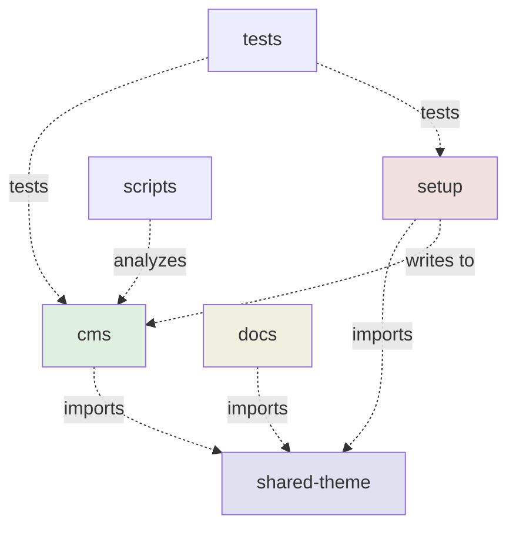

# Workspace Structure

This document describes the NX monorepo workspace structure for SveltyCMS.

---

## Overview

The workspace uses **NX for task orchestration** and **Bun workspaces** for dependency management. The structure follows a monorepo pattern with all applications under `apps/`.

---

## Key Principles

1. **App isolation** - Each app manages its own config, logs, and resources
2. **Shared theme** - All apps use `apps/shared-theme/` for consistent UI
3. **No duplication** - Each file/folder exists in only one location
4. **Relative paths** - Apps use local paths (`./config`) not workspace root paths (`../../config`)
5. **Standalone setup** - Setup wizard is separate app, not embedded in CMS

---

## Directory Structure

```
SveltyCMS/                           # Workspace root
├── apps/                            # All applications
│   ├── cms/                         # Main CMS application
│   │   ├── config/                  # CMS-specific config
│   │   │   ├── private.ts           # DB credentials (created by setup)
│   │   │   ├── roles.ts             # User roles
│   │   │   └── collections/         # Collection schemas
│   │   ├── compiledCollections/     # Auto-generated from config
│   │   ├── logs/                    # CMS logs
│   │   ├── src/                     # CMS source code
│   │   │   ├── routes/              # SvelteKit routes (NO /setup route)
│   │   │   ├── components/          # Svelte components
│   │   │   ├── databases/           # Database adapters
│   │   │   ├── stores/              # Svelte stores
│   │   │   ├── utils/               # Utility functions
│   │   │   └── widgets/             # Widget implementations
│   │   ├── static/                  # Static assets
│   │   ├── package.json             # CMS dependencies
│   │   ├── vite.config.ts           # Vite config (local paths)
│   │   ├── svelte.config.js         # SvelteKit config
│   │   ├── tailwind.config.ts       # Tailwind config
│   │   ├── project.json             # NX project config
│   │   └── tsconfig.json            # TypeScript config
│   │
│   ├── setup/                       # Setup wizard (standalone)
│   │   ├── logs/                    # Setup logs
│   │   ├── src/                     # Setup source
│   │   │   ├── routes/              # Setup wizard routes (to be moved from CMS)
│   │   │   │   ├── +page.svelte     # Main wizard UI
│   │   │   │   └── api/             # Setup API endpoints
│   │   │   └── lib/                 # Shared utilities
│   │   │       └── utils/
│   │   │           └── writeConfig.ts  # Write to ../cms/config/private.ts
│   │   ├── package.json             # Setup dependencies
│   │   ├── vite.config.ts           # Port 5173, @cms alias
│   │   ├── svelte.config.js         # SvelteKit + adapter-node
│   │   ├── project.json             # NX: setup-wizard
│   │   └── tsconfig.json            # TypeScript config
│   │
│   ├── shared-theme/                # Shared UI theme
│   │   ├── theme.ts                 # Theme configuration
│   │   ├── tailwind.config.ts       # Tailwind v4 config
│   │   ├── postcss.config.js        # PostCSS config
│   │   ├── index.js                 # Main export
│   │   ├── package.json             # Peer dependencies
│   │   └── README.md                # Usage instructions
│   │
│   ├── docs/                        # Documentation site
│   │   ├── architecture/            # Architecture docs
│   │   │   ├── dual-branch-strategy.mdx
│   │   │   ├── workspace-structure.mdx  # This file
│   │   │   ├── setup-wizard-architecture.mdx
│   │   │   ├── initialization-workflow.mdx
│   │   │   └── ...
│   │   ├── api/                     # API reference
│   │   ├── contributing/            # Contributor guides
│   │   │   └── contributing-docs.mdx
│   │   ├── database/                # Database docs
│   │   ├── guides/                  # How-to guides
│   │   ├── testing/                 # Testing docs
│   │   ├── widgets/                 # Widget system docs
│   │   ├── src/                     # Docs site source
│   │   │   ├── routes/              # SvelteKit routes
│   │   │   └── lib/                 # Components
│   │   ├── static/docs/             # Static assets for docs
│   │   ├── package.json             # Docs dependencies
│   │   ├── vite.config.ts           # Port 5174
│   │   ├── svelte.config.js         # SvelteKit + MDsveX
│   │   ├── project.json             # NX: docs
│   │   └── tsconfig.json            # TypeScript config
│   │
│   ├── tests/                       # Test suites
│   │   ├── bun/                     # Bun unit tests
│   │   ├── playwright/              # E2E tests
│   │   ├── ci-config/               # CI configuration
│   │   ├── package.json             # Test dependencies
│   │   └── project.json             # NX: tests
│   │
│   └── scripts/                     # Utility scripts
│       ├── bundle-stats.js          # Analyze bundle size
│       ├── check-mongodb.js         # Check MongoDB connection
│       ├── package.json             # Script dependencies
│       └── project.json             # NX: scripts
│
├── .github/                         # GitHub Actions
│   └── workflows/
│       ├── auto-release.yaml        # Semantic release (both branches)
│       ├── playwright.yml           # E2E tests (next branch)
│       └── docs-lint.yml            # Lint docs (next branch)
│
├── node_modules/                    # Root dependencies
├── package.json                     # Root package.json (workspaces)
├── bun.lock                         # Lockfile
├── nx.json                          # NX configuration
├── tsconfig.json                    # Root TypeScript config
├── eslint.config.js                 # Root ESLint config
├── .gitignore                       # Git ignore patterns
│
├── README.md                        # Project README
├── CONTRIBUTING.md                  # Contribution guidelines
├── CODE-OF-CONDUCT.md               # Code of conduct
├── SECURITY.md                      # Security policy
├── CHANGELOG.md                     # Change log
└── LICENSE                          # MIT License
```

---

## App-Specific Resources

Each app manages its own resources:

### CMS (`apps/cms/`)

- **Config**: `./config/` - Database credentials, roles, collections
- **Compiled**: `./compiledCollections/` - Auto-generated from config
- **Logs**: `./logs/` - CMS-specific logs
- **Port**: 5173 (default)

### Setup (`apps/setup/`)

- **Logs**: `./logs/` - Setup wizard logs
- **Port**: 5173 (runs first, before CMS)
- **Cross-app write**: Writes to `../cms/config/private.ts`

### Docs (`apps/docs/`)

- **Documentation**: All MDX files in subdirectories
- **Assets**: `./static/docs/` - Images, diagrams
- **Port**: 5174
- **Logs**: `./logs/` - Docs site logs

### Shared Theme (`apps/shared-theme/`)

- **No runtime**: Library only, imported by other apps
- **Exports**: `theme.ts`, `tailwind.config.ts`, `postcss.config.js`

### Tests (`apps/tests/`)

- **Bun tests**: `./bun/`
- **Playwright tests**: `./playwright/`
- **CI configs**: `./ci-config/`

### Scripts (`apps/scripts/`)

- **Utility scripts**: Bundle analysis, MongoDB checks
- **Build tools**: Custom build scripts

---

## Workspace Root Files

### Configuration

| File               | Purpose                            |
| ------------------ | ---------------------------------- |
| `package.json`     | Root package with workspaces array |
| `nx.json`          | NX task orchestration config       |
| `tsconfig.json`    | Root TypeScript configuration      |
| `eslint.config.js` | Root ESLint rules                  |
| `.gitignore`       | Git ignore patterns                |
| `bun.lock`         | Dependency lockfile                |

### Documentation (Root Level)

| File                 | Purpose                       |
| -------------------- | ----------------------------- |
| `README.md`          | Project overview, quick start |
| `CONTRIBUTING.md`    | How to contribute             |
| `CODE-OF-CONDUCT.md` | Community guidelines          |
| `SECURITY.md`        | Security policy               |
| `CHANGELOG.md`       | Version history               |
| `LICENSE`            | MIT License                   |

**Note**: Architecture docs moved to `apps/docs/architecture/`

---

## Path Resolution Strategy

### ❌ Old (Root-Based)

```typescript
// apps/cms/vite.config.ts
const paths = {
	config: path.resolve(CWD, '../../config'), // BAD
	compiledCollections: path.resolve(CWD, '../../compiledCollections') // BAD
};
```

### ✅ New (App-Local)

```typescript
// apps/cms/vite.config.ts
const paths = {
	config: path.resolve(CWD, './config'), // GOOD
	compiledCollections: path.resolve(CWD, './compiledCollections') // GOOD
};
```

### Cross-App References (Setup → CMS)

```typescript
// apps/setup/src/lib/utils/writeConfig.ts
const cmsConfigPath = path.resolve(
	process.cwd(), // apps/setup
	'../cms/config/private.ts' // → apps/cms/config/private.ts
);
```

---

## NX Project Graph



---

## Workspace Commands

### Development

```bash
# Individual apps
nx dev cms              # CMS on port 5173
nx dev setup            # Setup on port 5173
nx dev docs             # Docs on port 5174

# Multiple apps
nx run-many --target=dev --projects=cms,docs
```

### Building

```bash
# Individual apps
nx build cms
nx build setup
nx build docs

# All apps
nx run-many --target=build --all
```

### Testing

```bash
# All tests
nx test tests

# Specific test suites
nx run tests:test:bun
nx run tests:test:playwright
```

### Utilities

```bash
# Bundle analysis
nx run scripts:bundle-stats

# MongoDB check
nx run scripts:check-mongodb
```

---

## Package.json Workspaces

### Main Branch

```json
{
	"workspaces": ["apps/cms", "apps/setup", "apps/shared-theme"]
}
```

### Next Branch (Development)

```json
{
	"workspaces": ["apps/cms", "apps/setup", "apps/shared-theme", "apps/docs", "apps/tests", "apps/scripts"]
}
```

---

## Migration Notes

### From Old Structure

**What changed:**

- `config/` → `apps/cms/config/`
- `compiledCollections/` → `apps/cms/compiledCollections/`
- `logs/` → Per-app logs folders
- `tests/` → `apps/tests/`
- `scripts/` → `apps/scripts/`
- `docs/` → `apps/docs/`
- Setup routes → Moving to `apps/setup/` (in progress)

**What stayed:**

- Root configuration files (package.json, nx.json, etc.)
- Community files (README.md, CONTRIBUTING.md, etc.)

---

## Related Documentation

- [Dual-Branch Strategy](./dual-branch-strategy.mdx)
- [NX Migration Complete](./nx-migration-complete.mdx)
- [Standalone Setup Migration](./standalone-setup-migration.mdx)
- [Contributing Documentation](../contributing/contributing-docs.mdx)

---

## Summary

The SveltyCMS workspace is organized as an **NX monorepo** with:

- ✅ **App isolation** - Each app manages its own resources
- ✅ **Shared theme** - Consistent UI across all apps
- ✅ **Standalone setup** - Reduced CMS bundle size (~500KB)
- ✅ **Dual-branch strategy** - Simple for users, powerful for developers
- ✅ **Clear separation** - No mixed concerns between apps
- ✅ **NX orchestration** - Efficient task running and caching

This structure scales well while maintaining simplicity for end users! 🚀
