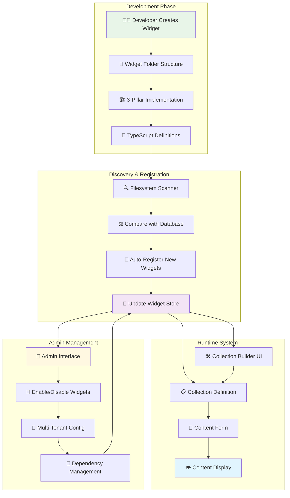
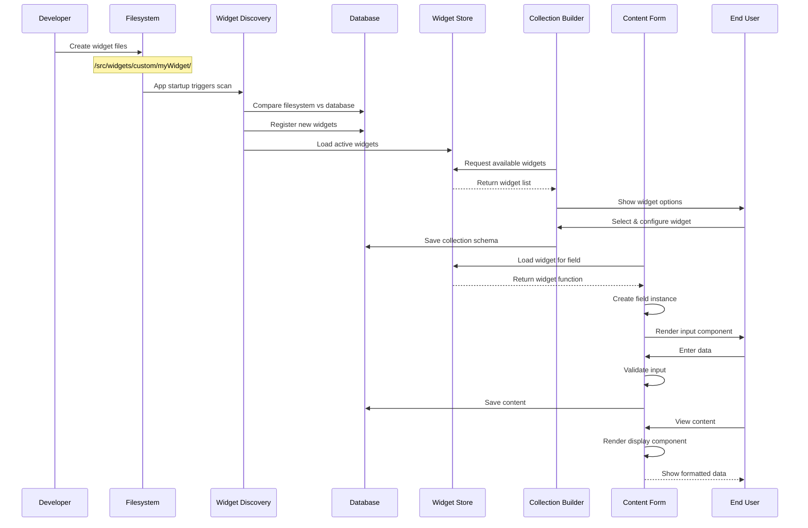
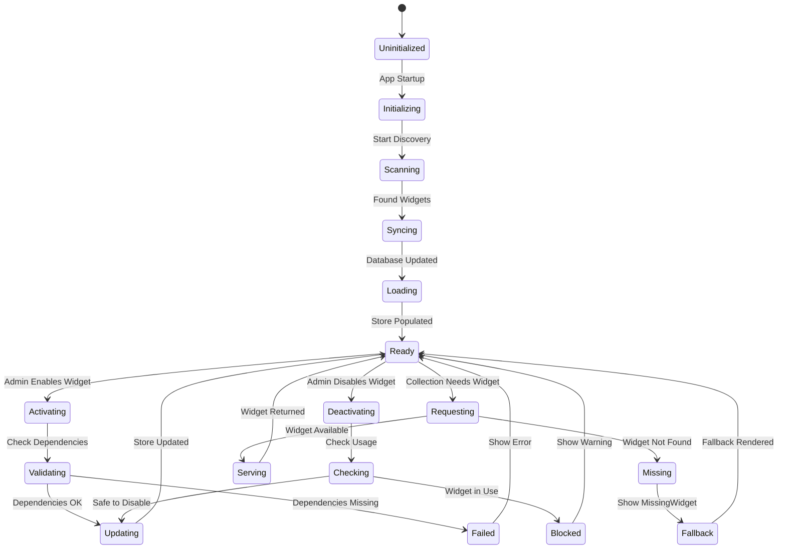
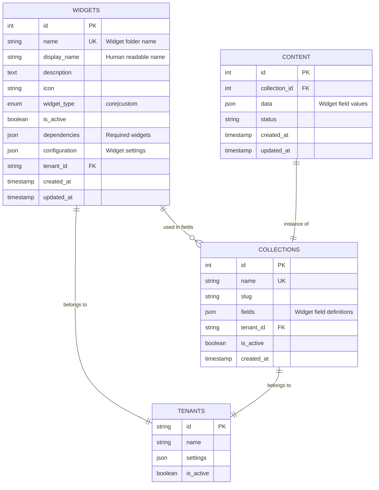
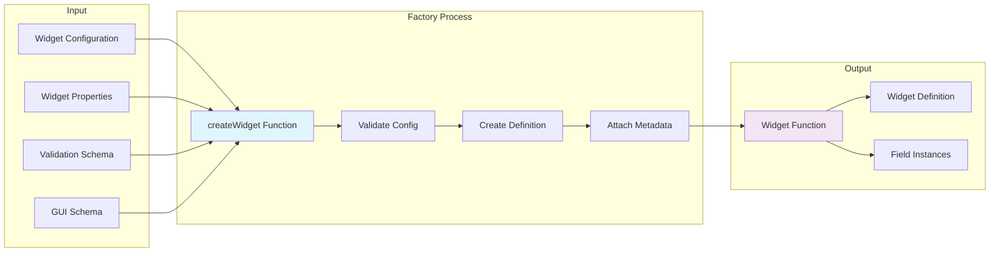
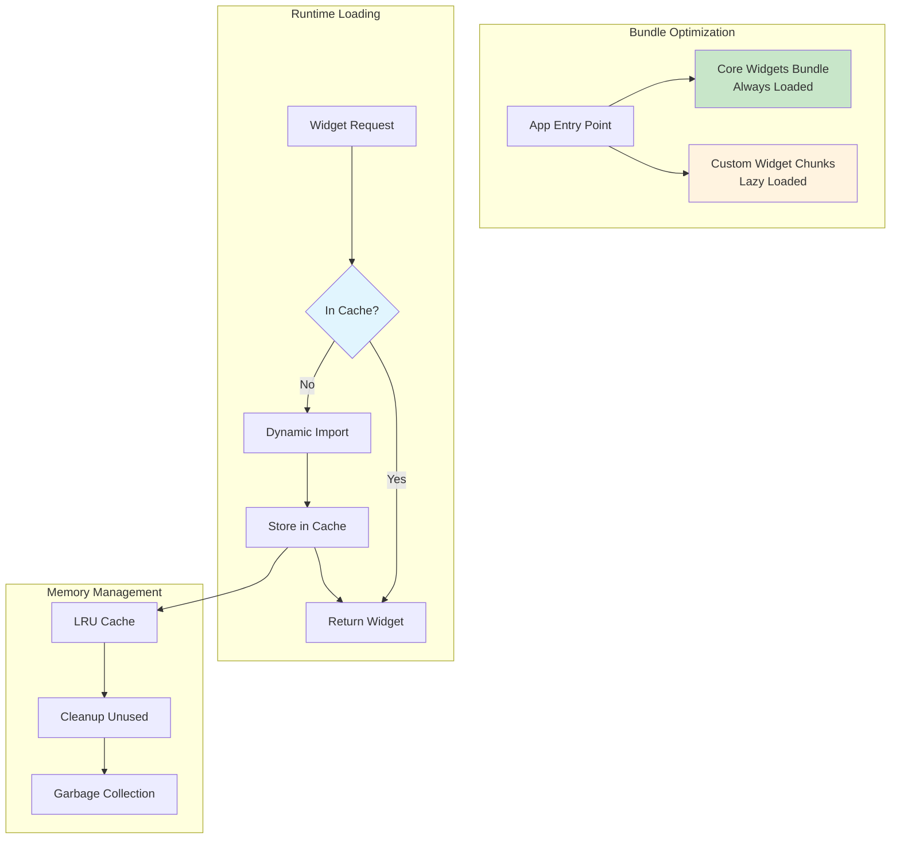
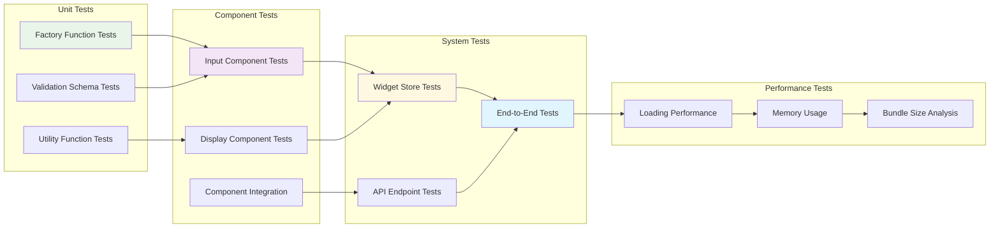
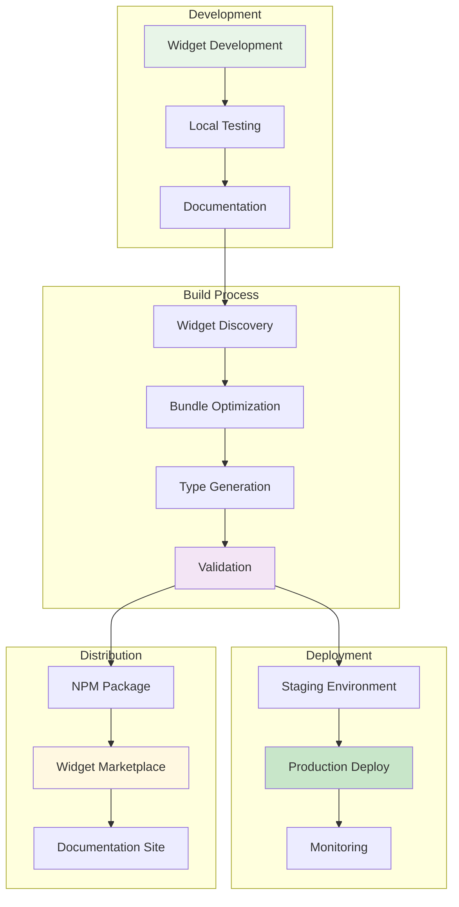

# Widget System Visual Overview

This page provides comprehensive visual diagrams explaining how the SveltyCMS widget system functions, from high-level concepts to detailed implementation.

## 🎯 Complete Widget System Flow



## 🏗️ 3-Pillar Architecture Deep Dive

```mermaid
graph TD
    subgraph "Widget Definition (Pillar 1)"
        IDX[index.ts<br/>📋 Widget Blueprint]
        CONFIG[createWidget() Configuration]
        VALID[🛡️ Validation Schema]
        GUI[🎨 GuiSchema]
        DEFAULTS[⚙️ Default Values]
        META[📊 Metadata]
    end

    subgraph "Input Component (Pillar 2)"
        INPUT[Input.svelte<br/>✏️ Interactive Editor]
        BIND[🔗 Two-way Binding]
        EVENTS[📡 Event Handling]
        VALIDATE[✅ Live Validation]
        TRANSLATE[🌍 Translation Support]
        UI[🎨 User Interface]
    end

    subgraph "Display Component (Pillar 3)"
        DISPLAY[Display.svelte<br/>👁️ Read-only Viewer]
        RENDER[🖼️ Value Rendering]
        FORMAT[📐 Format Output]
        COMPACT[📦 Compact Mode]
        PERF[⚡ Performance Optimized]
        STYLE[🎨 Styling]
    end

    IDX --> CONFIG
    CONFIG --> VALID
    CONFIG --> GUI
    CONFIG --> DEFAULTS
    CONFIG --> META

    CONFIG --> INPUT
    CONFIG --> DISPLAY

    INPUT --> BIND
    INPUT --> EVENTS
    INPUT --> VALIDATE
    INPUT --> TRANSLATE
    INPUT --> UI

    DISPLAY --> RENDER
    DISPLAY --> FORMAT
    DISPLAY --> COMPACT
    DISPLAY --> PERF
    DISPLAY --> STYLE

    VALID --> VALIDATE
    GUI --> UI
    DEFAULTS --> INPUT
    META --> DISPLAY

    style IDX fill:#e1f5fe
    style INPUT fill:#f3e5f5
    style DISPLAY fill:#e8f5e8
```

## 🔄 Widget Lifecycle & Data Flow



## 🏪 Widget Store State Management



## 🗄️ Database Schema & Relationships



## 🔧 Widget Factory Pattern



## 🌐 Multi-Tenant Widget Configuration

```mermaid
graph TD
    subgraph "Global Widget Pool"
        CORE[Core Widgets<br/>input, richText, date]
        CUSTOM[Custom Widgets<br/>seo, address, currency]
    end

    subgraph "Tenant A - E-commerce"
        A_CORE[✅ All Core Widgets]
        A_SEO[✅ SEO Widget]
        A_CURR[✅ Currency Widget]
        A_ADDR[❌ Address Widget]
    end

    subgraph "Tenant B - Blog"
        B_CORE[✅ All Core Widgets]
        B_SEO[✅ SEO Widget]
        B_CURR[❌ Currency Widget]
        B_ADDR[❌ Address Widget]
    end

    subgraph "Tenant C - Corporate"
        C_CORE[✅ All Core Widgets]
        C_SEO[❌ SEO Widget]
        C_CURR[❌ Currency Widget]
        C_ADDR[✅ Address Widget]
    end

    CORE --> A_CORE
    CORE --> B_CORE
    CORE --> C_CORE

    CUSTOM --> A_SEO
    CUSTOM --> A_CURR
    CUSTOM --> B_SEO
    CUSTOM --> C_ADDR

    style CORE fill:#c8e6c9
    style A_CORE fill:#c8e6c9
    style B_CORE fill:#c8e6c9
    style C_CORE fill:#c8e6c9
    style A_SEO fill:#e3f2fd
    style B_SEO fill:#e3f2fd
    style C_ADDR fill:#e3f2fd
```



## 📊 Performance & Loading Strategy



## 🧪 Testing Strategy Overview



## 🚀 Deployment & Distribution



---

## 📚 Documentation Navigation

Use these visual guides alongside the main documentation:

- **[Widget System Overview](/docs/widgets/widget-system-overview.mdx)** - High-level concepts
- **[Widget Architecture](/docs/widgets/widget-architecture.mdx)** - Technical implementation
- **[Development Guide](/docs/widgets/widget-development-guide.mdx)** - Creating widgets
- **[Widget System Index](/docs/widgets/index.mdx)** - Complete documentation hub
