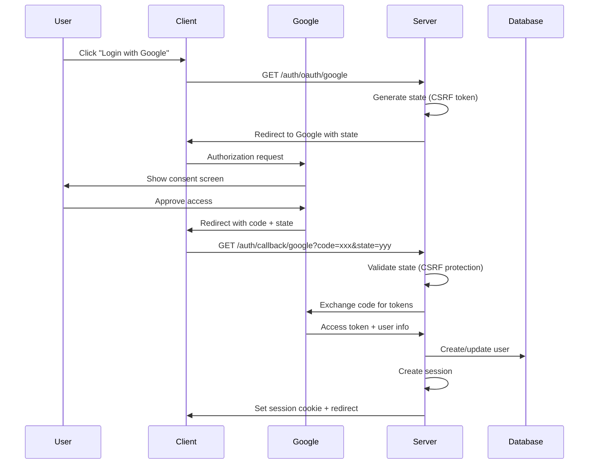

# Authentication System Architecture

## Overview

SveltyCMS implements a comprehensive, multi-tenant aware authentication and authorization system with enterprise-grade security features including **Argon2id password hashing**, JWT tokens, OAuth integration, TOTP-based 2FA, and role-based access control (RBAC).

**Core Features:**

- ✅ **Enterprise Security** - Argon2id password hashing (10-100x more secure than PBKDF2)
- ✅ **Multi-Tenant Support** - Complete tenant isolation for all operations
- ✅ **JWT Authentication** - Stateless token-based auth with refresh tokens
- ✅ **OAuth Integration** - Google OAuth 2.0 with extensible provider system
- ✅ **2FA/TOTP** - Time-based one-time passwords for enhanced security
- ✅ **Role-Based Access Control** - Flexible permission system with admin override
- ✅ **Session Management** - Secure session handling with Redis/in-memory caching
- ✅ **Token Management** - User invitations, password resets, email verification
- ✅ **Audit Logging** - Complete authentication event tracking

---

## System Architecture

### File Structure

```
src/auth/
├── index.ts                     # Main Auth class and exports
├── types.ts                     # TypeScript interfaces (User, Session, Token, etc.)
├── authDBInterface.ts           # Database adapter interface
├── constants.ts                 # Constants (cookie names, TTLs, token generation)
├── permissions.ts               # Permission utilities and checking
├── corePermissions.ts           # Core system permissions
├── apiPermissions.ts            # API-specific permissions
├── sessionManager.ts            # Session lifecycle management
├── sessionCleanup.ts            # Automatic expired session cleanup
├── googleAuth.ts                # Google OAuth implementation
├── totp.ts                      # TOTP generation and validation
├── twoFactorAuth.ts             # 2FA service (server-only)
├── twoFactorAuthTypes.ts        # 2FA type definitions
└── mongoDBAuth/                 # MongoDB adapter implementation
    ├── composeAuthAdapter.ts    # Composed adapter factory
    ├── userAdapter.ts           # User CRUD operations
    ├── sessionAdapter.ts        # Session operations
    └── tokenAdapter.ts          # Token operations

config/
└── roles.ts                     # Role definitions (admin, editor, user, developer)
```

### Core Components

#### 1. Auth Class (`src/auth/index.ts`)

The main authentication orchestrator:

```typescript
export class Auth {
	private db: authDBInterface;
	private sessionStore: SessionStore;

	// User Management
	async findUserById(id: string, tenantId?: string): Promise<User>;
	async findUserByEmail(email: string, tenantId?: string): Promise<User>;
	async createUser(userData: UserCreateData): Promise<User>;
	async updateUser(userId: string, updates: Partial<User>): Promise<User>;
	async deleteUser(userId: string, tenantId?: string): Promise<void>;

	// Password Management (Argon2id)
	async hashPassword(password: string): Promise<string>;
	async verifyPassword(password: string, hash: string): Promise<boolean>;

	// Session Management
	async createSession(userId: string, tenantId?: string): Promise<Session>;
	async getSession(sessionId: string): Promise<Session | null>;
	async deleteSession(sessionId: string): Promise<void>;
	async invalidateAllUserSessions(userId: string): Promise<void>;

	// Token Management
	async createToken(data: TokenCreateData): Promise<string>;
	async validateToken(token: string, userId?: string): Promise<TokenValidationResult>;
	async consumeToken(token: string): Promise<void>;

	// Role & Permission Management
	getRoles(): Role[];
	getRoleById(roleId: string): Role | undefined;
	hasPermission(user: User, permissionId: string): boolean;
	checkPermissions(user: User, permissionIds: string[]): boolean;
}
```

#### 2. Database Interface (`src/auth/authDBInterface.ts`)

Abstract interface for database operations, allowing multiple DB backends:

```typescript
export interface authDBInterface {
	// User operations
	findUserById(id: string, tenantId?: string): Promise<User>;
	findUserByEmail(email: string, tenantId?: string): Promise<User>;
	createUser(userData: UserCreateData): Promise<DatabaseResult<User>>;
	updateUser(userId: string, updates: Partial<User>, tenantId?: string): Promise<DatabaseResult<User>>;
	deleteUser(userId: string, tenantId?: string): Promise<DatabaseResult<void>>;

	// Session operations
	createSession(session: SessionCreateData): Promise<DatabaseResult<Session>>;
	findSessionById(id: string): Promise<Session | null>;
	deleteSession(id: string): Promise<DatabaseResult<void>>;
	deleteAllUserSessions(userId: string): Promise<DatabaseResult<void>>;

	// Token operations
	createToken(token: TokenCreateData): Promise<DatabaseResult<Token>>;
	findTokenByValue(token: string): Promise<Token | null>;
	updateToken(tokenId: string, updates: Partial<Token>): Promise<DatabaseResult<Token>>;
	deleteToken(tokenId: string): Promise<DatabaseResult<void>>;
}
```

**Supported Adapters:**

- **MongoDB** (`mongoDBAuth/`) - Production-ready MongoDB implementation
- **PostgreSQL** (future) - Can be implemented by extending interface
- **Custom** - Implement interface for any database

---

## Authentication Features

### Password Security (Argon2id)

SveltyCMS uses **Argon2id** from the centralized `@utils/crypto` module for password hashing:

```typescript
import { hashPassword, verifyPassword } from '@utils/crypto';

// Registration
const hashedPassword = await hashPassword(plainPassword);
await auth.createUser({ email, password: hashedPassword, ...userData });

// Login
const user = await auth.findUserByEmail(email);
const isValid = await verifyPassword(plainPassword, user.password);
```

**Why Argon2id?**

- 🏆 **Winner** of Password Hashing Competition (2015)
- 🛡️ **Memory-hard** - Requires 64 MB RAM per attempt (stops GPU farms)
- 🚫 **ASIC-resistant** - Can't build custom hardware to crack it
- ⏳ **Time-hard** - 3 iterations minimum
- 🔒 **10-100x more secure** than PBKDF2
- 🌍 **Future-proof** - Resistant to AI/quantum advances

**Security Parameters:**

```typescript
{
  memory: 65536,      // 64 MB RAM per hash
  time: 3,            // 3 iterations
  parallelism: 4,     // 4 parallel threads
  type: argon2id,     // Hybrid (resistant to side-channel + GPU attacks)
  hashLength: 32      // 256-bit output
}
```

**Attack Resistance:**

- **Brute Force:** ~10 billion years with modern hardware
- **GPU Farm:** 64 MB RAM per attempt makes GPUs impractical
- **AI/ML Attack:** Memory-hard nature resists neural network optimization
- **Quantum Attack:** Post-quantum resistant

### JWT Token Authentication

**Token Structure:**

```typescript
interface JWTPayload {
	userId: string;
	email: string;
	role: string;
	tenantId?: string;
	iat: number; // Issued at
	exp: number; // Expiration
}
```

**Token Types:**

1. **Access Token** - Short-lived (15-60 minutes), used for API requests
2. **Refresh Token** - Long-lived (7-30 days), used to refresh access tokens

**Implementation:**

```typescript
import { generateTokenWithExpiry } from '@src/auth/constants';

// Generate JWT (access token)
const accessToken = generateTokenWithExpiry(
	{
		userId: user._id,
		email: user.email,
		role: user.role,
		tenantId: user.tenantId
	},
	'1h'
); // 1 hour expiration

// Verify JWT
const payload = jwt.verify(accessToken, process.env.JWT_SECRET);
```

**Security Features:**

- HMAC-SHA256 or RSA signing
- HTTPOnly cookies for web clients
- Secure flag in production (HTTPS only)
- SameSite=Strict for CSRF protection
- Automatic token rotation on refresh

### OAuth Integration (Google)

**Provider Configuration:**

```typescript
// src/auth/googleAuth.ts
interface GoogleOAuthConfig {
	clientId: string;
	clientSecret: string;
	redirectUri: string;
	scopes: string[];
}
```

**OAuth 2.0 Flow:**



**Implementation:**

```typescript
// Authorization URL generation
export function generateGoogleAuthUrl(state: string): string {
	const params = new URLSearchParams({
		client_id: GOOGLE_CLIENT_ID,
		redirect_uri: GOOGLE_REDIRECT_URI,
		response_type: 'code',
		scope: 'openid email profile',
		state: state, // CSRF protection
		access_type: 'offline', // Get refresh token
		prompt: 'consent'
	});
	return `https://accounts.google.com/o/oauth2/v2/auth?${params}`;
}

// Handle callback
export async function handleGoogleCallback(code: string, state: string) {
	// 1. Validate state (CSRF protection)
	// 2. Exchange code for tokens
	// 3. Get user info from Google
	// 4. Create/update user in database
	// 5. Create session
	// 6. Return user + tokens
}
```

**Security Features:**

- State parameter validation (CSRF protection)
- Encrypted token storage
- Automatic token refresh
- Secure callback handling
- Account linking support

### Two-Factor Authentication (TOTP)

**TOTP Implementation:**

```typescript
// src/auth/totp.ts
export interface TOTPSecret {
	secret: string; // Base32 encoded secret
	qrCode: string; // Data URL for QR code
	backupCodes: string[]; // Recovery codes
}

// Generate TOTP secret
export function generateTOTPSecret(email: string): TOTPSecret {
	const secret = authenticator.generateSecret();
	const otpauth = authenticator.keyuri(email, 'SveltyCMS', secret);
	const qrCode = await QRCode.toDataURL(otpauth);
	const backupCodes = generateBackupCodes(10);

	return { secret, qrCode, backupCodes };
}

// Verify TOTP token
export function verifyTOTPToken(token: string, secret: string): boolean {
	return authenticator.verify({ token, secret });
}
```

**2FA Service:**

```typescript
// src/auth/twoFactorAuth.ts (server-only)
export class TwoFactorAuthService {
	async setupTwoFactor(userId: string): Promise<TwoFactorSetupResponse>;
	async verifyAndEnableTwoFactor(userId: string, token: string): Promise<boolean>;
	async verifyTwoFactorToken(userId: string, token: string): Promise<TwoFactorVerificationResult>;
	async disableTwoFactor(userId: string, password: string): Promise<boolean>;
	async regenerateBackupCodes(userId: string): Promise<string[]>;
	async useBackupCode(userId: string, code: string): Promise<boolean>;
}
```

**Security Features:**

- RFC 6238 compliant TOTP
- 30-second time window
- Backup codes with one-time use
- Encrypted secret storage (Argon2 + AES-256-GCM)
- Brute-force protection (rate limiting)

---

## Authorization System

### Role-Based Access Control (RBAC)

**Role Structure:**

```typescript
interface Role {
	_id: string; // Unique role ID
	name: string; // Display name
	description: string; // Role description
	isAdmin: boolean; // Admin override flag
	permissions: string[]; // Array of permission IDs
	icon?: string; // UI icon
	color?: string; // UI color
}
```

**Default Roles** (`config/roles.ts`):

#### 1. Administrator

```typescript
{
  _id: 'admin',
  name: 'Administrator',
  description: 'Full access to all system features',
  isAdmin: true,
  permissions: ['*'], // All permissions
  icon: 'material-symbols:verified-outline',
  color: 'gradient-primary'
}
```

**Capabilities:**

- ✅ Complete system access
- ✅ User management (create, edit, delete)
- ✅ Role and permission management
- ✅ System settings configuration
- ✅ Access to all API endpoints
- ✅ **Admin Override** - Bypasses permission checks

#### 2. Developer

```typescript
{
  _id: 'developer',
  name: 'Developer',
  description: 'Access to development and API features',
  permissions: [
    'system:dashboard',
    'api:graphql',
    'api:collections',
    'api:export',
    'collections:read',
    'content:builder',
    'config:widgetManagement'
  ],
  icon: 'material-symbols:code',
  color: 'gradient-pink'
}
```

**Capabilities:**

- ✅ API access (GraphQL, Collections, Media)
- ✅ Content builder and collection management
- ✅ Widget configuration
- ✅ System information viewing
- ❌ No user management
- ❌ No system settings modification

#### 3. Editor

```typescript
{
  _id: 'editor',
  name: 'Editor',
  description: 'Content creation and management',
  permissions: [
    'collections:read',
    'collections:update',
    'collections:create',
    'content:editor',
    'content:images',
    'system:dashboard',
    'user:manage'
  ],
  icon: 'material-symbols:edit',
  color: 'gradient-tertiary'
}
```

**Capabilities:**

- ✅ Create, edit, publish content
- ✅ Manage collections
- ✅ Upload and manage media
- ✅ Basic user management
- ❌ No API access
- ❌ No system configuration

#### 4. User

```typescript
{
  _id: 'user',
  name: 'User',
  description: 'Basic user with no special permissions',
  permissions: [],
  icon: 'material-symbols:person',
  color: 'gradient-secondary'
}
```

**Capabilities:**

- ✅ View published content
- ✅ Access own profile
- ❌ No content creation
- ❌ No admin access

### Permission System

**Permission Structure:**

```typescript
interface Permission {
	_id: string; // Unique permission ID (e.g., 'api:collections')
	name: string; // Display name
	description: string; // Permission description
	action: PermissionAction; // create | read | update | delete | access
	type: PermissionType; // system | user | content | api | config | collections | media
	scope?: string; // Optional scope (e.g., 'own' for user's own content)
}

enum PermissionAction {
	CREATE = 'create',
	READ = 'read',
	UPDATE = 'update',
	DELETE = 'delete',
	ACCESS = 'access'
}

enum PermissionType {
	SYSTEM = 'system',
	USER = 'user',
	CONTENT = 'content',
	API = 'api',
	CONFIG = 'config',
	COLLECTIONS = 'collections',
	MEDIA = 'media'
}
```

**Core Permissions** (`src/auth/corePermissions.ts`):

```typescript
export const corePermissions: Permission[] = [
	// System
	{ _id: 'system:dashboard', name: 'Dashboard Access', action: 'access', type: 'system' },
	{ _id: 'system:settings', name: 'System Settings', action: 'update', type: 'system' },

	// Collections
	{ _id: 'collections:read', name: 'Read Collections', action: 'read', type: 'collections' },
	{ _id: 'collections:create', name: 'Create Collections', action: 'create', type: 'collections' },
	{ _id: 'collections:update', name: 'Update Collections', action: 'update', type: 'collections' },
	{ _id: 'collections:delete', name: 'Delete Collections', action: 'delete', type: 'collections' },

	// API
	{ _id: 'api:graphql', name: 'GraphQL API', action: 'access', type: 'api' },
	{ _id: 'api:collections', name: 'Collections API', action: 'access', type: 'api' },

	// User Management
	{ _id: 'user:manage', name: 'Manage Users', action: 'update', type: 'user' },
	{ _id: 'user:delete', name: 'Delete Users', action: 'delete', type: 'user' }
];
```

**API Permissions** (`src/auth/apiPermissions.ts`):

```typescript
export const apiPermissions: Permission[] = [
	{ _id: 'api:export', name: 'Export API', action: 'access', type: 'api' },
	{ _id: 'api:import', name: 'Import API', action: 'access', type: 'api' },
	{ _id: 'api:media', name: 'Media API', action: 'access', type: 'api' },
	{ _id: 'api:widgets', name: 'Widgets API', action: 'access', type: 'api' },
	{ _id: 'api:user', name: 'User API', action: 'access', type: 'api' },
	{ _id: 'api:userActivity', name: 'User Activity API', action: 'access', type: 'api' }
];
```

### Permission Checking

**Check Single Permission:**

```typescript
import { hasPermission } from '@src/auth';

const canEdit = hasPermission(user, 'collections:update');
if (!canEdit) {
	throw error(403, 'Forbidden: Insufficient permissions');
}
```

**Check Multiple Permissions (ALL required):**

```typescript
import { checkPermissions } from '@src/auth';

const hasAllPermissions = checkPermissions(user, ['collections:read', 'collections:update']);
```

**Check by Action and Type:**

```typescript
import { hasPermissionByAction } from '@src/auth';

const canCreate = hasPermissionByAction(user, 'create', 'collections');
```

**Admin Override:**

Administrators automatically have ALL permissions, regardless of role permission array:

```typescript
export function hasPermissionWithRoles(user: User, permissionId: string, roles: Role[]): boolean {
	const userRole = roles.find((role) => role._id === user.role);

	// ADMIN OVERRIDE: Admins automatically have ALL permissions
	if (userRole?.isAdmin) {
		return true;
	}

	// Check if user's role has the specific permission
	return userRole?.permissions.includes(permissionId) ?? false;
}
```

### Dynamic Permission Registration

Register custom permissions at runtime:

```typescript
import { registerPermission } from '@src/auth/permissions';

registerPermission({
	_id: 'custom:feature',
	name: 'Custom Feature Access',
	description: 'Access to custom feature',
	action: 'access',
	type: 'system'
});
```

---

## 3-Layer Security Architecture

SveltyCMS implements a comprehensive **3-Layer Security Architecture** for enterprise-grade access control. This multi-layered approach ensures that unauthorized access is blocked at multiple checkpoints, providing defense-in-depth security.

### Architecture Overview

```
┌─────────────────────────────────────────────────────────────┐
│                      Client Request                          │
└──────────────────────┬──────────────────────────────────────┘
                       │
                       ▼
┌─────────────────────────────────────────────────────────────┐
│  LAYER 1: API Endpoint Protection (hooks.server.ts)         │
│  ─────────────────────────────────────────────────────      │
│  • Intercepts ALL API requests                               │
│  • Checks API_PERMISSIONS configuration                      │
│  • Validates user authentication                             │
│  • Verifies user role matches allowed roles                  │
│  • Returns 403 if unauthorized                               │
│  ✓ First line of defense - blocks at network level          │
└──────────────────────┬──────────────────────────────────────┘
                       │ AUTHORIZED ✓
                       ▼
┌─────────────────────────────────────────────────────────────┐
│  LAYER 2: Page-Level Authorization (+page.server.ts)        │
│  ─────────────────────────────────────────────────────      │
│  • Executes before page component loads                      │
│  • Uses hasPermissionByAction() for fine-grained control     │
│  • Filters data based on user permissions                    │
│  • Returns only data user is allowed to see                  │
│  • Sets page.data.permissions and page.data.isAdmin          │
│  ✓ Second line of defense - data filtering                   │
└──────────────────────┬──────────────────────────────────────┘
                       │ DATA FILTERED ✓
                       ▼
┌─────────────────────────────────────────────────────────────┐
│  LAYER 3: UI Element Visibility (PermissionGuard.svelte)    │
│  ─────────────────────────────────────────────────────      │
│  • Wraps sensitive UI components                             │
│  • Checks page.data.permissions for specific permission      │
│  • Hides/shows UI elements based on permissions              │
│  • Provides better UX (no confusing disabled buttons)        │
│  ✓ Third line of defense - UI visibility control             │
└──────────────────────┬──────────────────────────────────────┘
                       │ UI RENDERED ✓
                       ▼
                 Authorized User
```

### Layer 1: API Endpoint Protection

**Location:** `src/hooks.server.ts` → `src/auth/handleApiRequests.ts`

**Purpose:** Block unauthorized API calls at the earliest possible point.

**Implementation:**

```typescript
// src/auth/apiPermissions.ts
export const API_PERMISSIONS = {
	// Settings API - Admin only
	'api:settings': ['admin'],

	// User management - Admin and Developer
	'api:user': ['admin', 'developer'],

	// Content API - All authenticated users
	'api:collections': ['admin', 'developer', 'editor', 'user']
};

// src/auth/handleApiRequests.ts
export async function handleApiRequests(event: RequestEvent): Promise<Response | null> {
	const url = new URL(event.request.url);

	// Check if request is to protected API
	if (url.pathname.startsWith('/api/settings')) {
		const permissionKey = 'api:settings';
		const allowedRoles = API_PERMISSIONS[permissionKey] || [];

		// Verify user role is in allowed list
		const isAuthorized = allowedRoles.includes(event.locals.user?.role);

		if (!isAuthorized) {
			return json({ error: 'Forbidden: Insufficient permissions' }, { status: 403 });
		}
	}

	return null; // Allow request to proceed
}
```

**Benefits:**

- ✅ Fast rejection of unauthorized requests (no DB queries needed)
- ✅ Protects entire API endpoint categories
- ✅ Simple role-based checks
- ✅ Prevents unnecessary page/data loading

### Layer 2: Page-Level Authorization

**Location:** `+page.server.ts` load functions

**Purpose:** Filter data and check fine-grained permissions before rendering pages.

**Implementation:**

```typescript
// src/routes/(app)/config/+page.server.ts
import { hasPermissionByAction } from '@src/auth/permissions';
import { permissionConfigs } from '@src/auth/permissions';

export const load = async ({ locals }) => {
	const user = locals.user;
	if (!user) {
		throw redirect(302, '/auth/login');
	}

	// Check fine-grained permissions for each feature
	const permissions = {};
	for (const [key, config] of Object.entries(permissionConfigs)) {
		permissions[key] = hasPermissionByAction(
			user,
			config.action, // e.g., 'update'
			config.type // e.g., 'config'
		);
	}

	// Admin flag for PermissionGuard bypass
	const isAdmin = user.role === 'admin';

	return {
		permissions, // Pass to page component
		isAdmin // Admin override
	};
};
```

**Fine-Grained Permission Example:**

```typescript
// src/auth/permissions.ts
export const permissionConfigs = {
	// System Settings - Individual permissions per group
	settingsCache: {
		contextId: 'config:settings:cache',
		action: 'update',
		type: 'config'
	},
	settingsDatabase: {
		contextId: 'config:settings:database',
		action: 'update',
		type: 'config'
	},
	settingsSecurity: {
		contextId: 'config:settings:security',
		action: 'update',
		type: 'config'
	}
	// ... 10 more settings groups
};
```

**Benefits:**

- ✅ Fine-grained control (per-feature permissions)
- ✅ Data filtering before it reaches client
- ✅ Prevents exposure of unauthorized data
- ✅ Supports complex permission logic

### Layer 3: UI Element Visibility

**Location:** `src/components/PermissionGuard.svelte`

**Purpose:** Hide UI elements user cannot access, providing clean UX.

**Implementation:**

```svelte
<!-- src/components/PermissionGuard.svelte -->
<script lang="ts">
	import type { Snippet } from 'svelte';

	interface Props {
		permission?: string; // e.g., 'settingsCache'
		children: Snippet;
	}

	let { permission, children }: Props = $props();

	// Get permissions from parent page data
	const { data } = $page;
	const { permissions = {}, isAdmin = false } = data;

	// Check permission
	const hasPermission = isAdmin || (permission && permissions[permission]);
</script>

{#if hasPermission}
	{@render children()}
{/if}
```

**Usage in Pages:**

```svelte
<!-- Hide cache settings if user doesn't have permission -->
<PermissionGuard permission="settingsCache">
	<GenericSettingsGroup group={cacheSettings} values={$settingsStore.cache} on:save={handleSave} />
</PermissionGuard>

<!-- Admin-only section -->
<PermissionGuard>
	<button>Delete All Data</button>
</PermissionGuard>
```

**Benefits:**

- ✅ Clean UX (no confusing disabled buttons)
- ✅ Prevents accidental permission confusion
- ✅ Works with page.data from +page.server.ts
- ✅ Automatic admin override

### Complete Example: System Settings

Here's how all 3 layers work together to protect the System Settings page:

**Layer 1 - API Protection:**

```typescript
// Block unauthorized API calls
API_PERMISSIONS['api:settings'] = ['admin'];
// Non-admin users get 403 immediately
```

**Layer 2 - Page Authorization:**

```typescript
// +page.server.ts - Check fine-grained permissions
export const load = async ({ locals }) => {
	return {
		permissions: {
			settingsCache: hasPermissionByAction(user, 'update', 'config'),
			settingsDatabase: hasPermissionByAction(user, 'update', 'config'),
			settingsSecurity: hasPermissionByAction(user, 'update', 'config')
			// User might have cache but not database
		},
		isAdmin: user.role === 'admin'
	};
};
```

**Layer 3 - UI Visibility:**

```svelte
<!-- Only show groups user has permission for -->
{#each settingsGroups as group}
	<PermissionGuard permission={group.permissionId}>
		<button on:click={() => selectGroup(group)}>
			{group.icon}
			{group.name}
		</button>
	</PermissionGuard>
{/each}
```

### Permission Scenarios

**Scenario 1: Junior Admin (Cache Only)**

```typescript
juniorAdminRole.permissions = ['config:settings:cache'];
```

- Layer 1: ✅ Passes (has admin role)
- Layer 2: ✅ Gets `{ settingsCache: true, settingsDatabase: false, ... }`
- Layer 3: ✅ Sees cache settings, database settings hidden

**Scenario 2: Senior Admin (Cache + Database)**

```typescript
seniorAdminRole.permissions = ['config:settings:cache', 'config:settings:database'];
```

- Layer 1: ✅ Passes (has admin role)
- Layer 2: ✅ Gets `{ settingsCache: true, settingsDatabase: true, ... }`
- Layer 3: ✅ Sees both cache and database settings

**Scenario 3: Super Admin (All Permissions)**

```typescript
superAdminRole.isAdmin = true;
```

- Layer 1: ✅ Passes (admin role)
- Layer 2: ✅ Gets `{ isAdmin: true }` (bypasses all checks)
- Layer 3: ✅ Sees ALL settings (admin override)

**Scenario 4: Unauthorized Developer**

```typescript
developerRole.permissions = ['collections:read']; // No settings permissions
```

- Layer 1: ❌ **BLOCKED** - Returns 403 Forbidden
- Layer 2: Never reached
- Layer 3: Never reached

### Best Practices

**1. Always Use All 3 Layers**

```typescript
// ❌ BAD - Only client-side check (insecure)
{#if $page.data.isAdmin}
	<button>Delete</button>
{/if}

// ✅ GOOD - All 3 layers
// Layer 1: API_PERMISSIONS['api:settings'] = ['admin']
// Layer 2: Load function checks permissions
// Layer 3: PermissionGuard wraps UI
<PermissionGuard permission="settingsDelete">
	<button on:click={deleteSettings}>Delete</button>
</PermissionGuard>
```

**2. Use Fine-Grained Permissions for Complex Features**

```typescript
// ❌ BAD - Single coarse permission
const canAccessSettings = hasPermission(user, 'config:settings');

// ✅ GOOD - Fine-grained per-group permissions
const canAccessCache = hasPermission(user, 'config:settings:cache');
const canAccessDatabase = hasPermission(user, 'config:settings:database');
```

**3. Return isAdmin Flag for PermissionGuard**

```typescript
// +page.server.ts
export const load = async ({ locals }) => {
	return {
		permissions: calculatePermissions(locals.user),
		isAdmin: locals.user.role === 'admin' // Required for admin override
	};
};
```

**4. Add permissionId to All Protected Resources**

```typescript
// settingsGroups.ts
export const settingsGroups: SettingGroup[] = [
	{
		id: 'cache',
		name: 'Cache & Performance',
		permissionId: 'config:settings:cache' // Maps to permission config
	}
];
```

---

## Session Management

### Session Structure

```typescript
interface Session {
	_id: string; // Unique session ID
	userId: string; // User ID
	tenantId?: string; // Tenant ID (multi-tenant)
	createdAt: Date; // Session creation time
	expiresAt: Date; // Session expiration time
	lastActivity: Date; // Last activity timestamp
	device?: DeviceInfo; // Device information
	ipAddress?: string; // IP address
}

interface DeviceInfo {
	userAgent: string;
	browser: string;
	os: string;
	device: string;
}
```

### Session Lifecycle

**1. Session Creation:**

```typescript
// Create session after successful authentication
const session = await auth.createSession(user._id, user.tenantId);

// Store session ID in HTTPOnly cookie
cookies.set(SESSION_COOKIE_NAME, session._id, {
	path: '/',
	httpOnly: true,
	secure: !dev,
	sameSite: 'strict',
	maxAge: 60 * 60 * 24 * 7 // 7 days
});
```

**2. Session Validation:**

```typescript
// In hooks.server.ts
const sessionId = cookies.get(SESSION_COOKIE_NAME);
if (sessionId) {
	const session = await auth.getSession(sessionId);
	if (session && session.expiresAt > new Date()) {
		event.locals.user = await auth.findUserById(session.userId);
		event.locals.session = session;
	} else {
		// Session expired or invalid
		cookies.delete(SESSION_COOKIE_NAME, { path: '/' });
	}
}
```

**3. Session Renewal:**

```typescript
// Update last activity on each request
await sessionStore.update(sessionId, {
	lastActivity: new Date()
});

// Extend expiration if close to expiry
if (session.expiresAt.getTime() - Date.now() < 24 * 60 * 60 * 1000) {
	await sessionStore.update(sessionId, {
		expiresAt: new Date(Date.now() + 7 * 24 * 60 * 60 * 1000)
	});
}
```

**4. Session Cleanup:**

Automatic cleanup of expired sessions:

```typescript
// src/auth/sessionCleanup.ts
import { sessionCache } from '@src/hooks/utils/session';

// Run every hour
setInterval(
	async () => {
		const now = Date.now();
		const expired: string[] = [];

		sessionCache.forEach((session, sessionId) => {
			if (session.expiresAt.getTime() < now) {
				expired.push(sessionId);
			}
		});

		// Remove expired sessions
		for (const sessionId of expired) {
			sessionCache.delete(sessionId);
			await auth.deleteSession(sessionId);
		}

		logger.info(`Cleaned up ${expired.length} expired sessions`);
	},
	60 * 60 * 1000
); // 1 hour
```

### Session Storage

**In-Memory Cache** (Development):

```typescript
// Simple Map for development
const sessionCache = new Map<string, Session>();
```

**Redis Cache** (Production):

```typescript
import Redis from 'ioredis';

const redis = new Redis(process.env.REDIS_URL);

export const sessionStore: SessionStore = {
	async get(sessionId: string): Promise<Session | null> {
		const data = await redis.get(`session:${sessionId}`);
		return data ? JSON.parse(data) : null;
	},

	async set(sessionId: string, session: Session): Promise<void> {
		await redis.setex(
			`session:${sessionId}`,
			60 * 60 * 24 * 7, // 7 days
			JSON.stringify(session)
		);
	},

	async delete(sessionId: string): Promise<void> {
		await redis.del(`session:${sessionId}`);
	}
};
```

### Security Features

- **HTTPOnly Cookies** - JavaScript cannot access session cookie
- **Secure Flag** - HTTPS only in production
- **SameSite=Strict** - CSRF protection
- **Automatic Expiration** - Sessions expire after 7 days
- **Activity Tracking** - Last activity timestamp updated
- **Device Fingerprinting** - Track device information
- **IP Validation** - Optional IP address verification
- **Concurrent Session Limits** - Configurable max sessions per user

---

## Token Management

### Token Types

```typescript
interface Token {
	_id: string; // Unique token ID
	userId: string; // User ID
	tenantId?: string; // Tenant ID
	value: string; // Token value (hashed)
	type: TokenType; // Token type
	expiresAt: Date; // Expiration time
	createdAt: Date; // Creation time
	blocked: boolean; // Block status
	consumed: boolean; // Consumption status
	email?: string; // Email for token
	username?: string; // Username for invitation
	role?: string; // Role for invitation
}

enum TokenType {
	USER_INVITE = 'user-invite',
	PASSWORD_RESET = 'reset',
	EMAIL_VERIFY = 'verify',
	USER_CREATE = 'create'
}
```

### Token Operations

**1. User Invitation:**

```typescript
// Admin creates invitation token
const token = await auth.createToken({
	userId: adminId,
	tenantId: tenantId,
	email: newUserEmail,
	username: suggestedUsername,
	role: 'editor',
	type: 'user-invite',
	expiresAt: new Date(Date.now() + 7 * 24 * 60 * 60 * 1000) // 7 days
});

// Send invitation email
await sendEmail({
	to: newUserEmail,
	subject: 'Invitation to SveltyCMS',
	html: `Click here to create your account: ${PUBLIC_BASE_URL}/signup?token=${token}`
});
```

**2. Password Reset:**

```typescript
// User requests password reset
const token = await auth.createToken({
	userId: user._id,
	tenantId: user.tenantId,
	email: user.email,
	type: 'reset',
	expiresAt: new Date(Date.now() + 60 * 60 * 1000) // 1 hour
});

// Send reset email
await sendEmail({
	to: user.email,
	subject: 'Password Reset',
	html: `Reset your password: ${PUBLIC_BASE_URL}/reset-password?token=${token}`
});
```

**3. Email Verification:**

```typescript
// After registration
const token = await auth.createToken({
	userId: user._id,
	tenantId: user.tenantId,
	email: user.email,
	type: 'verify',
	expiresAt: new Date(Date.now() + 24 * 60 * 60 * 1000) // 24 hours
});

// Send verification email
await sendEmail({
	to: user.email,
	subject: 'Verify Your Email',
	html: `Verify your email: ${PUBLIC_BASE_URL}/verify-email?token=${token}`
});
```

**4. Token Validation:**

```typescript
const result = await auth.validateToken(token, userId);
if (!result.success) {
	throw error(400, result.message);
}

// Token is valid, proceed with action
```

**5. Token Consumption:**

```typescript
// Mark token as used (one-time use)
await auth.consumeToken(token);

// Subsequent validation will fail
const result = await auth.validateToken(token);
// result.success = false, message = "Token has been consumed"
```

### Token Security

- **Hashed Storage** - Tokens are hashed before database storage
- **One-Time Use** - Consumed tokens cannot be reused
- **Expiration** - All tokens have expiration times
- **Blocking** - Tokens can be blocked without deletion (audit trail)
- **Type Validation** - Token type must match expected type
- **User Validation** - Optional user ID verification
- **Tenant Isolation** - Multi-tenant support

---

## Multi-Tenant Support

### Tenant Isolation

All authentication operations support tenant isolation:

```typescript
// Create user in specific tenant
const user = await auth.createUser({
	email: 'user@example.com',
	password: hashedPassword,
	tenantId: 'tenant-abc123',
	role: 'editor'
});

// Find user in specific tenant
const user = await auth.findUserByEmail('user@example.com', 'tenant-abc123');

// Create session with tenant context
const session = await auth.createSession(user._id, 'tenant-abc123');
```

### Tenant Detection

```typescript
// In hooks.server.ts
const tenantId = event.url.hostname.split('.')[0]; // subdomain-based
// OR
const tenantId = event.request.headers.get('X-Tenant-ID'); // header-based
// OR
const tenantId = event.cookies.get('tenant_id'); // cookie-based

event.locals.tenantId = tenantId;
```

### Database Isolation

All database queries filter by `tenantId`:

```typescript
// MongoDB example
async findUserByEmail(email: string, tenantId?: string): Promise<User> {
  const query: any = { email };
  if (tenantId) {
    query.tenantId = tenantId;
  }
  return await db.collection('users').findOne(query);
}
```

---

## Security Best Practices

### Password Requirements

```typescript
export function validatePassword(password: string): { valid: boolean; message: string } {
	if (password.length < 12) {
		return { valid: false, message: 'Password must be at least 12 characters' };
	}
	if (!/[A-Z]/.test(password)) {
		return { valid: false, message: 'Password must contain uppercase letter' };
	}
	if (!/[a-z]/.test(password)) {
		return { valid: false, message: 'Password must contain lowercase letter' };
	}
	if (!/[0-9]/.test(password)) {
		return { valid: false, message: 'Password must contain number' };
	}
	if (!/[^A-Za-z0-9]/.test(password)) {
		return { valid: false, message: 'Password must contain special character' };
	}
	return { valid: true, message: 'Password is strong' };
}
```

### Rate Limiting

Authentication endpoints have rate limiting:

```typescript
// src/hooks/handleRateLimit.ts
const authRateLimiter = {
	'/auth/login': { max: 5, window: 15 * 60 * 1000 }, // 5 per 15 min
	'/auth/register': { max: 3, window: 60 * 60 * 1000 }, // 3 per hour
	'/auth/reset-password': { max: 3, window: 60 * 60 * 1000 }
};
```

### Audit Logging

All authentication events are logged:

```typescript
import { logger } from '@utils/logger.svelte';

// Login attempt
logger.info('Login attempt', { email, ip: event.getClientAddress() });

// Failed login
logger.warn('Failed login attempt', { email, reason: 'Invalid credentials' });

// Successful login
logger.info('User logged in', { userId: user._id, email: user.email });

// Permission denied
logger.warn('Permission denied', { userId, permission: permissionId });
```

### Session Security

- ✅ Use HTTPOnly, Secure, SameSite cookies
- ✅ Implement CSRF protection
- ✅ Rotate session IDs on privilege escalation
- ✅ Limit concurrent sessions per user
- ✅ Track device and IP information
- ✅ Automatic session expiration
- ✅ Invalidate all sessions on password change

### Token Security

- ✅ Hash tokens before database storage
- ✅ Use cryptographically secure random generation
- ✅ Short expiration times (1 hour for resets, 24 hours for verification)
- ✅ One-time use (consume after validation)
- ✅ Email confirmation for sensitive operations
- ✅ Block suspicious tokens

### OAuth Security

- ✅ Validate state parameter (CSRF protection)
- ✅ Encrypt stored tokens
- ✅ Use PKCE for mobile apps
- ✅ Implement token rotation
- ✅ Audit OAuth events
- ✅ Limit requested scopes

---

## API Usage Examples

### User Registration

```typescript
// +server.ts
import { auth } from '$lib/server/auth';
import { hashPassword } from '@utils/crypto';

export const POST: RequestHandler = async ({ request }) => {
	const { email, password, username } = await request.json();

	// Validate password strength
	const passwordValidation = validatePassword(password);
	if (!passwordValidation.valid) {
		return json({ error: passwordValidation.message }, { status: 400 });
	}

	// Hash password with Argon2id
	const hashedPassword = await hashPassword(password);

	// Create user
	const user = await auth.createUser({
		email,
		password: hashedPassword,
		username,
		role: 'user',
		tenantId: 'default'
	});

	// Create email verification token
	const token = await auth.createToken({
		userId: user._id,
		email: user.email,
		type: 'verify',
		expiresAt: new Date(Date.now() + 24 * 60 * 60 * 1000)
	});

	// Send verification email
	await sendVerificationEmail(user.email, token);

	return json({ success: true, userId: user._id });
};
```

### User Login

```typescript
import { auth } from '$lib/server/auth';
import { verifyPassword } from '@utils/crypto';
import { SESSION_COOKIE_NAME } from '@src/auth/constants';

export const POST: RequestHandler = async ({ request, cookies }) => {
	const { email, password } = await request.json();

	// Find user
	const user = await auth.findUserByEmail(email);
	if (!user) {
		return json({ error: 'Invalid credentials' }, { status: 401 });
	}

	// Verify password with Argon2id
	const isValid = await verifyPassword(password, user.password);
	if (!isValid) {
		return json({ error: 'Invalid credentials' }, { status: 401 });
	}

	// Check if 2FA is enabled
	if (user.twoFactorEnabled) {
		// Return temporary token, require 2FA code
		return json({
			requiresTwoFactor: true,
			tempToken: generateTempToken(user._id)
		});
	}

	// Create session
	const session = await auth.createSession(user._id, user.tenantId);

	// Set session cookie
	cookies.set(SESSION_COOKIE_NAME, session._id, {
		path: '/',
		httpOnly: true,
		secure: !dev,
		sameSite: 'strict',
		maxAge: 60 * 60 * 24 * 7
	});

	return json({
		success: true,
		user: {
			id: user._id,
			email: user.email,
			role: user.role
		}
	});
};
```

### Protected Route

```typescript
// +page.server.ts
import { error } from '@sveltejs/kit';
import { hasPermission } from '@src/auth';

export const load: PageServerLoad = async ({ locals }) => {
	// Check authentication
	if (!locals.user) {
		throw error(401, 'Unauthorized');
	}

	// Check permission
	if (!hasPermission(locals.user, 'collections:read')) {
		throw error(403, 'Forbidden');
	}

	// Load data
	return {
		collections: await getCollections(locals.user.tenantId)
	};
};
```

---

## Related Documentation

- [Build-Time Security Plugin](/docs/dev-guide/security-plugin) - Vite plugin preventing private settings exposure
- [Cryptography Module](/docs/dev-guide/cryptography-module) - Argon2id and AES-256-GCM implementation
- [Server Hooks & Middleware](/docs/dev-guide/server-hooks-middleware) - Request lifecycle and security
- [API Security](/docs/dev-guide/api-security) - API endpoint protection
- [Import/Export System](/docs/dev-guide/import-export-system) - Secure data migration with Argon2 encryption
- [System Settings](/docs/user-guide/system-settings) - User guide

---

_Last Updated: October 3, 2025_
_Security Audit: Annual review recommended_
