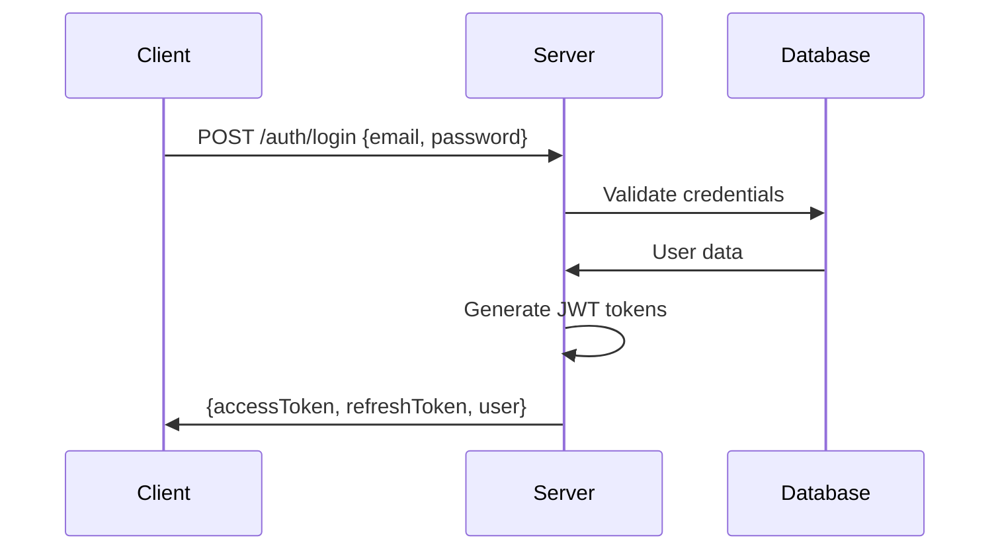
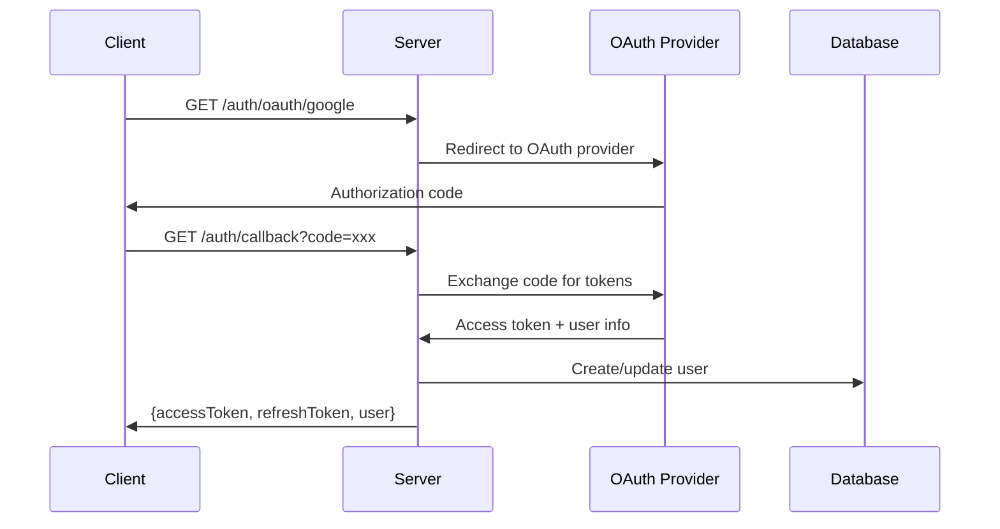

# Authentication System

This section explains **how SveltyCMS authentication works** - from JWT implementation to OAuth integration and session management.

## How Authentication Works

### 🔑 [JWT Implementation](./Token_Management.md)

**Token generation and validation**

- JWT structure and claims
- Token signing and verification
- Refresh token handling
- Token expiration management

### 🌐 [OAuth Integration](./OAuth_Implementation.md)

**Google OAuth flow**

- OAuth 2.0 implementation
- Provider configuration
- Callback handling
- User account linking

### 🔒 [Session Management](./Session_Management.md)

**Secure session handling**

- Session creation and storage
- Session validation
- Session cleanup
- Security considerations

### 🛡️ [Implementation Details](./Implementation.md)

**Technical implementation**

- Authentication middleware
- Route protection
- API authentication
- Error handling

## Authentication Flow

### Standard Login Flow

### OAuth Flow

## Key Concepts

- **JWT Tokens**: Stateless authentication with signed tokens
- **Refresh Tokens**: Long-lived tokens for access token renewal
- **OAuth Integration**: Third-party authentication support
- **Session Security**: Secure session management with HTTPOnly cookies
- **Role-based Access**: Integration with authorization system

## Security Features

- **Token Signing**: HMAC-SHA256 or RSA signatures
- **Token Rotation**: Automatic refresh token rotation
- **Rate Limiting**: Login attempt rate limiting
- **Session Timeout**: Configurable session expiration
- **CSRF Protection**: Cross-site request forgery prevention
