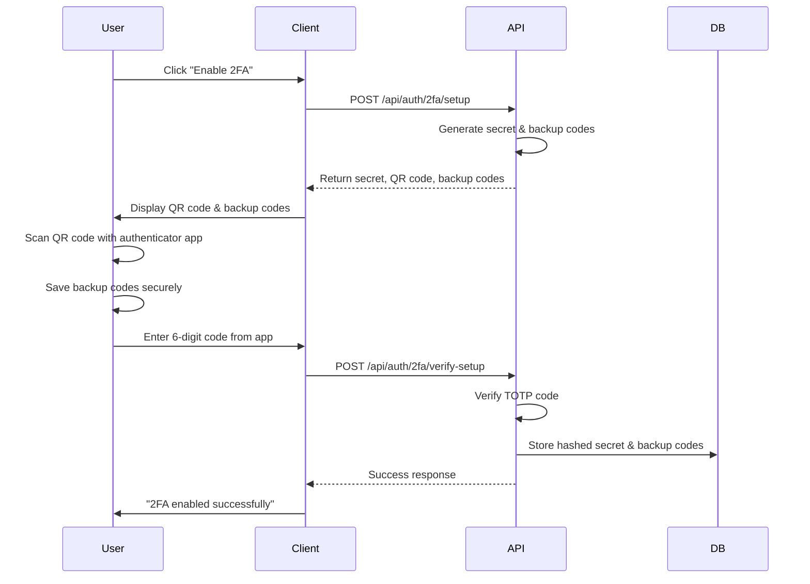
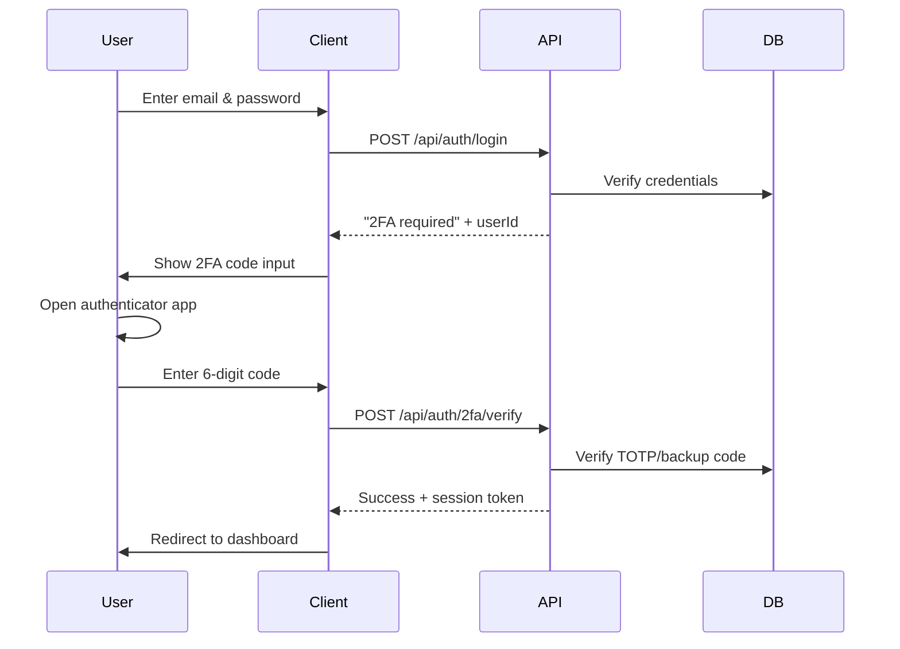

# Two-Factor Authentication API

## Overview

This document provides a complete reference for all Two-Factor Authentication (2FA) API endpoints in SveltyCMS. The 2FA system uses Time-based One-Time Passwords (TOTP) compatible with authenticator apps like Google Authenticator, Authy, and 1Password.

### Quantum Computing Security

The 2FA implementation uses **quantum-resistant cryptography**:

- **Backup codes**: Hashed with Argon2id (memory-hard, quantum-resistant)
- **TOTP secrets**: Stored with AES-256-GCM encryption (128-bit quantum security)
- **SHA-256 hashing**: Maintains security even with Grover's algorithm
- **No RSA/ECC**: Avoids public-key crypto vulnerable to Shor's algorithm
- **Security timeline**: Secure against quantum computers for 15-30+ years

While TOTP itself uses SHA-1 (TOTP standard), the secret storage and backup code hashing use quantum-resistant algorithms. See [Quantum Security Guide](/docs/architecture/quantum-security.mdx) for details.

## Authentication

All 2FA endpoints require the user to be authenticated via session cookie:

```http
Cookie: session=your-session-id
```

**Base Path:** `/api/auth/2fa`

## Endpoints

### 1. Setup 2FA

Initiates the 2FA setup process for the authenticated user. This generates a new TOTP secret, QR code, and backup codes.

#### Request

```http
POST /api/auth/2fa/setup
```

**Headers:**

```http
Cookie: session=your-session-id
Content-Type: application/json
```

**Permissions Required:** Authenticated user only

**Preconditions:**

- User must be authenticated
- 2FA must NOT already be enabled for the user

#### Response

**Success (200):**

```json
{
	"success": true,
	"data": {
		"secret": "JBSWY3DPEHPK3PXP",
		"qrCodeURL": "otpauth://totp/SveltyCMS:user@example.com?secret=JBSWY3DPEHPK3PXP&issuer=SveltyCMS",
		"manualEntryDetails": {
			"issuer": "SveltyCMS",
			"account": "user@example.com",
			"secret": "JBSWY3DPEHPK3PXP",
			"algorithm": "SHA1",
			"digits": 6,
			"period": 30
		},
		"backupCodes": ["A1B2C3D4", "E5F6G7H8", "I9J0K1L2", "M3N4O5P6", "Q7R8S9T0", "U1V2W3X4", "Y5Z6A7B8", "C9D0E1F2", "G3H4I5J6", "K7L8M9N0"]
	},
	"message": "2FA setup initiated. Please save your backup codes and scan the QR code with your authenticator app."
}
```

**Error Responses:**

```json
// 401 Unauthorized - User not authenticated
{
  "message": "Authentication required"
}

// 400 Bad Request - 2FA already enabled
{
  "message": "2FA is already enabled for this account"
}

// 500 Internal Server Error
{
  "message": "Failed to initiate 2FA setup"
}
```

#### Important Notes

- **Save the secret and backup codes immediately** - they cannot be retrieved again
- The QR code URL can be used to generate a QR code image for scanning
- Manual entry details are provided for authenticator apps that don't support QR codes
- The setup is NOT complete until the verification step succeeds

---

### 2. Verify Setup

Completes the 2FA setup by verifying the first TOTP code from the user's authenticator app.

#### Request

```http
POST /api/auth/2fa/verify-setup
```

**Headers:**

```http
Cookie: session=your-session-id
Content-Type: application/json
```

**Body:**

```json
{
	"secret": "JBSWY3DPEHPK3PXP",
	"verificationCode": "123456",
	"backupCodes": ["A1B2C3D4", "E5F6G7H8", "I9J0K1L2", "M3N4O5P6", "Q7R8S9T0", "U1V2W3X4", "Y5Z6A7B8", "C9D0E1F2", "G3H4I5J6", "K7L8M9N0"]
}
```

**Permissions Required:** Authenticated user only

**Preconditions:**

- User must be authenticated
- 2FA must NOT already be enabled
- Secret must match the one generated in setup
- Verification code must be valid

#### Response

**Success (200):**

```json
{
	"success": true,
	"message": "2FA has been successfully enabled for your account. Please save your backup codes in a secure location."
}
```

**Error Responses:**

```json
// 401 Unauthorized
{
  "message": "Authentication required"
}

// 400 Bad Request - Invalid code
{
  "message": "Invalid verification code. Please try again."
}

// 400 Bad Request - Already enabled
{
  "message": "2FA is already enabled for this account"
}

// 500 Internal Server Error
{
  "message": "Failed to complete 2FA setup"
}
```

#### Important Notes

- Once verified, 2FA is immediately active
- The secret and backup codes are securely stored (hashed)
- The user will be required to provide a 2FA code on future logins

---

### 3. Verify 2FA Code

Verifies a 2FA code during authentication or for sensitive operations. Supports both TOTP codes and backup codes.

#### Request

```http
POST /api/auth/2fa/verify
```

**Headers:**

```http
Content-Type: application/json
```

**Body:**

```json
{
	"userId": "user123",
	"code": "123456"
}
```

**Permissions Required:** None (used during authentication)

#### Response

**Success (200) - TOTP Code:**

```json
{
	"success": true,
	"message": "2FA verification successful",
	"method": "totp",
	"backupCodeUsed": false
}
```

**Success (200) - Backup Code:**

```json
{
	"success": true,
	"message": "2FA verification successful using backup code. 9 backup codes remaining.",
	"method": "backup",
	"backupCodeUsed": true
}
```

**Failed Verification (200):**

```json
{
	"success": false,
	"message": "Invalid 2FA code"
}
```

**Error Responses:**

```json
// 500 Internal Server Error
{
	"message": "Failed to verify 2FA code"
}
```

#### Important Notes

- This endpoint returns 200 even for failed verification (check `success` field)
- Backup codes are single-use and removed after successful verification
- The `backupCodeUsed` field indicates if a backup code was consumed
- TOTP codes are valid for 30 seconds (standard TOTP window)

---

### 4. Disable 2FA

Disables two-factor authentication for the authenticated user.

#### Request

```http
POST /api/auth/2fa/disable
```

**Headers:**

```http
Cookie: session=your-session-id
Content-Type: application/json
```

**Permissions Required:** Authenticated user only

**Preconditions:**

- User must be authenticated
- 2FA must be enabled

#### Response

**Success (200):**

```json
{
	"success": true,
	"message": "2FA has been disabled for your account."
}
```

**Error Responses:**

```json
// 401 Unauthorized
{
  "message": "Authentication required"
}

// 400 Bad Request - 2FA not enabled
{
  "message": "2FA is not enabled for this account"
}

// 500 Internal Server Error
{
  "message": "Failed to disable 2FA"
}
```

#### Important Notes

- All 2FA data (secret, backup codes) is removed
- User will no longer be prompted for 2FA codes
- This action should require additional verification (password confirmation) in production

---

### 5. Get 2FA Status

Retrieves the current 2FA status for the authenticated user.

#### Request

```http
GET /api/auth/2fa/backup-codes
```

**Headers:**

```http
Cookie: session=your-session-id
```

**Permissions Required:** Authenticated user only

#### Response

**Success (200):**

```json
{
	"success": true,
	"data": {
		"enabled": true,
		"hasBackupCodes": true,
		"backupCodesCount": 10,
		"lastVerification": "2025-10-05T14:30:00Z"
	}
}
```

**Error Responses:**

```json
// 401 Unauthorized
{
  "message": "Authentication required"
}

// 500 Internal Server Error
{
  "message": "Failed to get 2FA status"
}
```

---

### 6. Regenerate Backup Codes

Generates a new set of backup codes, invalidating the old ones.

#### Request

```http
POST /api/auth/2fa/backup-codes
```

**Headers:**

```http
Cookie: session=your-session-id
Content-Type: application/json
```

**Permissions Required:** Authenticated user only

**Preconditions:**

- User must be authenticated
- 2FA must be enabled

#### Response

**Success (200):**

```json
{
	"success": true,
	"data": {
		"backupCodes": ["A1B2C3D4", "E5F6G7H8", "I9J0K1L2", "M3N4O5P6", "Q7R8S9T0", "U1V2W3X4", "Y5Z6A7B8", "C9D0E1F2", "G3H4I5J6", "K7L8M9N0"]
	},
	"message": "New backup codes generated. Please save these codes in a secure location. Your old backup codes are no longer valid."
}
```

**Error Responses:**

```json
// 401 Unauthorized
{
  "message": "Authentication required"
}

// 400 Bad Request - 2FA not enabled
{
  "message": "2FA is not enabled for this account"
}

// 500 Internal Server Error
{
  "message": "Failed to regenerate backup codes"
}
```

#### Important Notes

- **Old backup codes are immediately invalidated**
- Store these codes securely - they are only shown once
- Each code can only be used once
- Users should regenerate codes if they suspect compromise

---

## Integration Flow

### Complete 2FA Setup Flow



### Login with 2FA Flow



---

## Security Considerations

### TOTP Implementation

- **Algorithm:** SHA-1 (TOTP standard)
- **Digits:** 6
- **Period:** 30 seconds
- **Time window:** ±1 period (prevents timing issues)

### Backup Codes

- **Format:** 8 alphanumeric characters
- **Storage:** Quantum-resistant hashing using Argon2id (64 MB memory-hard)
- **Single-use:** Automatically removed after use
- **Count:** 10 codes per user
- **Quantum security:** Memory-hard hashing resists quantum speedup

### Best Practices

1. **Always save backup codes** - Store them in a password manager or secure location
2. **Verify setup immediately** - Test the authenticator app before closing the setup dialog
3. **Regenerate if compromised** - Use the regenerate endpoint if codes are exposed
4. **Monitor backup code usage** - Track remaining codes via the status endpoint
5. **Secure the secret** - Never expose the TOTP secret after setup

---

## Database Schema

The 2FA data is stored in the User model:

```typescript
interface User {
	// ... other fields
	is2FAEnabled?: boolean; // Whether 2FA is active
	totpSecret?: string; // Encrypted TOTP secret
	backupCodes?: string[]; // Hashed backup codes
	last2FAVerification?: Date; // Last successful verification
}
```

---

## Error Handling

All endpoints follow consistent error patterns:

- **401:** Authentication required
- **400:** Bad request (precondition failed, invalid input)
- **500:** Server error (database failure, crypto error)

Errors include descriptive messages for debugging.

---

## Testing

### Manual Testing with cURL

**Setup 2FA:**

```bash
curl -X POST http://localhost:5173/api/auth/2fa/setup \
  -H "Cookie: session=your-session-cookie" \
  -H "Content-Type: application/json"
```

**Verify Setup:**

```bash
curl -X POST http://localhost:5173/api/auth/2fa/verify-setup \
  -H "Cookie: session=your-session-cookie" \
  -H "Content-Type: application/json" \
  -d '{
    "secret": "YOUR_SECRET",
    "verificationCode": "123456",
    "backupCodes": ["A1B2C3D4", "E5F6G7H8", ...]
  }'
```

**Verify 2FA Code:**

```bash
curl -X POST http://localhost:5173/api/auth/2fa/verify \
  -H "Content-Type: application/json" \
  -d '{
    "userId": "user123",
    "code": "123456"
  }'
```

### Automated Testing

See `tests/playwright/2fa.test.ts` for comprehensive E2E tests.

---

## Related Documentation

- [Authentication System](/docs/Dev_Guide/01_Authentication/Authentication_System.mdx)
- [User Management API](/docs/Dev_Guide/API_User_Token_Management.md)
- [Security Plugin](/docs/Dev_Guide/Security_Plugin.mdx)
- [Cryptography Module](/docs/Dev_Guide/Cryptography_Module.mdx)

---

## Implementation Details

For implementation details, see:

- `src/databases/auth/twoFactorAuth.ts` - Service layer
- `src/databases/auth/totp.ts` - TOTP and backup code utilities
- `src/routes/api/auth/2fa/` - API endpoint implementations
