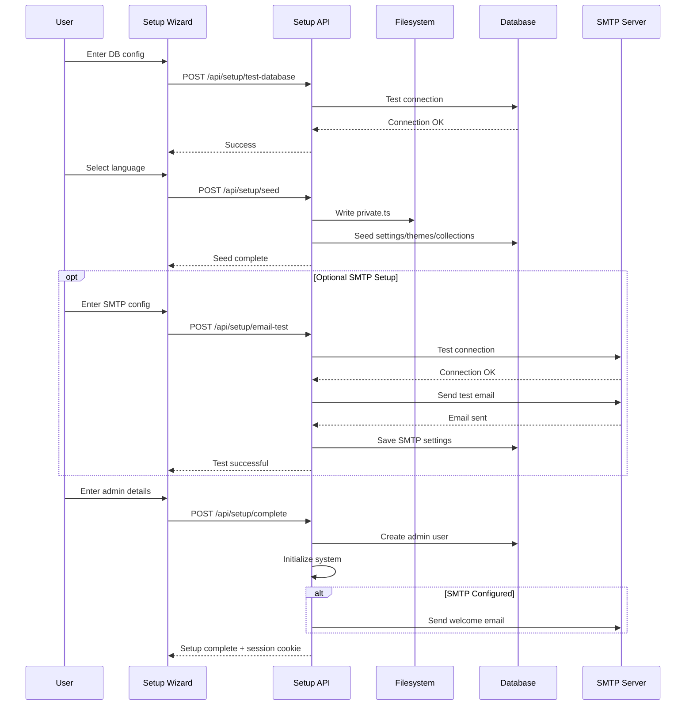
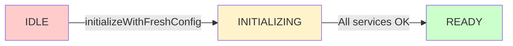
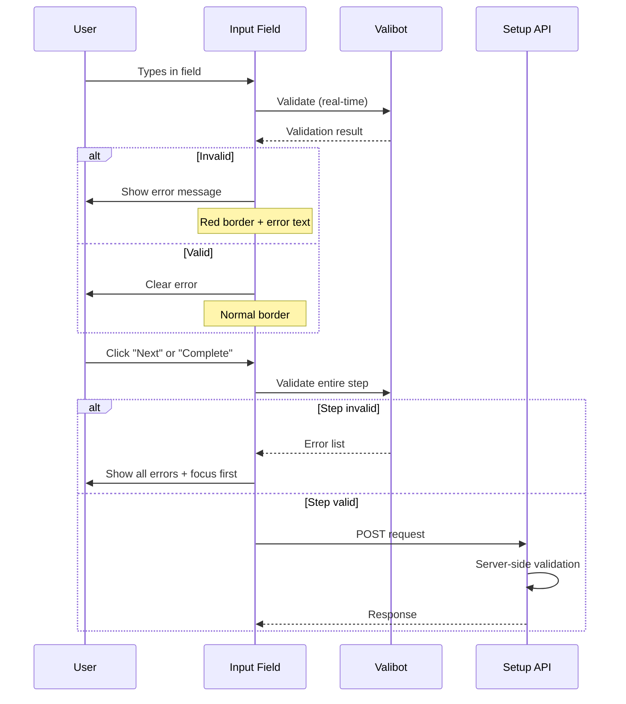

# Setup API Reference

The Setup API provides endpoints for the initial configuration and setup of a fresh SveltyCMS installation. These endpoints are **only accessible during the initial setup phase** before the system has been fully configured.

> The setup wizard includes real-time client-side validation using Valibot, intelligent error classification, and auto-save functionality for improved user experience. See the [Setup Wizard Guide](/docs/guides/setup-wizard.mdx) for complete UI documentation.

## Table of Contents

- [Overview](#overview)
- [Authentication](#authentication)
- [Endpoints](#endpoints)
  - [Test Database Connection](#test-database-connection)
  - [Install Database Driver](#install-database-driver)
  - [Seed Database](#seed-database)
  - [Test SMTP Configuration (Optional)](#test-smtp-configuration-optional)
  - [Complete Setup](#complete-setup)
- [Setup Workflow](#setup-workflow)
- [Validation](#validation)
- [Error Handling](#error-handling)
- [Security Considerations](#security-considerations)

---

## Overview

The setup process consists of four main API calls:

1. **Test Database** - Validates database connection and installs required drivers
2. **Seed Database** - Writes configuration file and seeds default data
3. **Test SMTP** (Optional) - Validates email configuration and sends test email
4. **Complete Setup** - Creates admin user and initializes the system



---

## Authentication

### Setup Mode Only

These endpoints are **only accessible when the system is in setup mode**:

- Config file (`config/private.ts`) doesn't exist OR
- Config file exists but has empty values (not yet configured) OR
- Config file exists but database has no admin users

### Automatic Disabling & Security

Once setup is complete (config file has valid values):

- **The `/setup` page** redirects to `/login` (302 redirect)
- **All `/api/setup/*` endpoints** return `403 Forbidden` with error message
- System enters normal operation mode
- Ongoing system configuration is managed via `/api/settings/*` endpoints (see [Settings API](./Settings_API.mdx))

**Security Rationale:**

Blocking setup API endpoints after completion prevents:

- Unauthorized database connection testing and information disclosure
- Potential re-seeding or data manipulation attempts
- Exposure of system configuration details
- Processing of unnecessary requests

> **Note:** The setup process creates initial system settings in the database. After setup, these settings are managed through the [Settings API](./Settings_API.mdx), NOT by re-running setup endpoints.

---

## Endpoints

### Test Database Connection

Tests the database connection and automatically installs required drivers if missing.

#### Request

```http
POST /api/setup/test-database
Content-Type: application/json

{
  "type": "mongodb" | "mongodb+srv",
  "host": "localhost",
  "port": 27017,
  "name": "sveltycms",
  "user": "admin",
  "password": "secret123"
}
```

#### Parameters

| Field      | Type   | Required | Description                                          |
| ---------- | ------ | -------- | ---------------------------------------------------- |
| `type`     | string | Yes      | Database type: `mongodb` or `mongodb+srv` (Atlas)    |
| `host`     | string | Yes      | Database host (domain or IP)                         |
| `port`     | number | No       | Port number (default: 27017 for MongoDB)             |
| `name`     | string | Yes      | Database name to use                                 |
| `user`     | string | No       | Username for authentication (optional for localhost) |
| `password` | string | No       | Password for authentication                          |

#### Response (Success)

```json
{
	"success": true,
	"message": "Database connection successful",
	"details": {
		"connectionString": "mongodb://localhost:27017/sveltycms",
		"authenticated": true,
		"serverVersion": "7.0.0",
		"dbStats": {
			"collections": 0,
			"dataSize": 0,
			"indexSize": 0
		},
		"warnings": []
	}
}
```

#### Response (Failure)

```json
{
	"success": false,
	"error": "Connection timeout: Could not connect to database",
	"errorType": "NETWORK_ERROR",
	"details": {
		"errorCode": "ETIMEDOUT",
		"message": "Connection timed out after 15000ms"
	}
}
```

#### Auto-Installation

If the MongoDB driver (`mongoose`) is not installed, the endpoint will:

1. Detect the package manager (bun/npm/pnpm/yarn)
2. Automatically install `mongoose`
3. Retry the connection test
4. Return the test results

#### Error Types

| Error Type       | Description                               |
| ---------------- | ----------------------------------------- |
| `NETWORK_ERROR`  | Cannot reach database server              |
| `AUTH_ERROR`     | Invalid credentials                       |
| `DATABASE_ERROR` | Database-specific error                   |
| `CONFIG_ERROR`   | Invalid configuration parameters          |
| `DRIVER_ERROR`   | Failed to install or load database driver |

---

### Install Database Driver

Automatically installs the required database driver (currently MongoDB/Mongoose) if it's not already installed. This endpoint is called automatically by the test-database endpoint but can also be called directly.

#### Request

```http
POST /api/setup/install-driver
Content-Type: application/json

{
  "dbType": "mongodb"
}
```

#### Parameters

| Field    | Type   | Required | Description                               |
| -------- | ------ | -------- | ----------------------------------------- |
| `dbType` | string | Yes      | Database type: `mongodb` (others planned) |

#### Response (Success)

```json
{
	"success": true,
	"message": "Successfully installed driver for mongodb",
	"alreadyInstalled": false
}
```

#### Response (Already Installed)

```json
{
	"success": true,
	"message": "Driver for mongodb is already installed",
	"alreadyInstalled": true
}
```

#### Response (Failure)

```json
{
	"success": false,
	"error": "Failed to install driver: npm install mongoose exited with code 1"
}
```

#### Installation Process

1. **Detect Package Manager**: Checks for lock files (bun.lockb, package-lock.json, pnpm-lock.yaml, yarn.lock)
2. **Check Existing Installation**: Tests if `mongoose` can be imported
3. **Install Driver**: Runs appropriate package manager command
4. **Verify Installation**: Confirms driver can be loaded

**Supported Package Managers**:

- Bun (recommended for SveltyCMS)
- npm
- pnpm
- Yarn

**Installation Commands**:

```bash
# Bun
bun add mongoose

# npm
npm install mongoose

# pnpm
pnpm add mongoose

# Yarn
yarn add mongoose
```

---

### Seed Database

Writes the configuration file and seeds the database with default data including system settings.

> **Important:** This endpoint creates the **initial** system settings in the database. After setup is complete, these settings are managed through the [Settings API](./Settings_API.mdx) (`/api/settings/*`), not by re-running this endpoint.

#### Request

```http
POST /api/setup/seed
Content-Type: application/json

{
  "type": "mongodb",
  "host": "localhost",
  "port": 27017,
  "name": "sveltycms",
  "user": "admin",
  "password": "secret123"
}
```

#### Process

1. **Write Configuration File** (`config/private.ts`)
   - Database credentials
   - Generated JWT secret (32 bytes, base64)
   - Generated encryption key (32 bytes, base64)

2. **Create Database Adapter**
   - Connects to database
   - Initializes authentication models

3. **Seed Default Data**
   - **Settings**: 53 public settings + 23 private settings
   - **Themes**: Default SveltyCMS theme
   - **Collections**: Scans and registers collection models

#### Response (Success)

```json
{
	"success": true,
	"message": "Database initialized successfully! ✨",
	"firstCollection": {
		"name": "Posts",
		"path": "/Collections/Posts"
	}
}
```

#### Response (Failure)

```json
{
	"success": false,
	"error": "Failed to write configuration file",
	"details": {
		"message": "EACCES: permission denied, open 'config/private.ts'",
		"code": "EACCES"
	},
	"message": "Initialization failed, but you can continue. Data will be created on first use."
}
```

#### Created Collections

After seeding, the following database collections exist:

```
system_settings          ← Public/private configuration
system_themes            ← Theme configurations
system_content_structure ← Navigation hierarchy (empty)
auth_users              ← User accounts (empty)
auth_sessions           ← User sessions (empty)
collection_<uuid>       ← Per-collection data tables
```

#### Seeded Settings

**Public Settings (53 keys):**

- Host configuration (DEV/PROD URLs)
- Site configuration (name, password length)
- Language settings (default locale, available languages)
- Media configuration (storage type, sizes, formats)
- Theme configuration
- Logging configuration

**Private Settings (23 keys):**

- 2FA configuration
- SMTP configuration
- OAuth configuration (Google)
- Redis configuration
- Cache TTL settings

See `/docs/architecture/initialization-workflow.mdx` for complete list.

---

### Test SMTP Configuration (Optional)

Tests SMTP connection and optionally sends a test email. This endpoint is **optional** and can be skipped during setup. SMTP settings can be configured later via the admin panel.

#### Request

```http
POST /api/setup/email-test
Content-Type: application/json

{
  "host": "smtp.gmail.com",
  "port": 587,
  "user": "your-email@gmail.com",
  "password": "your-app-password",
  "from": "noreply@example.com",
  "secure": true,
  "testRecipient": "admin@example.com",
  "saveToDatabase": true
}
```

#### Request Body Parameters

| Parameter        | Type    | Required | Description                                           |
| ---------------- | ------- | -------- | ----------------------------------------------------- |
| `host`           | string  | Yes      | SMTP server hostname (e.g., `smtp.gmail.com`)         |
| `port`           | number  | Yes      | SMTP port (587 for TLS, 465 for SSL)                  |
| `user`           | string  | Yes      | SMTP username/email                                   |
| `password`       | string  | Yes      | SMTP password or app-specific password                |
| `from`           | string  | No       | Sender email address (defaults to `user`)             |
| `secure`         | boolean | No       | Use TLS/STARTTLS (default: `true`)                    |
| `testRecipient`  | string  | No       | Email address to send test email to                   |
| `saveToDatabase` | boolean | No       | Whether to save settings to database (default: false) |

#### Common SMTP Providers

**Gmail:**

```json
{
	"host": "smtp.gmail.com",
	"port": 587,
	"user": "your-email@gmail.com",
	"password": "your-app-password",
	"secure": true
}
```

> Note: Use [App Passwords](https://support.google.com/accounts/answer/185833) for Gmail, not your regular password.

**Outlook/Office365:**

```json
{
	"host": "smtp.office365.com",
	"port": 587,
	"user": "your-email@outlook.com",
	"password": "your-password",
	"secure": true
}
```

**SendGrid:**

```json
{
	"host": "smtp.sendgrid.net",
	"port": 587,
	"user": "apikey",
	"password": "your-sendgrid-api-key",
	"secure": true
}
```

#### Success Response (200 OK)

```json
{
	"success": true,
	"message": "SMTP connection successful! Test email sent.",
	"testEmailSent": true,
	"saved": true,
	"latencyMs": 1234
}
```

#### Error Response (400 Bad Request)

```json
{
	"success": false,
	"error": "Authentication failed. Please check your username and password.",
	"latencyMs": 567
}
```

#### Common Error Codes

| Error Code     | Meaning               | Solution                                    |
| -------------- | --------------------- | ------------------------------------------- |
| `EAUTH`        | Authentication failed | Check username/password                     |
| `ECONNREFUSED` | Connection refused    | Check host/port or firewall                 |
| `ETIMEDOUT`    | Connection timed out  | Check network connectivity                  |
| `ENOTFOUND`    | Host not found        | Verify SMTP server address                  |
| `ESOCKET`      | TLS/SSL error         | Try different port (587 vs 465) or `secure` |

#### Saved Settings

When `saveToDatabase: true`, the following settings are saved to `system_settings` collection:

- `SMTP_HOST`
- `SMTP_PORT`
- `SMTP_USER`
- `SMTP_PASS` (encrypted)
- `SMTP_FROM`
- `SMTP_SECURE`

These settings are used by `/api/sendMail` for:

- User registration emails
- Password reset emails
- Two-factor authentication codes
- System notifications
- Content workflow notifications

#### Why SMTP is Needed

SMTP configuration enables:

1. **User Management** - Welcome emails, account verification
2. **Password Recovery** - Reset tokens and recovery emails
3. **Two-Factor Authentication** - Security codes via email
4. **System Notifications** - Error reports, backup confirmations
5. **Content Workflow** - Approval notifications, content updates

#### Skipping SMTP Setup

If SMTP is not configured during setup:

- The system will function normally
- Email-dependent features will be disabled
- SMTP can be configured later in **System Settings → Email**
- The `skipWelcomeEmail` flag should be passed to `/api/setup/complete`

---

### Complete Setup

Creates the admin user, initializes the global system, and provides a session cookie for immediate login.

#### Request

```http
POST /api/setup/complete
Content-Type: application/json

{
  "admin": {
    "username": "admin",
    "email": "admin@example.com",
    "password": "SecurePass123!",
    "confirmPassword": "SecurePass123!"
  },
  "firstCollection": {
    "name": "Posts",
    "path": "/Collections/Posts"
  }
}
```

#### Parameters

| Field                   | Type   | Required | Description                             |
| ----------------------- | ------ | -------- | --------------------------------------- |
| `admin.username`        | string | Yes      | Admin username (3-50 chars)             |
| `admin.email`           | string | Yes      | Valid email address                     |
| `admin.password`        | string | Yes      | Password (min 8 chars, see validation)  |
| `admin.confirmPassword` | string | Yes      | Must match password                     |
| `firstCollection.name`  | string | No       | Name of first collection (from seed)    |
| `firstCollection.path`  | string | No       | Path to first collection (for redirect) |

#### Password Validation

Passwords must meet these requirements:

- Minimum 8 characters (configured via `PASSWORD_LENGTH` setting)
- At least one uppercase letter
- At least one lowercase letter
- At least one number
- At least one special character

#### Process

1. **Validate Admin Data**
   - Check password strength
   - Verify email format
   - Confirm password match

2. **Parse Configuration** (Bypass Vite Cache)
   - Read `config/private.ts` directly from filesystem
   - Extract database credentials using regex

3. **Create Admin User + Session** (Single Transaction)
   - Insert into `auth_users` collection
   - Create session in `auth_sessions` collection
   - Role: `admin`, `isRegistered: true`

4. **Initialize Global System**
   - Reload `private.ts` into memory
   - Connect global `dbAdapter`
   - Load settings from database
   - Initialize ThemeManager, MediaFolder
   - **State Transition**: `IDLE → INITIALIZING → READY`

5. **Initialize ContentManager**
   - Scan compiled collections
   - Register collection models in database
   - Build content structure cache

6. **Invalidate Caches**
   - Clear settings cache
   - Clear setup completion cache

7. **Send Welcome Email** (Optional, Non-Fatal)
   - Uses `/api/sendMail` endpoint
   - Graceful failure if SMTP not configured

8. **Create Session Cookie**
   - HttpOnly, Secure (in production)
   - SameSite: Lax
   - Max age: 24 hours

#### Response (Success)

```json
{
	"success": true,
	"message": "Setup complete! Welcome to SveltyCMS! 🎉",
	"redirectPath": "/en/Collections/Posts",
	"loggedIn": true,
	"requiresHardReload": false,
	"requiresServerRestart": false
}
```

#### Response Headers (Success)

```http
HTTP/1.1 200 OK
Content-Type: application/json
Set-Cookie: session=<encrypted-session-id>; Path=/; HttpOnly; Secure; SameSite=Lax; Max-Age=86400
```

#### Response (Failure)

```json
{
	"success": false,
	"error": "Failed to create admin user: Email already exists"
}
```

#### System State After Completion



The system is now **fully operational** without requiring a server restart!

---

## Setup Workflow

### Complete Setup Flow with Timing

```mermaid
gantt
    title Setup Process Timeline
    dateFormat  ss
    axisFormat %S sec

    section Vite
    Vite startup           :00, 2s
    Create private.ts      :02, 1s
    Compile collections    :03, 2s
    Open browser           :05, 1s

    section User Input
    Enter DB config        :06, 30s
    Select language        :36, 5s
    Enter admin details    :41, 20s

    section API Calls
    Test database          :36, 3s
    Seed database          :41, 5s
    Complete setup         :61, 4s

    section System Init
    Initialize system      :65, 3s
    Load collections       :68, 2s
```



### Typical Timings

| Phase                | Duration      | Notes                            |
| -------------------- | ------------- | -------------------------------- |
| Vite Startup         | 2-5 seconds   | Includes TypeScript compilation  |
| Database Test        | 1-3 seconds   | May include driver installation  |
| Seed Database        | 3-8 seconds   | Depends on number of collections |
| Complete Setup       | 4-6 seconds   | Includes system initialization   |
| **Total Setup Time** | **10-25 sec** | Excluding user input time        |

---

## Validation

### Client-Side Validation

The setup wizard implements real-time validation using [Valibot](https://valibot.dev/) schemas before any API calls are made.

#### Database Configuration Schema

```typescript
import * as v from 'valibot';

export const dbConfigSchema = v.object({
	type: v.string(),
	host: v.pipe(v.string(), v.minLength(1, 'Host is required')),
	port: v.string(),
	name: v.pipe(v.string(), v.minLength(1, 'Database name is required')),
	user: v.string(),
	password: v.string()
});
```

#### Admin User Schema

```typescript
export const setupAdminSchema = v.object(
	{
		username: v.pipe(v.string(), v.minLength(3, 'Username must be at least 3 characters'), v.maxLength(50, 'Username must not exceed 50 characters')),
		email: v.pipe(v.string(), v.email('Invalid email address')),
		password: v.pipe(
			v.string(),
			v.minLength(8, 'Password must be at least 8 characters'),
			v.regex(/[A-Z]/, 'Must contain uppercase letter'),
			v.regex(/[a-z]/, 'Must contain lowercase letter'),
			v.regex(/[0-9]/, 'Must contain number'),
			v.regex(/[!@#$%^&*()_+\-=[\]{};':"\\|,.<>?]/, 'Must contain special character')
		),
		confirmPassword: v.string()
	},
	[
		v.forward(
			v.partialCheck([['password'], ['confirmPassword']], (input) => input.password === input.confirmPassword, 'Passwords do not match'),
			['confirmPassword']
		)
	]
);
```

#### System Settings Schema

```typescript
export const systemSettingsSchema = v.object({
	siteName: v.pipe(v.string(), v.minLength(1, 'Site name is required')),
	hostProd: v.pipe(v.string(), v.url('Must be a valid URL (e.g., https://mysite.com)')),
	defaultSystemLanguage: v.string(),
	systemLanguages: v.pipe(v.array(v.string()), v.minLength(1, 'At least one system language is required')),
	defaultContentLanguage: v.string(),
	contentLanguages: v.pipe(v.array(v.string()), v.minLength(1, 'At least one content language is required')),
	mediaStorageType: v.string(),
	mediaFolder: v.string()
});
```

#### Validation Flow



### Server-Side Validation

All endpoints perform server-side validation even though client-side validation exists. This provides security and handles edge cases where client validation is bypassed.

**Validation Points**:

1. **Request Body Structure** - JSON parsing and field presence
2. **Data Types** - String, number, boolean validation
3. **Business Rules** - Database connectivity, unique constraints
4. **Security Checks** - XSS prevention, SQL injection protection

**Example**:

```typescript
// Server-side validation (TypeScript)
function validateAdminUser(data: unknown) {
	if (!data || typeof data !== 'object') {
		throw new Error('Invalid request body');
	}

	const { username, email, password } = data as Record<string, unknown>;

	if (!username || typeof username !== 'string' || username.length < 3) {
		throw new Error('Username must be at least 3 characters');
	}

	if (!email || typeof email !== 'string' || !isValidEmail(email)) {
		throw new Error('Invalid email address');
	}

	if (!password || typeof password !== 'string' || password.length < 8) {
		throw new Error('Password must be at least 8 characters');
	}

	// Additional password complexity checks...
}
```

---

## Error Handling

All setup API endpoints return standardized error responses with classification to help the UI provide appropriate recovery options.

### Error Categories

Errors are classified into four categories based on their nature and recovery options:

#### 1. Validation Errors (`VALIDATION_ERROR`)

**Description**: User input doesn't meet requirements. **Recoverable** - user can fix and retry.

**Example:**

```json
{
	"success": false,
	"error": "Password must be at least 8 characters",
	"errorType": "VALIDATION_ERROR"
}
```

**Common Causes**:

- Password too short or missing complexity requirements
- Invalid email format
- Missing required fields
- Mismatched password confirmation
- Invalid URL format for host configuration

**Recovery**:

- Fix the validation error indicated in the message
- Check all fields meet requirements
- Retry the request

#### 2. Configuration Errors (`CONFIG_ERROR`)

**Description**: System configuration issues. **Recoverable** - admin can fix configuration.

**Example:**

```json
{
	"success": false,
	"error": "Unable to write to config/private.ts - check permissions",
	"errorType": "CONFIG_ERROR"
}
```

**Common Causes**:

- File system permission denied
- Config directory not writable
- Invalid file paths
- Missing environment variables
- Incorrect file structure

**Recovery**:

- Check filesystem permissions (`chmod 755 config/`)
- Verify user running the application has write access
- Ensure config directory exists
- Check disk space availability

#### 3. Network Errors (`NETWORK_ERROR`)

**Description**: Network/connectivity issues. **Recoverable** - wait and retry.

**Example:**

```json
{
	"success": false,
	"error": "Connection timeout",
	"errorType": "NETWORK_ERROR"
}
```

**Common Causes**:

- Database server not reachable
- Network connectivity issues
- Firewall blocking connection
- DNS resolution failures
- Timeout waiting for response

**Recovery**:

- Verify database server is running
- Check firewall rules and network connectivity
- Confirm host/port are correct
- Check if database accepts remote connections
- Retry after network is stable

#### 4. System Errors (`SYSTEM_ERROR`)

**Description**: Unexpected server-side errors. **May require technical support**.

**Example:**

```json
{
	"success": false,
	"error": "Failed to initialize system: TypeError: Cannot read property 'connect' of undefined",
	"errorType": "SYSTEM_ERROR"
}
```

**Common Causes**:

- Unhandled exceptions in server code
- Missing dependencies
- Database driver installation failures
- Out of memory errors
- Corrupted data or invalid state

**Recovery**:

- Check server logs for detailed stack traces
- Verify all dependencies are installed (`bun install`)
- Try restarting the application
- Check for system resource availability (memory, disk)
- Contact technical support if issue persists

### Error Response Format

All endpoints return errors in a consistent format:

```typescript
interface ErrorResponse {
	success: false;
	error: string; // Human-readable error message
	errorType?: string; // Category: VALIDATION_ERROR | CONFIG_ERROR | NETWORK_ERROR | SYSTEM_ERROR
	details?: unknown; // Optional additional context
}
```

### UI Error Handling

The setup wizard UI handles errors based on their category:

````typescript
// Example error handling in UI
async function handleApiCall(endpoint: string, data: unknown) {
  try {
    const response = await fetch(endpoint, {
      method: 'POST',
      headers: { 'Content-Type': 'application/json' },
      body: JSON.stringify(data)
    });

    const result = await response.json();

    if (!result.success) {
      switch (result.errorType) {
        case 'VALIDATION_ERROR':
          // Show inline validation errors
          showFieldErrors(result.error);
          break;
        case 'CONFIG_ERROR':
          // Show modal with configuration guidance
          showConfigHelp(result.error);
          break;
        case 'NETWORK_ERROR':
          // Show retry prompt
          showRetryDialog(result.error);
          break;
        case 'SYSTEM_ERROR':
        default:
          // Show error with support contact
          showSystemError(result.error);
          break;
      }
    }
  } catch (error) {
    // Handle fetch failures
    showNetworkError('Failed to connect to server');
  }
}

---

## Security Considerations

### During Setup

1. **No Authentication Required**
   - Setup endpoints bypass authentication
   - Only accessible when no admin users exist
   - Automatically disabled after setup

2. **Generated Secrets**
   - JWT secret: 32 bytes, base64 encoded
   - Encryption key: 32 bytes, base64 encoded
   - Cryptographically secure random generation

3. **Password Security**
   - Bcrypt hashing with salt
   - Minimum complexity requirements
   - Stored hashed in database

4. **Session Security**
   - HttpOnly cookies (XSS prevention)
   - Secure flag in production (HTTPS)
   - SameSite: Lax (CSRF mitigation)

### After Setup

1. **Endpoints Disabled**
   - All `/api/setup/*` endpoints return `403 Forbidden` with error message
   - Setup wizard page (`/setup`) redirects to `/login`
   - This security measure prevents:
     - Database connection information disclosure
     - Unauthorized system reconfiguration attempts
     - Exposure of setup-specific functionality

2. **Settings Management Transition**
   - Initial system settings are created during setup via `/api/setup/seed`
   - After setup, modify settings through **[Settings API](/docs/api/Settings_API.mdx)**:
     - `GET /api/settings/[group]` - Retrieve settings
     - `PUT /api/settings/[group]` - Update settings
     - `DELETE /api/settings/[group]` - Reset to defaults
   - Settings changes are live and cached for performance
   - No server restart required for most settings

3. **Configuration Protection**
   - `config/private.ts` in `.gitignore`
   - Secrets never exposed to client
   - Credentials encrypted at rest

4. **Database Security**
   - Multi-tenant isolation (if enabled)
   - Role-based access control
   - Audit logging for admin actions

---

## Related Documentation

- [Initialization Workflow](/docs/architecture/initialization-workflow.mdx) - Complete setup workflow
- [Authentication API](/docs/api/Authentication_2FA_API.mdx) - User authentication
- [User Management API](/docs/api/User_Management_API.mdx) - User CRUD operations
- [Settings API](/docs/api/Settings_API.mdx) - System settings management

---

## Example: Complete Setup Script

```javascript
// Full setup automation example
async function setupSveltyCMS() {
	const config = {
		type: 'mongodb',
		host: 'localhost',
		port: 27017,
		name: 'sveltycms',
		user: 'admin',
		password: 'secret123'
	};

	// Step 1: Test database
	const testResponse = await fetch('/api/setup/test-database', {
		method: 'POST',
		headers: { 'Content-Type': 'application/json' },
		body: JSON.stringify(config)
	});

	if (!testResponse.ok) {
		throw new Error('Database test failed');
	}

	// Step 2: Seed database
	const seedResponse = await fetch('/api/setup/seed', {
		method: 'POST',
		headers: { 'Content-Type': 'application/json' },
		body: JSON.stringify(config)
	});

	const { firstCollection } = await seedResponse.json();

	// Step 3: Complete setup
	const completeResponse = await fetch('/api/setup/complete', {
		method: 'POST',
		headers: { 'Content-Type': 'application/json' },
		body: JSON.stringify({
			admin: {
				username: 'admin',
				email: 'admin@example.com',
				password: 'SecurePass123!',
				confirmPassword: 'SecurePass123!'
			},
			firstCollection
		})
	});

	const result = await completeResponse.json();
	console.log(result);
	// {
	//   success: true,
	//   redirectPath: '/en/Collections/Posts',
	//   loggedIn: true,
	//   requiresServerRestart: false
	// }

	// System is now ready!
	window.location.href = result.redirectPath;
}
````

---

This API provides a seamless, secure, and user-friendly setup experience with automatic driver installation, intelligent seeding, and zero-restart initialization.

---

## Related Documentation

- [Setup Wizard Guide](/docs/guides/setup-wizard.mdx) - Complete UI and UX documentation
- [Authentication 2FA API](/docs/api/Authentication_2FA_API.mdx) - User authentication system
- [User Management API](/docs/api/User_Management_API.mdx) - User CRUD operations
- [Configuration API](/docs/api/Configuration_API.mdx) - System configuration
- [Database Documentation](/docs/database/README.md) - Database adapters and connections
- [Initialization Workflow](/docs/architecture/initialization-workflow.mdx) - System startup sequence
- [Valibot Documentation](https://valibot.dev/) - Validation library reference

---
