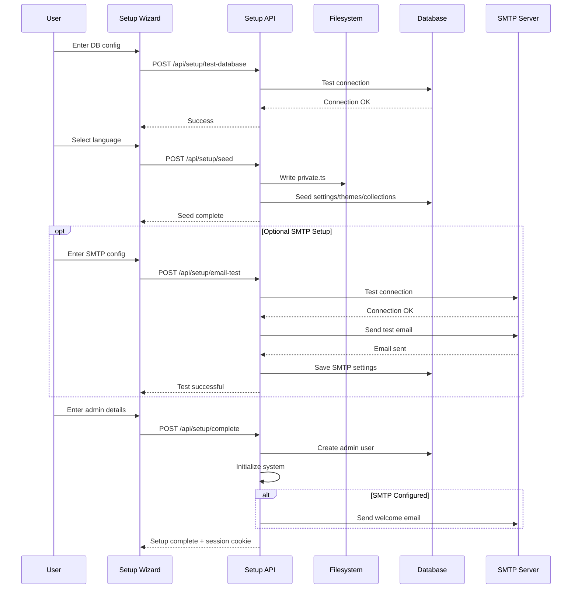
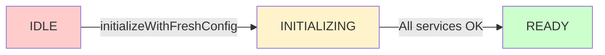

# Setup API Reference

The Setup API provides endpoints for the initial configuration and setup of a fresh SveltyCMS installation. These endpoints are **only accessible during the initial setup phase** before the system has been fully configured.

## Table of Contents

- [Overview](#overview)
- [Authentication](#authentication)
- [Endpoints](#endpoints)
  - [Test Database Connection](#test-database-connection)
  - [Seed Database](#seed-database)
  - [Test SMTP Configuration (Optional)](#test-smtp-configuration-optional)
  - [Complete Setup](#complete-setup)
- [Setup Workflow](#setup-workflow)
- [Error Handling](#error-handling)
- [Security Considerations](#security-considerations)

---

## Overview

The setup process consists of four main API calls:

1. **Test Database** - Validates database connection and installs required drivers
2. **Seed Database** - Writes configuration file and seeds default data
3. **Test SMTP** (Optional) - Validates email configuration and sends test email
4. **Complete Setup** - Creates admin user and initializes the system



---

## Authentication

### Setup Mode Only

These endpoints are **only accessible when the system is in setup mode**:

- Config file (`config/private.ts`) doesn't exist OR
- Config file exists but database has no admin users

### Automatic Disabling

Once setup is complete:

- These endpoints return `403 Forbidden`
- All requests redirect to `/login`
- System enters normal operation mode

---

## Endpoints

### Test Database Connection

Tests the database connection and automatically installs required drivers if missing.

#### Request

```http
POST /api/setup/test-database
Content-Type: application/json

{
  "type": "mongodb" | "mongodb+srv",
  "host": "localhost",
  "port": 27017,
  "name": "sveltycms",
  "user": "admin",
  "password": "secret123"
}
```

#### Parameters

| Field      | Type   | Required | Description                                          |
| ---------- | ------ | -------- | ---------------------------------------------------- |
| `type`     | string | Yes      | Database type: `mongodb` or `mongodb+srv` (Atlas)    |
| `host`     | string | Yes      | Database host (domain or IP)                         |
| `port`     | number | No       | Port number (default: 27017 for MongoDB)             |
| `name`     | string | Yes      | Database name to use                                 |
| `user`     | string | No       | Username for authentication (optional for localhost) |
| `password` | string | No       | Password for authentication                          |

#### Response (Success)

```json
{
	"success": true,
	"message": "Database connection successful",
	"details": {
		"connectionString": "mongodb://localhost:27017/sveltycms",
		"authenticated": true,
		"serverVersion": "7.0.0",
		"dbStats": {
			"collections": 0,
			"dataSize": 0,
			"indexSize": 0
		},
		"warnings": []
	}
}
```

#### Response (Failure)

```json
{
	"success": false,
	"error": "Connection timeout: Could not connect to database",
	"errorType": "NETWORK_ERROR",
	"details": {
		"errorCode": "ETIMEDOUT",
		"message": "Connection timed out after 15000ms"
	}
}
```

#### Auto-Installation

If the MongoDB driver (`mongoose`) is not installed, the endpoint will:

1. Detect the package manager (bun/npm/pnpm/yarn)
2. Automatically install `mongoose`
3. Retry the connection test
4. Return the test results

#### Error Types

| Error Type       | Description                               |
| ---------------- | ----------------------------------------- |
| `NETWORK_ERROR`  | Cannot reach database server              |
| `AUTH_ERROR`     | Invalid credentials                       |
| `DATABASE_ERROR` | Database-specific error                   |
| `CONFIG_ERROR`   | Invalid configuration parameters          |
| `DRIVER_ERROR`   | Failed to install or load database driver |

---

### Seed Database

Writes the configuration file and seeds the database with default data.

#### Request

```http
POST /api/setup/seed
Content-Type: application/json

{
  "type": "mongodb",
  "host": "localhost",
  "port": 27017,
  "name": "sveltycms",
  "user": "admin",
  "password": "secret123"
}
```

#### Process

1. **Write Configuration File** (`config/private.ts`)
   - Database credentials
   - Generated JWT secret (32 bytes, base64)
   - Generated encryption key (32 bytes, base64)

2. **Create Database Adapter**
   - Connects to database
   - Initializes authentication models

3. **Seed Default Data**
   - **Settings**: 53 public settings + 23 private settings
   - **Themes**: Default SveltyCMS theme
   - **Collections**: Scans and registers collection models

#### Response (Success)

```json
{
	"success": true,
	"message": "Database initialized successfully! ✨",
	"firstCollection": {
		"name": "Posts",
		"path": "/Collections/Posts"
	}
}
```

#### Response (Failure)

```json
{
	"success": false,
	"error": "Failed to write configuration file",
	"details": {
		"message": "EACCES: permission denied, open 'config/private.ts'",
		"code": "EACCES"
	},
	"message": "Initialization failed, but you can continue. Data will be created on first use."
}
```

#### Created Collections

After seeding, the following database collections exist:

```
system_settings          ← Public/private configuration
system_themes            ← Theme configurations
system_content_structure ← Navigation hierarchy (empty)
auth_users              ← User accounts (empty)
auth_sessions           ← User sessions (empty)
collection_<uuid>       ← Per-collection data tables
```

#### Seeded Settings

**Public Settings (53 keys):**

- Host configuration (DEV/PROD URLs)
- Site configuration (name, password length)
- Language settings (default locale, available languages)
- Media configuration (storage type, sizes, formats)
- Theme configuration
- Logging configuration

**Private Settings (23 keys):**

- 2FA configuration
- SMTP configuration
- OAuth configuration (Google)
- Redis configuration
- Cache TTL settings

See `/docs/architecture/initialization-workflow.mdx` for complete list.

---

### Test SMTP Configuration (Optional)

Tests SMTP connection and optionally sends a test email. This endpoint is **optional** and can be skipped during setup. SMTP settings can be configured later via the admin panel.

#### Request

```http
POST /api/setup/email-test
Content-Type: application/json

{
  "host": "smtp.gmail.com",
  "port": 587,
  "user": "your-email@gmail.com",
  "password": "your-app-password",
  "from": "noreply@example.com",
  "secure": true,
  "testRecipient": "admin@example.com",
  "saveToDatabase": true
}
```

#### Request Body Parameters

| Parameter        | Type    | Required | Description                                           |
| ---------------- | ------- | -------- | ----------------------------------------------------- |
| `host`           | string  | Yes      | SMTP server hostname (e.g., `smtp.gmail.com`)         |
| `port`           | number  | Yes      | SMTP port (587 for TLS, 465 for SSL)                  |
| `user`           | string  | Yes      | SMTP username/email                                   |
| `password`       | string  | Yes      | SMTP password or app-specific password                |
| `from`           | string  | No       | Sender email address (defaults to `user`)             |
| `secure`         | boolean | No       | Use TLS/STARTTLS (default: `true`)                    |
| `testRecipient`  | string  | No       | Email address to send test email to                   |
| `saveToDatabase` | boolean | No       | Whether to save settings to database (default: false) |

#### Common SMTP Providers

**Gmail:**

```json
{
	"host": "smtp.gmail.com",
	"port": 587,
	"user": "your-email@gmail.com",
	"password": "your-app-password",
	"secure": true
}
```

> Note: Use [App Passwords](https://support.google.com/accounts/answer/185833) for Gmail, not your regular password.

**Outlook/Office365:**

```json
{
	"host": "smtp.office365.com",
	"port": 587,
	"user": "your-email@outlook.com",
	"password": "your-password",
	"secure": true
}
```

**SendGrid:**

```json
{
	"host": "smtp.sendgrid.net",
	"port": 587,
	"user": "apikey",
	"password": "your-sendgrid-api-key",
	"secure": true
}
```

#### Success Response (200 OK)

```json
{
	"success": true,
	"message": "SMTP connection successful! Test email sent.",
	"testEmailSent": true,
	"saved": true,
	"latencyMs": 1234
}
```

#### Error Response (400 Bad Request)

```json
{
	"success": false,
	"error": "Authentication failed. Please check your username and password.",
	"latencyMs": 567
}
```

#### Common Error Codes

| Error Code     | Meaning               | Solution                                    |
| -------------- | --------------------- | ------------------------------------------- |
| `EAUTH`        | Authentication failed | Check username/password                     |
| `ECONNREFUSED` | Connection refused    | Check host/port or firewall                 |
| `ETIMEDOUT`    | Connection timed out  | Check network connectivity                  |
| `ENOTFOUND`    | Host not found        | Verify SMTP server address                  |
| `ESOCKET`      | TLS/SSL error         | Try different port (587 vs 465) or `secure` |

#### Saved Settings

When `saveToDatabase: true`, the following settings are saved to `system_settings` collection:

- `SMTP_HOST`
- `SMTP_PORT`
- `SMTP_USER`
- `SMTP_PASS` (encrypted)
- `SMTP_FROM`
- `SMTP_SECURE`

These settings are used by `/api/sendMail` for:

- User registration emails
- Password reset emails
- Two-factor authentication codes
- System notifications
- Content workflow notifications

#### Why SMTP is Needed

SMTP configuration enables:

1. **User Management** - Welcome emails, account verification
2. **Password Recovery** - Reset tokens and recovery emails
3. **Two-Factor Authentication** - Security codes via email
4. **System Notifications** - Error reports, backup confirmations
5. **Content Workflow** - Approval notifications, content updates

#### Skipping SMTP Setup

If SMTP is not configured during setup:

- The system will function normally
- Email-dependent features will be disabled
- SMTP can be configured later in **System Settings → Email**
- The `skipWelcomeEmail` flag should be passed to `/api/setup/complete`

---

### Complete Setup

Creates the admin user, initializes the global system, and provides a session cookie for immediate login.

#### Request

```http
POST /api/setup/complete
Content-Type: application/json

{
  "admin": {
    "username": "admin",
    "email": "admin@example.com",
    "password": "SecurePass123!",
    "confirmPassword": "SecurePass123!"
  },
  "firstCollection": {
    "name": "Posts",
    "path": "/Collections/Posts"
  }
}
```

#### Parameters

| Field                   | Type   | Required | Description                             |
| ----------------------- | ------ | -------- | --------------------------------------- |
| `admin.username`        | string | Yes      | Admin username (3-50 chars)             |
| `admin.email`           | string | Yes      | Valid email address                     |
| `admin.password`        | string | Yes      | Password (min 8 chars, see validation)  |
| `admin.confirmPassword` | string | Yes      | Must match password                     |
| `firstCollection.name`  | string | No       | Name of first collection (from seed)    |
| `firstCollection.path`  | string | No       | Path to first collection (for redirect) |

#### Password Validation

Passwords must meet these requirements:

- Minimum 8 characters (configured via `PASSWORD_LENGTH` setting)
- At least one uppercase letter
- At least one lowercase letter
- At least one number
- At least one special character

#### Process

1. **Validate Admin Data**
   - Check password strength
   - Verify email format
   - Confirm password match

2. **Parse Configuration** (Bypass Vite Cache)
   - Read `config/private.ts` directly from filesystem
   - Extract database credentials using regex

3. **Create Admin User + Session** (Single Transaction)
   - Insert into `auth_users` collection
   - Create session in `auth_sessions` collection
   - Role: `admin`, `isRegistered: true`

4. **Initialize Global System**
   - Reload `private.ts` into memory
   - Connect global `dbAdapter`
   - Load settings from database
   - Initialize ThemeManager, MediaFolder
   - **State Transition**: `IDLE → INITIALIZING → READY`

5. **Initialize ContentManager**
   - Scan compiled collections
   - Register collection models in database
   - Build content structure cache

6. **Invalidate Caches**
   - Clear settings cache
   - Clear setup completion cache

7. **Send Welcome Email** (Optional, Non-Fatal)
   - Uses `/api/sendMail` endpoint
   - Graceful failure if SMTP not configured

8. **Create Session Cookie**
   - HttpOnly, Secure (in production)
   - SameSite: Lax
   - Max age: 24 hours

#### Response (Success)

```json
{
	"success": true,
	"message": "Setup complete! Welcome to SveltyCMS! 🎉",
	"redirectPath": "/en/Collections/Posts",
	"loggedIn": true,
	"requiresHardReload": false,
	"requiresServerRestart": false
}
```

#### Response Headers (Success)

```http
HTTP/1.1 200 OK
Content-Type: application/json
Set-Cookie: session=<encrypted-session-id>; Path=/; HttpOnly; Secure; SameSite=Lax; Max-Age=86400
```

#### Response (Failure)

```json
{
	"success": false,
	"error": "Failed to create admin user: Email already exists"
}
```

#### System State After Completion



The system is now **fully operational** without requiring a server restart!

---

## Setup Workflow

### Complete Setup Flow with Timing

```mermaid
gantt
    title Setup Process Timeline
    dateFormat  ss
    axisFormat %S sec

    section Vite
    Vite startup           :00, 2s
    Create private.ts      :02, 1s
    Compile collections    :03, 2s
    Open browser           :05, 1s

    section User Input
    Enter DB config        :06, 30s
    Select language        :36, 5s
    Enter admin details    :41, 20s

    section API Calls
    Test database          :36, 3s
    Seed database          :41, 5s
    Complete setup         :61, 4s

    section System Init
    Initialize system      :65, 3s
    Load collections       :68, 2s
```



### Typical Timings

| Phase                | Duration      | Notes                            |
| -------------------- | ------------- | -------------------------------- |
| Vite Startup         | 2-5 seconds   | Includes TypeScript compilation  |
| Database Test        | 1-3 seconds   | May include driver installation  |
| Seed Database        | 3-8 seconds   | Depends on number of collections |
| Complete Setup       | 4-6 seconds   | Includes system initialization   |
| **Total Setup Time** | **10-25 sec** | Excluding user input time        |

---

## Error Handling

### Common Errors

#### 1. Database Connection Failures

**Error:**

```json
{
	"success": false,
	"error": "Connection timeout",
	"errorType": "NETWORK_ERROR"
}
```

**Solutions:**

- Check firewall rules
- Verify database is running
- Check network connectivity
- Verify host/port are correct

#### 2. Permission Errors

**Error:**

```json
{
	"success": false,
	"error": "EACCES: permission denied, open 'config/private.ts'"
}
```

**Solutions:**

- Check filesystem permissions
- Ensure `config/` directory is writable
- Run with appropriate user permissions

#### 3. Validation Errors

**Error:**

```json
{
	"success": false,
	"error": "Invalid admin user data: Password must be at least 8 characters"
}
```

**Solutions:**

- Follow password requirements
- Ensure email format is valid
- Match password confirmation

#### 4. Mongoose/Driver Errors

**Error:**

```json
{
	"success": false,
	"error": "Failed to install driver: npm install mongoose failed"
}
```

**Solutions:**

- Check internet connection
- Verify package manager is installed
- Manually install: `npm install mongoose`

---

## Security Considerations

### During Setup

1. **No Authentication Required**
   - Setup endpoints bypass authentication
   - Only accessible when no admin users exist
   - Automatically disabled after setup

2. **Generated Secrets**
   - JWT secret: 32 bytes, base64 encoded
   - Encryption key: 32 bytes, base64 encoded
   - Cryptographically secure random generation

3. **Password Security**
   - Bcrypt hashing with salt
   - Minimum complexity requirements
   - Stored hashed in database

4. **Session Security**
   - HttpOnly cookies (XSS prevention)
   - Secure flag in production (HTTPS)
   - SameSite: Lax (CSRF mitigation)

### After Setup

1. **Endpoints Disabled**
   - All `/api/setup/*` return `403 Forbidden`
   - Setup wizard page redirects to `/login`

2. **Configuration Protection**
   - `config/private.ts` in `.gitignore`
   - Secrets never exposed to client
   - Credentials encrypted at rest

3. **Database Security**
   - Multi-tenant isolation (if enabled)
   - Role-based access control
   - Audit logging for admin actions

---

## Related Documentation

- [Initialization Workflow](/docs/architecture/initialization-workflow.mdx) - Complete setup workflow
- [Authentication API](/docs/api/Authentication_2FA_API.mdx) - User authentication
- [User Management API](/docs/api/User_Management_API.mdx) - User CRUD operations
- [Settings API](/docs/api/Settings_API.mdx) - System settings management

---

## Example: Complete Setup Script

```javascript
// Full setup automation example
async function setupSveltyCMS() {
	const config = {
		type: 'mongodb',
		host: 'localhost',
		port: 27017,
		name: 'sveltycms',
		user: 'admin',
		password: 'secret123'
	};

	// Step 1: Test database
	const testResponse = await fetch('/api/setup/test-database', {
		method: 'POST',
		headers: { 'Content-Type': 'application/json' },
		body: JSON.stringify(config)
	});

	if (!testResponse.ok) {
		throw new Error('Database test failed');
	}

	// Step 2: Seed database
	const seedResponse = await fetch('/api/setup/seed', {
		method: 'POST',
		headers: { 'Content-Type': 'application/json' },
		body: JSON.stringify(config)
	});

	const { firstCollection } = await seedResponse.json();

	// Step 3: Complete setup
	const completeResponse = await fetch('/api/setup/complete', {
		method: 'POST',
		headers: { 'Content-Type': 'application/json' },
		body: JSON.stringify({
			admin: {
				username: 'admin',
				email: 'admin@example.com',
				password: 'SecurePass123!',
				confirmPassword: 'SecurePass123!'
			},
			firstCollection
		})
	});

	const result = await completeResponse.json();
	console.log(result);
	// {
	//   success: true,
	//   redirectPath: '/en/Collections/Posts',
	//   loggedIn: true,
	//   requiresServerRestart: false
	// }

	// System is now ready!
	window.location.href = result.redirectPath;
}
```

---

This API provides a seamless, secure, and user-friendly setup experience with automatic driver installation, intelligent seeding, and zero-restart initialization.
