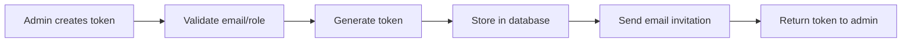
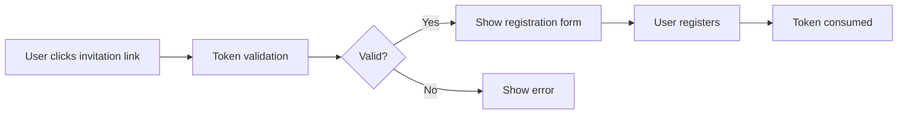
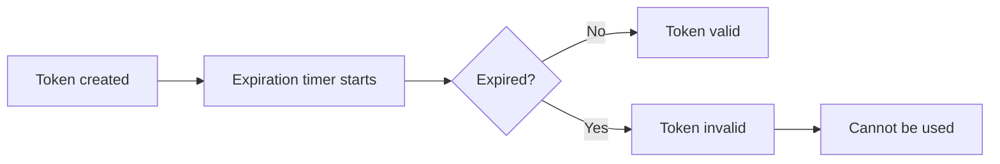

# Token API Endpoints Reference

## Overview

The Token API provides endpoints for managing user invitation tokens. These tokens are used to invite new users to register in the system with pre-assigned roles and expiration dates.

**Base Path:** `/api/token`

**Key Features:**

- ✅ Create invitation tokens with email and role assignment
- ✅ Update token details (role, expiration)
- ✅ Delete tokens individually or in batch
- ✅ Block/unblock tokens
- ✅ Multi-tenant support
- ✅ Email notifications with invitation links

---

## Endpoints Summary

| Method   | Endpoint                 | Description                             | Auth Required |
| -------- | ------------------------ | --------------------------------------- | ------------- |
| `POST`   | `/api/token/createToken` | Create new invitation token             | ✅ Admin      |
| `GET`    | `/api/token`             | List all tokens                         | ✅ Admin      |
| `PUT`    | `/api/token/[tokenID]`   | Update token details                    | ✅ Admin      |
| `DELETE` | `/api/token/[tokenID]`   | Delete a token                          | ✅ Admin      |
| `POST`   | `/api/token/batch`       | Batch operations (delete/block/unblock) | ✅ Admin      |

---

## 1. Create Invitation Token

Creates a new invitation token and optionally sends an email invitation.

### Endpoint

```
POST /api/token/createToken
```

### Request Body

```json
{
	"email": "newuser@example.com",
	"role": "editor",
	"expiresIn": "2 days"
}
```

#### Parameters

| Field       | Type   | Required | Description                                   |
| ----------- | ------ | -------- | --------------------------------------------- |
| `email`     | string | ✅       | Email address for the invitation              |
| `role`      | string | ✅       | Role ID to assign (admin, editor, user, etc.) |
| `expiresIn` | string | ✅       | Token validity period                         |

#### Valid `expiresIn` Values

- `"2 hrs"` - 2 hours
- `"12 hrs"` - 12 hours
- `"2 days"` - 2 days (default)
- `"1 week"` - 1 week (7 days)
- `"2 weeks"` - 2 weeks (14 days)
- `"1 month"` - 1 month (30 days)

### Response

#### Success (200 OK)

```json
{
	"success": true,
	"message": "Token created and email sent successfully.",
	"token": {
		"value": "abc123def456...",
		"expires": "2025-11-10T12:00:00.000Z"
	},
	"email_sent": true
}
```

#### Email Not Sent (SMTP Not Configured)

```json
{
	"success": true,
	"message": "Token created; email not sent - SMTP not configured.",
	"token": {
		"value": "abc123def456...",
		"expires": "2025-11-10T12:00:00.000Z"
	},
	"email_sent": false,
	"smtp_not_configured": true,
	"user_message": "Please configure email settings in System Settings."
}
```

#### Email Skipped (Development Mode)

```json
{
	"success": true,
	"message": "Token created; email sending skipped (development mode).",
	"token": {
		"value": "abc123def456...",
		"expires": "2025-11-10T12:00:00.000Z"
	},
	"email_sent": false,
	"dev_mode": true
}
```

#### Error Responses

**409 Conflict** - User already exists

```json
{
	"success": false,
	"message": "A user with this email address already exists in this tenant."
}
```

**409 Conflict** - Token already exists

```json
{
	"success": false,
	"message": "An invitation token for this email already exists in this tenant."
}
```

**400 Bad Request** - Invalid role

```json
{
	"success": false,
	"message": "Invalid role selected."
}
```

### Example Usage

#### cURL

```bash
curl -X POST https://cms.example.com/api/token/createToken \
  -H "Content-Type: application/json" \
  -H "Cookie: session=your-session-cookie" \
  -d '{
    "email": "newuser@example.com",
    "role": "editor",
    "expiresIn": "1 week"
  }'
```

#### JavaScript (Fetch)

```javascript
const response = await fetch('/api/token/createToken', {
	method: 'POST',
	headers: {
		'Content-Type': 'application/json'
	},
	body: JSON.stringify({
		email: 'newuser@example.com',
		role: 'editor',
		expiresIn: '1 week'
	})
});

const result = await response.json();
if (result.success) {
	console.log('Token created:', result.token.value);
	console.log('Expires:', result.token.expires);

	if (!result.email_sent) {
		if (result.smtp_not_configured) {
			console.warn('SMTP not configured - email not sent');
		} else if (result.dev_mode) {
			console.info('Development mode - email skipped');
		}
	}
}
```

---

## 2. List All Tokens

Retrieves all invitation tokens for the current tenant.

### Endpoint

```
GET /api/token
```

### Response

#### Success (200 OK)

```json
{
	"success": true,
	"data": {
		"tokens": [
			{
				"_id": "token123",
				"token": "abc123def456...",
				"email": "user1@example.com",
				"role": "editor",
				"expires": "2025-11-10T12:00:00.000Z",
				"type": "invite",
				"blocked": false,
				"consumed": false,
				"tenantId": "tenant1"
			},
			{
				"_id": "token456",
				"token": "xyz789ghi012...",
				"email": "user2@example.com",
				"role": "user",
				"expires": "2025-11-15T12:00:00.000Z",
				"type": "invite",
				"blocked": false,
				"consumed": false,
				"tenantId": "tenant1"
			}
		],
		"count": 2
	}
}
```

### Example Usage

#### cURL

```bash
curl -X GET https://cms.example.com/api/token \
  -H "Cookie: session=your-session-cookie"
```

#### JavaScript (Fetch)

```javascript
const response = await fetch('/api/token');
const result = await response.json();

if (result.success) {
	console.log(`Found ${result.data.count} tokens`);
	result.data.tokens.forEach((token) => {
		console.log(`${token.email} - ${token.role} - Expires: ${token.expires}`);
	});
}
```

---

## 3. Update Token

Updates an existing token's email, role, or expiration.

### Endpoint

```
PUT /api/token/[tokenID]
```

### Request Body

```json
{
	"newTokenData": {
		"email": "updated@example.com",
		"role": "admin",
		"expiresInHours": 168
	}
}
```

#### Parameters

| Field                         | Type   | Required | Description                        |
| ----------------------------- | ------ | -------- | ---------------------------------- |
| `newTokenData`                | object | ✅       | Object containing fields to update |
| `newTokenData.email`          | string | ❌       | New email address                  |
| `newTokenData.role`           | string | ❌       | New role ID                        |
| `newTokenData.expiresInHours` | number | ❌       | New expiration in hours            |

**Note:** `expiresInHours` conversion table:

- 2 hours = `2`
- 12 hours = `12`
- 2 days = `48`
- 1 week = `168`
- 2 weeks = `336`
- 1 month = `720`

### Response

#### Success (200 OK)

```json
{
	"success": true,
	"message": "Token updated successfully."
}
```

#### Error Responses

**404 Not Found**

```json
{
	"success": false,
	"message": "Token not found or not modified"
}
```

**403 Forbidden** (Multi-tenant)

```json
{
	"success": false,
	"message": "Forbidden: You can only edit tokens within your own tenant."
}
```

### Example Usage

#### cURL

```bash
curl -X PUT https://cms.example.com/api/token/abc123def456 \
  -H "Content-Type: application/json" \
  -H "Cookie: session=your-session-cookie" \
  -d '{
    "newTokenData": {
      "email": "updated@example.com",
      "role": "admin",
      "expiresInHours": 168
    }
  }'
```

#### JavaScript (Fetch)

```javascript
const response = await fetch(`/api/token/${tokenId}`, {
	method: 'PUT',
	headers: {
		'Content-Type': 'application/json'
	},
	body: JSON.stringify({
		newTokenData: {
			email: 'updated@example.com',
			role: 'admin',
			expiresInHours: 168 // 1 week
		}
	})
});

const result = await response.json();
if (result.success) {
	console.log('Token updated successfully');
}
```

---

## 4. Delete Token

Deletes a single invitation token.

### Endpoint

```
DELETE /api/token/[tokenID]
```

### Response

#### Success (200 OK)

```json
{
	"success": true,
	"message": "Token deleted successfully."
}
```

#### Error Responses

**404 Not Found**

```json
{
	"success": false,
	"message": "Token not found"
}
```

**403 Forbidden** (Multi-tenant)

```json
{
	"success": false,
	"message": "Forbidden: Token not found."
}
```

### Example Usage

#### cURL

```bash
curl -X DELETE https://cms.example.com/api/token/abc123def456 \
  -H "Cookie: session=your-session-cookie"
```

#### JavaScript (Fetch)

```javascript
const response = await fetch(`/api/token/${tokenId}`, {
	method: 'DELETE'
});

const result = await response.json();
if (result.success) {
	console.log('Token deleted successfully');
}
```

---

## 5. Batch Operations

Perform batch operations on multiple tokens at once.

### Endpoint

```
POST /api/token/batch
```

### Request Body

```json
{
	"tokenIds": ["token1", "token2", "token3"],
	"action": "delete"
}
```

#### Parameters

| Field      | Type   | Required | Description                                        |
| ---------- | ------ | -------- | -------------------------------------------------- |
| `tokenIds` | array  | ✅       | Array of token IDs to operate on                   |
| `action`   | string | ✅       | Action to perform: `delete`, `block`, or `unblock` |

### Response

#### Success (200 OK)

```json
{
	"success": true,
	"message": "Tokens deleted successfully."
}
```

### Actions

#### Delete

Permanently removes tokens from the database.

```json
{
	"tokenIds": ["token1", "token2"],
	"action": "delete"
}
```

#### Block

Prevents tokens from being used for registration (without deleting).

```json
{
	"tokenIds": ["token1", "token2"],
	"action": "block"
}
```

#### Unblock

Re-enables previously blocked tokens.

```json
{
	"tokenIds": ["token1", "token2"],
	"action": "unblock"
}
```

### Example Usage

#### cURL

```bash
curl -X POST https://cms.example.com/api/token/batch \
  -H "Content-Type: application/json" \
  -H "Cookie: session=your-session-cookie" \
  -d '{
    "tokenIds": ["token1", "token2", "token3"],
    "action": "delete"
  }'
```

#### JavaScript (Fetch)

```javascript
const response = await fetch('/api/token/batch', {
	method: 'POST',
	headers: {
		'Content-Type': 'application/json'
	},
	body: JSON.stringify({
		tokenIds: ['token1', 'token2', 'token3'],
		action: 'delete'
	})
});

const result = await response.json();
if (result.success) {
	console.log('Batch operation completed');
}
```

---

## Multi-Tenancy Support

All token endpoints support multi-tenancy:

- **Tenant Isolation**: Tokens are scoped to the current tenant
- **Cross-Tenant Protection**: Users cannot access tokens from other tenants
- **Automatic Filtering**: Token lists automatically filter by tenant
- **Security Checks**: All operations verify tenant ownership

### Multi-Tenant Behavior

```javascript
// Admin in Tenant A
const response = await fetch('/api/token');
// Returns only tokens for Tenant A

// Attempt to edit Tenant B's token (will fail)
const editResponse = await fetch('/api/token/tenant-b-token', {
	method: 'PUT',
	body: JSON.stringify({ newTokenData: { role: 'admin' } })
});
// Response: 403 Forbidden
```

---

## Token Lifecycle

### 1. Creation



### 2. Usage



### 3. Expiration



---

## Error Handling

### Common Error Codes

| Status Code | Meaning               | Common Causes                                            |
| ----------- | --------------------- | -------------------------------------------------------- |
| `400`       | Bad Request           | Invalid email format, missing fields, invalid expiration |
| `401`       | Unauthorized          | Not logged in, session expired                           |
| `403`       | Forbidden             | Insufficient permissions, cross-tenant access attempt    |
| `404`       | Not Found             | Token doesn't exist or already deleted                   |
| `409`       | Conflict              | User already exists, token already exists for email      |
| `500`       | Internal Server Error | Database error, SMTP error (non-blocking)                |

### Error Response Format

```json
{
	"success": false,
	"message": "Detailed error message here"
}
```

---

## Security Considerations

### Authentication

- All endpoints require admin authentication
- Session cookies or bearer tokens supported
- Automatic session validation via hooks

### Authorization

- Role-based access control (RBAC)
- Admin role required for all token operations
- Fine-grained permissions can be configured

### Multi-Tenancy

- Strict tenant isolation enforced
- Cross-tenant access blocked at database level
- Tenant ID validated on every request

### Token Security

- Tokens are cryptographically secure random strings
- One-time use (consumed after registration)
- Automatic expiration based on configured duration
- Can be manually blocked or deleted

---

## Best Practices

### 1. Token Expiration

Choose appropriate expiration times based on use case:

```javascript
// Quick onboarding
expiresIn: '2 hrs'; // For immediate registration

// Standard invitation
expiresIn: '2 days'; // Default, recommended

// Long-term invitation
expiresIn: '1 week'; // For flexible scheduling

// Extended invitation
expiresIn: '1 month'; // For rare cases
```

### 2. Role Assignment

Assign the minimum required role:

```javascript
// Most users
role: 'user';

// Content creators
role: 'editor';

// Administrators (careful!)
role: 'admin';
```

### 3. Email Validation

Always validate email before creating token:

```javascript
const emailRegex = /^[^\s@]+@[^\s@]+\.[^\s@]+$/;
if (!emailRegex.test(email)) {
	throw new Error('Invalid email format');
}
```

### 4. Error Handling

Handle all response types:

```javascript
const result = await fetch('/api/token/createToken', {
	method: 'POST',
	body: JSON.stringify(tokenData)
}).then((res) => res.json());

if (!result.success) {
	// Handle error
	console.error(result.message);
	return;
}

if (!result.email_sent) {
	if (result.smtp_not_configured) {
		// Provide manual token delivery option
		showManualTokenDialog(result.token.value);
	} else if (result.dev_mode) {
		// Log token for development
		console.log('Dev token:', result.token.value);
	}
}
```

---

## Related Documentation

- [User Management API](/docs/api/User_Management_API.mdx)
- [Authentication System](/docs/architecture/authentication-system.mdx)
- [Multi-Tenant Architecture](/docs/architecture/enterprise-configuration-management.mdx)
- [Email Configuration](/docs/guides/email-setup.mdx)
- [Role Management](/docs/architecture/admin-user-management.mdx)
