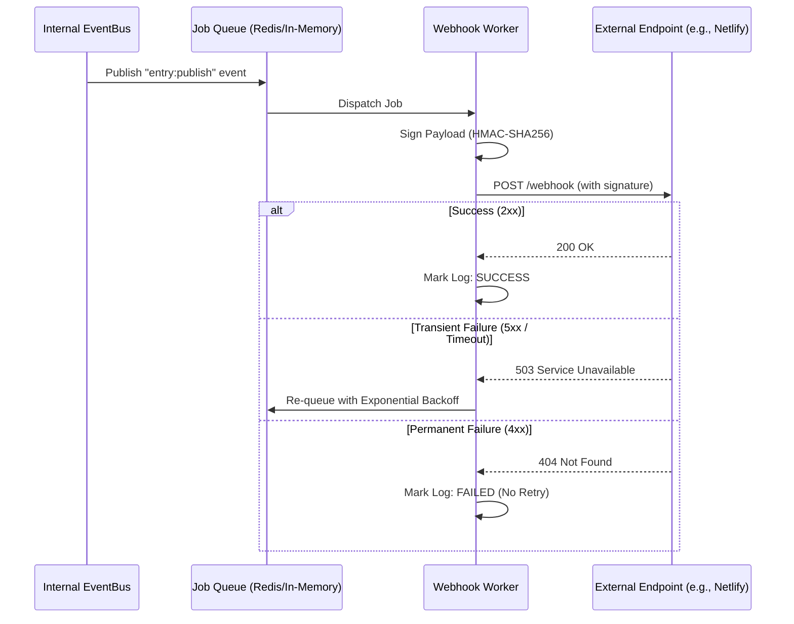

# Webhooks API Reference

Webhooks provide a push-based mechanism to notify external systems (CI/CD pipelines, search indexes, or third-party apps) whenever content or media changes occur in SveltyCMS.

---

## ⚡ Quick Reference

| Feature            | HTTP Endpoint            | Local SDK Equivalent                 |
| :----------------- | :----------------------- | :----------------------------------- |
| **List Webhooks**  | `GET /api/webhooks`      | `locals.cms.system.webhooks.list`    |
| **Create Webhook** | `POST /api/webhooks`     | `locals.cms.system.webhooks.create`  |
| **View Logs**      | `GET /api/webhooks/logs` | `locals.cms.system.webhooks.getLogs` |

---

## 1. The Goal

Trigger an external action—like rebuilding a static site or clearing a CDN cache—immediately after an entry is published or a file is uploaded.

---

## 2. The Solution

### Configuring a Webhook

Webhooks are typically managed via the Admin Panel under **Settings > Webhooks**.

**Example: Automated Rebuild**

1. **URL**: `https://api.netlify.com/build_hooks/...`
2. **Events**: `entry:publish`, `entry:unpublish`
3. **Secret**: `my-secure-signing-key`

### Local SDK (Recommended for Management)

Use the Local SDK to programmatically manage webhooks during system setup or for custom integrations.

```typescript
const webhook = await locals.cms.system.webhooks.create({
  name: "Algolia Indexer",
  url: "https://functions.worker.dev/index",
  events: ["entry:publish", "entry:delete"],
  secret: "shhh-secret",
});
```

---

## 3. The Mechanics

SveltyCMS uses a **Durable Delivery Pipeline** with exponential backoff to ensure webhooks reach their destination even during network instability.



### Security: Payload Verification

Every webhook includes an `X-SveltyCMS-Signature` header. You **must** verify this signature to ensure the request originated from your CMS.

```javascript
const crypto = require("crypto");

function verify(payload, signature, secret) {
  const hmac = crypto.createHmac("sha256", secret);
  const digest = "sha256=" + hmac.update(payload).digest("hex");
  return crypto.timingSafeEqual(Buffer.from(signature), Buffer.from(digest));
}
```

---

## Related Documents

- [Real-Time Events API (SSE)](./real-time-events-api.mdx)
- [GraphQL Subscriptions Reference](./graphql-websocket-subscriptions.mdx)
- [Automation System Guide](../guides/development/automation-system.mdx)
