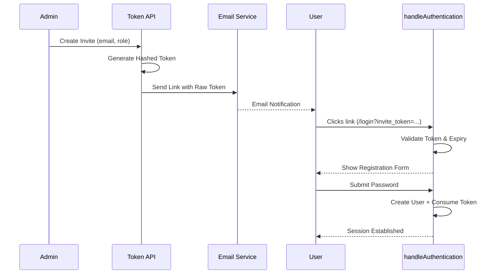

# Invitation Tokens API Reference

Invitation tokens are single-use, time-limited keys used to onboard new users to SveltyCMS. They allow administrators to pre-assign roles and deliver secure registration links via email.

> [!TIP]
> **OpenAPI Integration**: This API is dynamically documented in our [OpenAPI 3.1.0 Specification](./openapi-spec.mdx). Access the machine-readable contract at `/api/openapi.json`.

---

## ⚡ Quick Reference

| Feature           | HTTP Endpoint                  | Local SDK Equivalent          |
| :---------------- | :----------------------------- | :---------------------------- |
| **Create Invite** | `POST /api/token/create-token` | `locals.cms.auth.createToken` |
| **List Invites**  | `GET /api/token`               | `locals.cms.auth.listTokens`  |
| **Revoke Invite** | `DELETE /api/token/[id]`       | `locals.cms.auth.revokeToken` |

---

## 1. The Goal

Invite a new team member to join a specific tenant with a predefined role (e.g., Editor) while ensuring they set their own secure password during registration.

---

## 2. The Solution

### Sending an Invite (Local SDK)

Ideal for automated provisioning or custom admin tools.

```typescript
const invite = await locals.cms.auth.createToken({
  email: "newhire@company.com",
  role: "editor",
  expiresIn: "2 days",
});

// The link sent in the email will be:
// https://cms.com/login?invite_token=${invite.value}
```

### Listing Active Invites

**Endpoint**: `GET /api/token`
**Response**:

```json
{
  "success": true,
  "data": [{ "email": "test@test.com", "role": "user", "expires": "2026-04-03T..." }]
}
```

---

## 3. The Mechanics

The invitation flow ensures that user identities are verified via email before an account is fully activated.



### Expiration Policies

Tokens must have an explicit expiration window. The following strings are supported:

- `2 hrs`, `12 hrs`
- `2 days`, `1 week`
- `2 weeks`, `1 month`

> [!IMPORTANT]
> **One-per-Email**: SveltyCMS enforces a strict policy of one active invitation per email address. Attempting to create a second invite for the same email will return `409 CONFLICT`.

---

## Related Documents

- [User Management API Reference](./user-management-api.mdx)
- [Programmatic API Tokens Reference](./user-token-management-api.mdx)
- [Email System Configuration](../guides/development/email-system.mdx)
