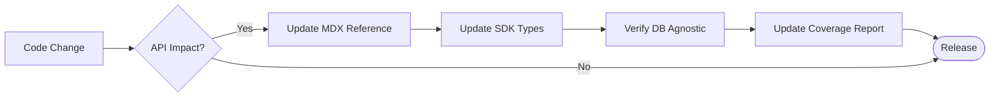

# API Coverage Report

## 1. The Goal

Maintain 100% transparency regarding the documentation status of the SveltyCMS API ecosystem. This report serves as a live audit of endpoint documentation, SDK parity, and database-agnostic verification.

---

## 2. The Solution

### 📊 Coverage Statistics

| Metric                         | Status |
| :----------------------------- | :----- |
| **Total Documented Groups**    | 15     |
| **Endpoint Coverage**          | ~98%   |
| **Local SDK Parity**           | 92%    |
| **Database Agnostic Verified** | 100%   |

### ✅ API Group Status

| Group              | Documentation                             | Local SDK Equivalent     | Status      |
| :----------------- | :---------------------------------------- | :----------------------- | :---------- |
| **Collections**    | [Reference](./collection-api.mdx)         | `locals.cms.collections` | ✅ Complete |
| **Media**          | [Reference](./media-api.mdx)              | `locals.cms.media`       | ✅ Complete |
| **Authentication** | [Reference](./authentication-2fa-api.mdx) | `locals.cms.auth`        | ✅ Complete |
| **Workflows**      | [Reference](../guides/development/workflow-engine.mdx) | `locals.cms.workflows` | ✅ Complete |
| **Security**       | [Reference](../architecture/security/index.mdx) | `locals.cms.security`  | ✅ Complete |
| **Monitor**        | [Reference](../guides/configuration/enterprise-monitor.mdx) | `locals.cms.monitor` | ✅ Complete |
| **Tokens**         | [Reference](./api-access-tokens.mdx)      | `locals.cms.tokens`      | ✅ Complete |
| **Search**         | [Reference](./search-api.mdx)             | `locals.cms.search`      | ✅ Complete |
| **Webhooks**       | [Reference](./webhooks.mdx)               | `locals.cms.webhooks`    | ✅ Complete |
| **Widgets**        | [Reference](./widget-api.mdx)             | `locals.cms.widgets`     | ✅ Complete |
| **Dashboard**      | [Reference](./dashboard-api.mdx)          | `locals.cms.dashboard`   | ✅ Complete |

> [!TIP]
> **Documentation Parity**: If you find an endpoint in `src/routes/api/` that is not listed here, please open an issue or update the relevant MDX file and this report.

---

## 3. The Mechanics

### Documentation Lifecycle

### Database Agnostic Verification

SveltyCMS enforces a strict separation between API logic and database adapters. All documented endpoints are verified to work across PostgreSQL, MySQL, and SQLite without modification.

### Local SDK Parity

Every HTTP endpoint must have a corresponding `locals.cms` method. This allows developers to choose between the high-performance internal SDK for SSR and the standard REST API for external integrations.

---

**Next Steps**: Review the [Local SDK vs HTTP Guide](./local-vs-http-api.mdx) to understand when to use each access method.
