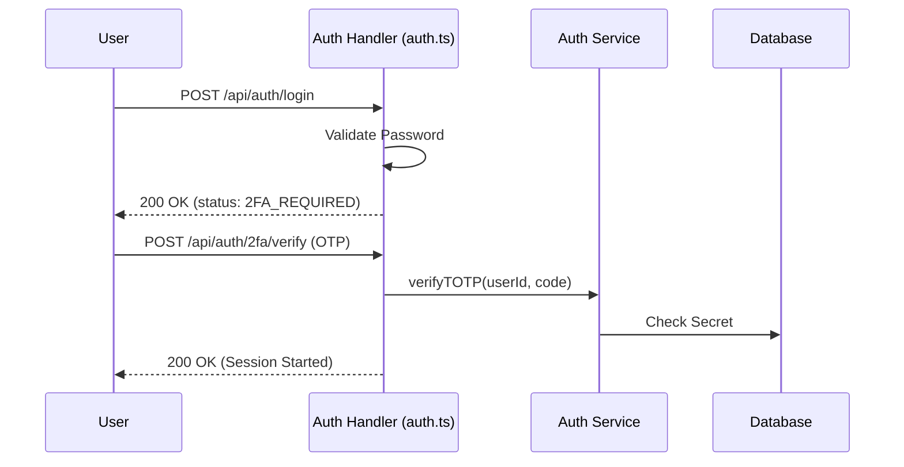

# Authentication & Identity Reference (`auth.ts`)

The Authentication API handles the complete lifecycle of a user identity within SveltyCMS. It manages everything from standard password-based authentication and Two-Factor Authentication (2FA) to enterprise Single Sign-On (SSO) via SAML 2.0.

---

## ⚡ Quick Reference

| Feature | HTTP Endpoint | Method | Permission Required |
| :--- | :--- | :--- | :--- |
| **Login** | `/api/auth/login` | `POST` | **Public** |
| **Logout** | `/api/auth/logout` | `POST` | **Authenticated** |
| **Profile Me** | `/api/auth/me` | `GET` | **Authenticated** |
| **List Users** | `/api/user` | `GET` | `manage:user` |
| **Manage 2FA** | `/api/auth/2fa/status`| `GET` | **Authenticated** |
| **SAML Login** | `/api/auth/saml/login`| `GET` | **Public** |
| **Permissions** | `/api/permission/list`| `GET` | `manage:system` |

---

## 1. Core Authentication

### User Lifecycle
Standard authentication uses secure `HttpOnly` cookies to maintain session state across requests.

- **Login**: `POST /api/auth/login` — validates credentials and starts a session.
- **Logout**: `POST /api/auth/logout` — invalidates the current session and clears cookies.
- **Me**: `GET /api/auth/me` — returns the current user object and their assigned permissions.

### Profile Management
Users can update their own security attributes and metadata via dedicated endpoints:
- **Update Attributes**: `PATCH /api/auth/update-user-attributes`
- **Save Avatar**: `POST /api/auth/save-avatar` — Supports both Multipart form-data (file upload) and JSON payloads (URL string).

---

## 2. Secure Identity Layer (2FA)

SveltyCMS supports mandatory or optional Two-Factor Authentication via Time-based One-Time Passwords (TOTP).

### 2FA Verification Flow
When 2FA is enabled, a standard login will return a `2FA_REQUIRED` status, requiring a second step.

**Endpoint**: `POST /api/auth/2fa/verify`  
**Payload**: `{ "userId": "...", "code": "123456" }`

---

## 3. Enterprise SSO (SAML 2.0)

For enterprise environments, SveltyCMS acts as a **Service Provider (SP)** and integrates with Identity Providers (IdP) like Okta or Azure AD.

### SAML Configuration
To connect an external IdP, the admin must provide the XML metadata.

**Endpoint**: `POST /api/auth/saml/config`  
**Payload**: `{ "tenant": "...", "rawMetadata": "<XML_CONTENT>" }`

### Just-In-Time (JIT) Provisioning
The system automatically creates user records upon the first successful SAML login if they don't already exist, mapping IdP attributes to SveltyCMS roles.

---

## 4. RBAC & Permissions

The authorization system is built on granular permissions assigned to user roles.

- **Check Permissions**: `GET /api/permission/list` returns the full registry of available permissions in the system.
- **Role Assignment**: Managed via `POST /api/auth/update-roles` (requires `manage:system`) or `PATCH /api/user/{id}` (requires `manage:user`).

---

## Related Documents

- [Token Management (tokens.ts)](./tokens.mdx)
- [SCIM 2.0 Provisioning (scim.ts)](./scim.mdx)
- [Security Architecture Report](../architecture/security/index.mdx)
