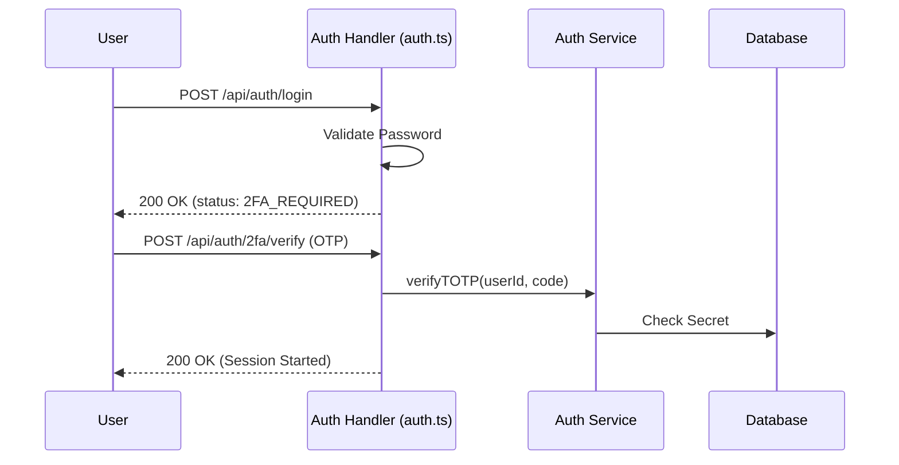

# Authentication & Identity API Reference

The Authentication API handles the complete lifecycle of a user identity within SveltyCMS for **programmatic access** (SDK, mobile apps, external services). It manages everything from standard password-based authentication and Two-Factor Authentication (2FA) to enterprise Single Sign-On (SSO) via SAML 2.0.

> **Important**: The browser-based login flow (`/login`) now uses **type-safe Remote Functions** defined in `auth.server.ts`. These provide full TypeScript inference between components and server logic. The REST API endpoints below remain available for programmatic access (SDK, mobile apps, external services). See [Login Security](../architecture/security/login-security.mdx) for the page-level authentication documentation.

---

## ⚡ Quick Reference

| Feature          | HTTP Endpoint                | Method | Permission Required |
| :--------------- | :--------------------------- | :----- | :------------------ |
| **Login**        | `/api/auth/login`            | `POST` | **Public**          |
| **Logout**       | `/api/auth/logout`           | `POST` | **Authenticated**   |
| **Current User** | `/api/auth`                  | `GET`  | **Authenticated**   |
| **List Users**   | `/api/user`                  | `GET`  | `manage:user`       |
| **Create User**  | `/api/auth/create-user`      | `POST` | `manage:user`       |
| **2FA Status**   | `/api/auth/2fa/status`       | `GET`  | **Authenticated**   |
| **2FA Setup**    | `/api/auth/2fa/setup`        | `POST` | **Authenticated**   |
| **2FA Enable**   | `/api/auth/2fa/enable`       | `POST` | **Authenticated**   |
| **2FA Verify**   | `/api/auth/2fa/verify`       | `POST` | **Authenticated**   |
| **2FA Disable**  | `/api/auth/2fa/disable`      | `POST` | **Authenticated**   |
| **Backup Codes** | `/api/auth/2fa/backup-codes` | `GET`  | **Authenticated**   |
| **SAML Login**   | `/api/auth/saml/login`       | `GET`  | **Public**          |
| **SAML ACS**     | `/api/auth/saml/acs`         | `POST` | **Public**          |
| **SAML Config**  | `/api/auth/saml/config`      | `POST` | `manage:system`     |
| **Permissions**  | `/api/permission/list`       | `GET`  | `manage:system`     |

---

## 1. Core Authentication

### User Lifecycle

Standard authentication uses secure `HttpOnly` cookies to maintain session state across requests. Session cookies use the `__Host-` prefix on HTTPS connections per RFC 6265bis.

- **Login**: `POST /api/auth/login` — Validates credentials (email + password), starts a session, sets `__Host-auth_sessions` cookie, and rotates the CSRF token.
- **Logout**: `POST /api/auth/logout` — Invalidates the current session, clears cookies, and invalidates the session cache.
- **Current User**: `GET /api/auth` — Returns the authenticated user object and their assigned permissions.

### Profile Management

Users can update their own security attributes and metadata via dedicated endpoints:

- **Update Attributes**: `POST /api/auth/update-user-attributes` (also accepts `PUT` and `PATCH`) — Updates profile fields. Pass `user_id: "self"` for the current user.
- **Save Avatar**: `POST /api/auth/save-avatar` — Supports both Multipart form-data (file upload) and JSON payloads (URL string).

---

## 2. Secure Identity Layer (2FA)

SveltyCMS supports mandatory or optional Two-Factor Authentication via Time-based One-Time Passwords (TOTP).

### 2FA Setup Flow

1. **Initiate Setup**: `POST /api/auth/2fa/setup` — Returns a TOTP secret and QR code URI.
2. **Verify & Enable**: `POST /api/auth/2fa/enable` — Verifies the TOTP code and enables 2FA. Payload: `{ "code": "123456", "secret": "...", "backupCodes": [...] }`

### 2FA Verification Flow

When 2FA is enabled, a standard login will return a `2FA_REQUIRED` status, requiring a second step.

**Endpoint**: `POST /api/auth/2fa/verify`  
**Payload**: `{ "userId": "...", "code": "123456" }`

### Backup Codes

- **Retrieve**: `GET /api/auth/2fa/backup-codes` — Returns backup codes if 2FA is enabled.
- **Regenerate**: `POST /api/auth/2fa/regenerate-backup-codes` — Generates new backup codes.

### Disable 2FA

**Endpoint**: `POST /api/auth/2fa/disable`  
**Payload**: `{ "password": "current_password" }` — Requires current password verification before disabling.

---

## 3. Enterprise SSO (SAML 2.0)

For enterprise environments, SveltyCMS acts as a **Service Provider (SP)** and integrates with Identity Providers (IdP) like Okta or Azure AD.

### SAML Configuration

To connect an external IdP, the admin must provide the XML metadata.

**Endpoint**: `POST /api/auth/saml/config`  
**Payload**: `{ "tenant": "...", "rawMetadata": "<XML_CONTENT>" }`

### SAML Assertion Consumer Service

The IdP redirects the user to the ACS endpoint after authentication.

**Endpoint**: `POST /api/auth/saml/acs` — Processes the SAML response, validates the assertion, and starts a session.

### Just-In-Time (JIT) Provisioning

The system automatically creates user records upon the first successful SAML login if they don't already exist, mapping IdP attributes to SveltyCMS roles.

---

## 4. RBAC & Permissions

The authorization system is built on granular permissions assigned to user roles.

- **Check Permissions**: `GET /api/permission/list` returns the full registry of available permissions in the system.
- **Role Assignment**: Managed via `POST /api/auth/update-roles` (requires `manage:system`) or `PATCH /api/user/{id}` (requires `manage:user`).

---

## Related Documents

- [Token Management (tokens.ts)](./tokens.mdx)
- [SCIM 2.0 Provisioning (scim.ts)](./scim.mdx)
- [Login Security](../architecture/security/login-security.mdx)
- [Authentication System Architecture](../architecture/authentication-system.mdx)
