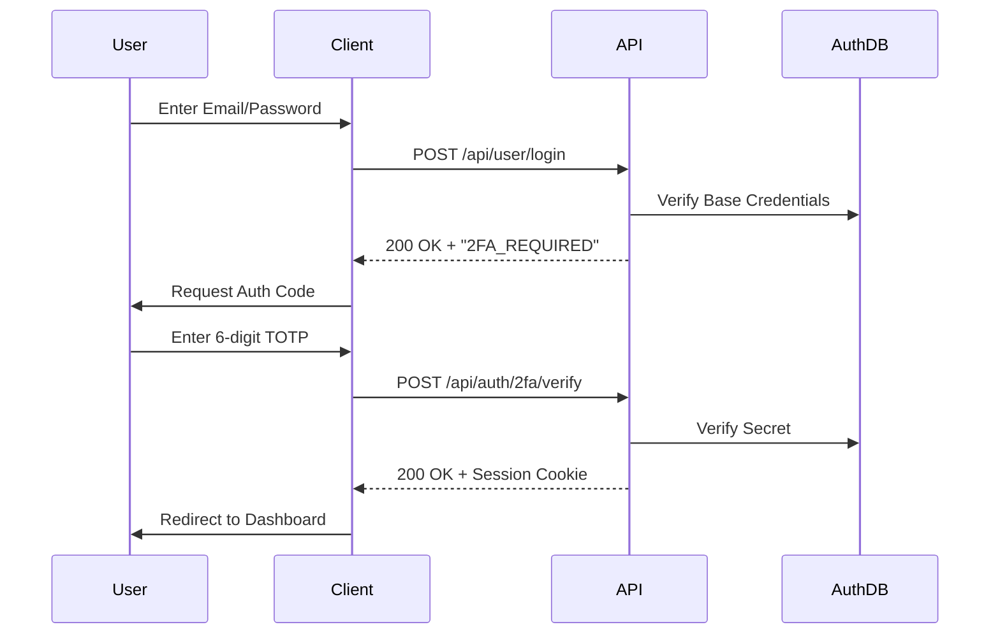

# Two-Factor Authentication API Reference

> [!TIP]
> **OpenAPI Integration**: This API is dynamically documented in our [OpenAPI 3.1.0 Specification](./openapi-spec.mdx). Access the machine-readable contract at `/api/openapi.json`.

## 1. The Goal

Secure user accounts with an additional layer of protection using Time-based One-Time Passwords (TOTP). This API provides endpoints for provisioning, verifying, and recovering 2FA status, ensuring high security with quantum-resistant storage.

---

## 2. The Solution

### 🚀 Quick Reference

| Method   | Endpoint                     | **Local SDK Equivalent**         | Description                                |
| :------- | :--------------------------- | :------------------------------- | :----------------------------------------- |
| **POST** | `/api/auth/2fa/setup`        | `locals.cms.auth.setup2FA`       | Generate new TOTP secret and QR code       |
| **POST** | `/api/auth/2fa/verify-setup` | `locals.cms.auth.verify2FASetup` | Validate the first code to enable 2FA      |
| **POST** | `/api/auth/2fa/verify`       | `locals.cms.auth.verify2FA`      | Standard verification during login/actions |
| **POST** | `/api/auth/2fa/disable`      | `locals.cms.auth.disable2FA`     | Deactivate 2FA for the current user        |
| **GET**  | `/api/auth/2fa/backup-codes` | `locals.cms.auth.getBackupCodes` | Retrieve 2FA status and remaining codes    |

> [!TIP]
> **Use the Local SDK**: For building custom account settings pages in SvelteKit, **always use `locals.cms.auth`**. It provides direct access to security methods without additional HTTP overhead.

---

### A. 2FA Setup Flow

The setup process requires a two-step handshake: **Handshake** (Setup) → **Confirmation** (Verify Setup).

**Initiation**: `POST /api/auth/2fa/setup`
Returns a secret and QR code URL for the authenticator app.

**Confirmation**: `POST /api/auth/2fa/verify-setup`
Finalizes the activation. 2FA is not enforced until this step succeeds.

### B. Verification

Accepts both **6-digit TOTP** codes and **8-character backup codes**. It implements a ±30s time window to account for clock drift.

---

## 3. The Mechanics

### Login with 2FA Flow

### Quantum Security Implementation

- **Secret Storage**: TOTP secrets are encrypted at rest using **AES-256-GCM**.
- **Backup Code Hashing**: Each backup code is individually hashed with **Argon2id**.
- **Brute-Force Resistance**: Memory-hard hashing prevents quantum speedup (Grover's algorithm).

---

**Next Steps**: For automated provisioning, see the [SCIM 2.0 API Reference](./scim-v2-api.mdx).
