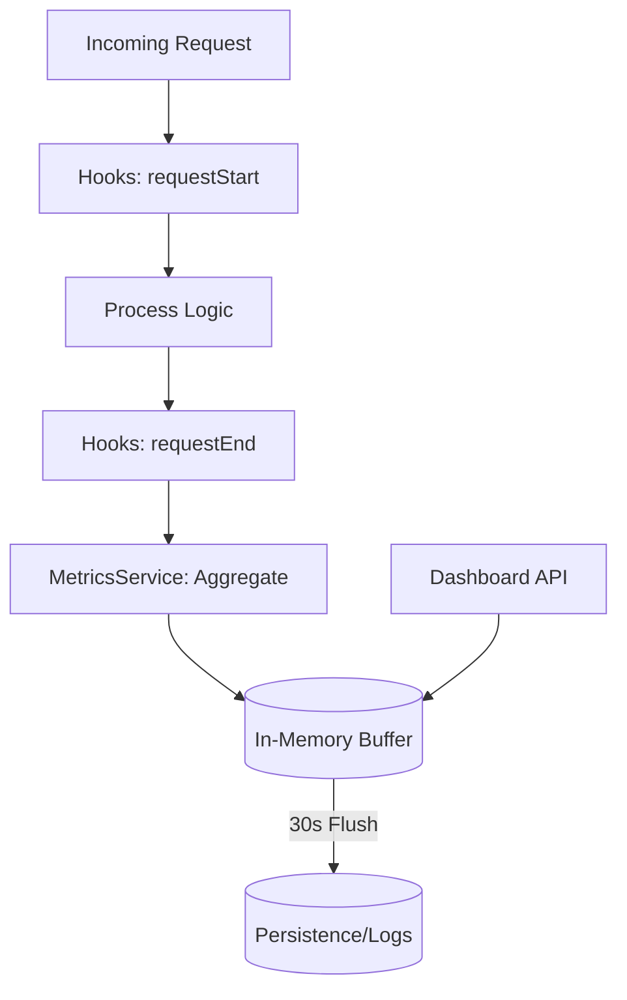

# Dashboard & Monitoring API

The Dashboard API provides real-time visibility into system health, performance metrics, and user activity. This API powers the SveltyCMS Admin Studio dashboard and enables external monitoring via custom analytics tools.

> [!TIP]
> **OpenAPI Integration**: This API is dynamically documented in our [OpenAPI 3.1.0 Specification](./openapi-spec.mdx). Access the machine-readable contract at `/api/openapi.json`.

---

## ⚡ Quick Reference

| Feature | HTTP Endpoint | Description |
| :--- | :--- | :--- |
| **System Metrics** | `GET /api/dashboard/metrics` | Returns performance & health metrics (e.g., RPS, latency). |
| **System Info** | `GET /api/dashboard/system-info` | Returns OS and Node.js environment information. |
| **Cache Metrics** | `GET /api/dashboard/cache-metrics` | Returns hit/miss rates for the Redis/Memory cache. |
| **Audit Logs** | `GET /api/dashboard/logs` | Retrieves paginated system and activity logs. |
| **Online Users** | `GET /api/dashboard/online-user` | Lists currently active users and their activity time. |
| **Recent Content** | `GET /api/dashboard/last5-content` | Lists the 5 most recently modified content entries. |
| **Recent Media** | `GET /api/dashboard/last5media` | Lists the 5 most recently uploaded media assets. |
| **System Messages** | `GET /api/dashboard/system-messages` | Returns active system alerts and notifications. |

---

## 1. Key Metrics & Diagnostics

### Performance Metrics

Retrieves core performance indicators including request counts, average response times, and error rates.

**Endpoint**: `GET /api/dashboard/metrics?detailed=true`

### System Logs (Audit Trail)

Access the internal logging stream. Supports filtering by severity level and pagination.

**Endpoint**: `GET /api/dashboard/logs?limit=50&page=1`

### User Preferences

Manages dashboard-specific UI preferences for the authenticated user.

**Endpoint**: `GET /api/system-preferences?key=dashboard.layout`

---

## 2. The Mechanics

### Metrics Collection Pipeline

### Scoped Visibility

- **Standard Users**: Can only access metrics related to their assigned `tenantId`.
- **System Admins**: Can access global health and aggregate metrics across all tenants.

---

## Related Documents

- [Real-Time Events API Reference](./real-time-events-api.mdx)
- [System Utilities API Reference](./system-utilities-api.mdx)
- [Logger Levels Architecture](../architecture/logger-levels.mdx)
