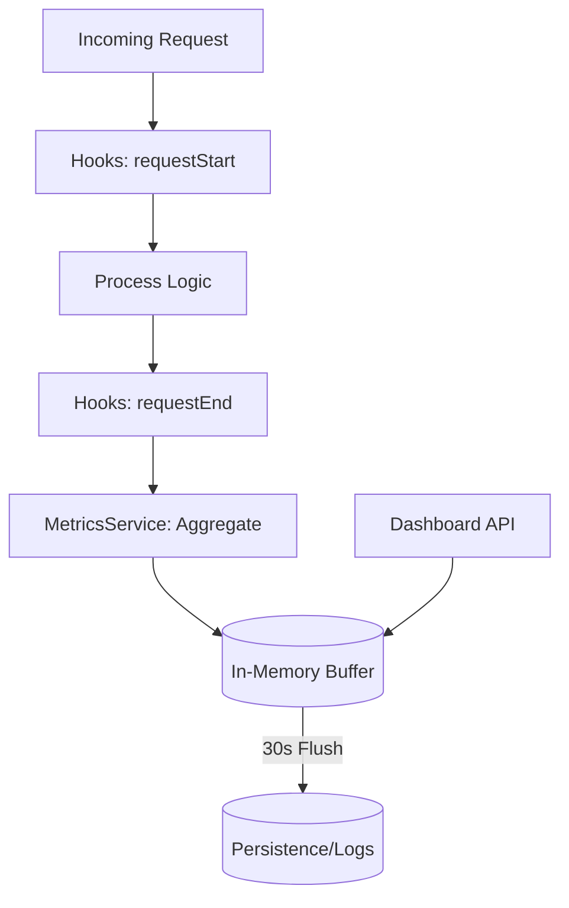

# Dashboard & Monitoring API

## 1. The Goal

Provide real-time visibility into system health, performance metrics, and user activity. This API powers the SveltyCMS Admin Studio dashboard and enables external monitoring via Prometheus or custom analytics tools.

---

## 2. The Solution

### 🚀 Quick Reference

| Method  | Endpoint                       | **Local SDK Equivalent**                | Description                          |
| :------ | :----------------------------- | :-------------------------------------- | :----------------------------------- |
| **GET** | `/api/dashboard/metrics`       | `locals.cms.dashboard.getMetrics`       | System performance & health metrics  |
| **GET** | `/api/dashboard/systemInfo`    | `locals.cms.dashboard.getSystemInfo`    | Detailed OS/Node.js environment info |
| **GET** | `/api/dashboard/cache-metrics` | `locals.cms.dashboard.getCacheMetrics`  | Redis/Internal cache hit rates       |
| **GET** | `/api/dashboard/logs`          | `locals.cms.dashboard.getLogs`          | Retrieve recent system logs          |
| **GET** | `/api/dashboard/online-user`   | `locals.cms.dashboard.getOnlineUsers`   | List currently active users          |
| **GET** | `/api/dashboard/last5-content` | `locals.cms.dashboard.getRecentContent` | Most recently modified entries       |

> [!TIP]
> **Performance Tip**: When building custom widgets for the Admin Studio, use the **Local SDK** in your `+page.server.ts` to fetch metrics. It avoids unnecessary JSON serialization and network overhead.

---

### A. System Metrics

Retrieves core performance indicators including request counts, average response times, and error rates.

**Endpoint**: `GET /api/dashboard/metrics?detailed=true`

### B. System Logs

Access the internal logging stream. Supports filtering by level (`error`, `warn`, `info`) and time ranges.

**Endpoint**: `GET /api/dashboard/logs`

### C. Preferences API

Manages user-specific dashboard layouts and widget states.

**Endpoint**: `GET /api/system-preferences?key=dashboard.layout.default`

---

## 3. The Mechanics

### Metrics Collection Pipeline

### Database-Agnostic Abstraction

The Dashboard API never queries the database directly. It utilizes the **MetricsService** and **LogAdapter** interfaces to ensure compatibility across all supported database engines.

### Multi-Tenancy Scoping

In Multi-Tenant mode, all metrics (except system-wide health) are automatically scoped to the `tenantId` of the authenticated user. Super-admins can access global metrics by omitting the tenant filter.

---

**Next Steps**: For real-time updates, see the [Real-Time Events API Reference](./real-time-events-api.mdx). To configure log levels, see the [Logger Levels Guide](../architecture/logger-levels.mdx).
