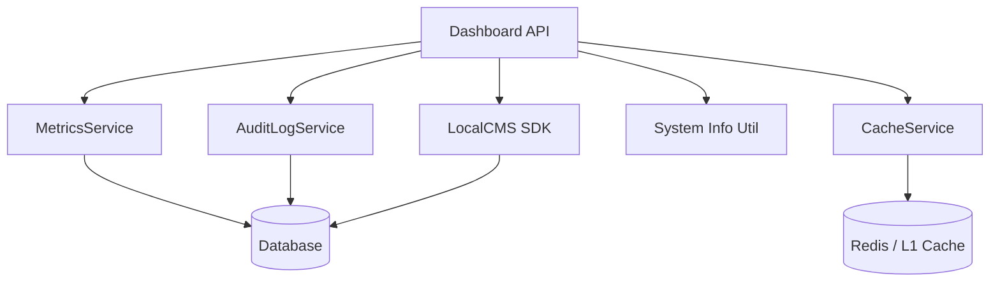

# Dashboard API & Widgets Reference

The Dashboard API provides real-time visibility into system performance, health, user activity, and cache efficiency. These endpoints power the 16 dashboard widgets in the admin Studio.

---

## ⚡ Quick Reference

| Feature                | HTTP Endpoint                    | Method | Permission Required |
| :--------------------- | :------------------------------- | :----- | :------------------ |
| **Dashboard Stats**    | `/api/dashboard/stats`           | `GET`  | `manage:system`     |
| **Health Check**       | `/api/dashboard/health`          | `GET`  | `manage:system`     |
| **Metrics Report**     | `/api/dashboard/metrics`         | `GET`  | `manage:system`     |
| **System Information** | `/api/dashboard/system-info`     | `GET`  | `manage:system`     |
| **Audit Logs**         | `/api/dashboard/logs`            | `GET`  | `manage:system`     |
| **Cache Metrics**      | `/api/dashboard/cache-metrics`   | `GET`  | `manage:system`     |
| **Recent Content**     | `/api/dashboard/last5-content`   | `GET`  | `manage:system`     |
| **Recent Media**       | `/api/dashboard/last5media`      | `GET`  | `manage:system`     |
| **Online Users**       | `/api/dashboard/online-user`     | `GET`  | `manage:system`     |
| **System Messages**    | `/api/dashboard/system-messages` | `GET`  | `manage:system`     |

---

## 1. Core Metrics

### Dashboard Stats

Returns a unified snapshot of content, user, and media counts plus system health.

**Endpoint**: `GET /api/dashboard/stats`
**Response**:

```json
{
  "contentCount": 42,
  "userCount": 15,
  "mediaCount": 128,
  "storageUsed": "0 MB",
  "healthStatus": "healthy",
  "uptime": 12345.678
}
```

### Metrics Report

Returns the full `MetricsService` report with API hits, cache statistics, and error rates.

**Endpoint**: `GET /api/dashboard/metrics`
**Parameters**: `?detailed=true` — Includes additional system information (memory, uptime, Node version).

### Health Check

Returns the system health status from the core health service.

**Endpoint**: `GET /api/dashboard/health`

---

## 2. System Monitoring

### System Information

Returns OS, CPU, memory, and disk information. Filter by type for specific subsystems.

**Endpoint**: `GET /api/dashboard/system-info`
**Parameters**: `?type=cpu|memory|os|disk` — Filter to a specific subsystem.

```json
{
  "osInfo": { "platform": "linux", "arch": "x64" },
  "cpuInfo": { "model": "...", "cores": 8 },
  "memoryInfo": { "total": 16384, "free": 8192 },
  "diskInfo": { "root": { "totalGb": 256, "usedGb": 45 } }
}
```

### Cache Metrics

Returns cache performance statistics including hit rate, operations count, and per-category breakdown.

**Endpoint**: `GET /api/dashboard/cache-metrics`
**Response**:

```json
{
  "overall": {
    "hits": 15420,
    "misses": 342,
    "hitRate": 97.83,
    "sets": 450,
    "deletes": 120,
    "size": 89,
    "totalOperations": 15762
  },
  "byCategory": {},
  "byTenant": {},
  "timestamp": 1717298400000
}
```

---

## 3. Activity & Logging

### Audit Logs

Returns paginated audit log entries with severity filtering and text search.

**Endpoint**: `GET /api/dashboard/logs`
**Parameters**:

- `limit` (max 100) — Number of entries per page
- `page` — Page number (1-based)
- `level` — Filter by severity (`low`, `medium`, `high`, `critical`)
- `search` — Full-text search across message and action fields

### System Messages

Returns recent system messages derived from audit logs, categorized by severity.

**Endpoint**: `GET /api/dashboard/system-messages`
**Parameters**: `?limit=10` — Number of messages (default: 10)

### Recent Content

Returns the most recently created content entries.

**Endpoint**: `GET /api/dashboard/last5-content`
**Parameters**: `?limit=5` — Number of entries (default: 5)

### Recent Media

Returns the most recently uploaded media items.

**Endpoint**: `GET /api/dashboard/last5media`

### Online Users

Returns a list of currently active users with session duration estimates.

**Endpoint**: `GET /api/dashboard/online-user`

---

## 4. Dashboard Widgets (UI)

The admin dashboard is composed of 16 modular Svelte 5 widgets, each backed by one or more API endpoints:

| Widget                        | File                               | Data Source                      |
| :---------------------------- | :--------------------------------- | :------------------------------- |
| **System Health**             | `system-health-widget.svelte`      | `/api/dashboard/health`          |
| **Unified Metrics**           | `unified-metrics-widget.svelte`    | `/api/dashboard/metrics`         |
| **CPU Monitor**               | `cpu-widget.svelte`                | `system-info?type=cpu`           |
| **Memory Monitor**            | `memory-widget.svelte`             | `system-info?type=memory`        |
| **Disk Monitor**              | `disk-widget.svelte`               | `system-info?type=disk`          |
| **Cache Monitor**             | `cache-monitor-widget.svelte`      | `/api/dashboard/cache-metrics`   |
| **Performance**               | `performance-widget.svelte`        | `/api/dashboard/metrics`         |
| **Audit Log**                 | `audit-log-widget.svelte`          | `/api/dashboard/logs`            |
| **Activity Logs**             | `logs-widget.svelte`               | `/api/dashboard/logs`            |
| **System Messages**           | `system-messages-widget.svelte`    | `/api/dashboard/system-messages` |
| **Last 5 Content**            | `last5-content-widget.svelte`      | `/api/dashboard/last5-content`   |
| **Last 5 Media**              | `last5-media-widget.svelte`        | `/api/dashboard/last5media`      |
| **Online Users**              | `user-online-widget.svelte`        | `/api/dashboard/online-user`     |
| **Security**                  | `security-widget.svelte`           | `/api/dashboard/metrics`         |
| **Database Pool Diagnostics** | `database-pool-diagnostics.svelte` | `/api/dashboard/health`          |
| **SCIM Status**               | `scim-status-widget.svelte`        | (SCIM endpoint)                  |

### Widget Architecture

Widgets are dynamically discovered from `src/routes/(app)/dashboard/widgets/` at server startup. Each widget exports optional `widgetMeta` for display metadata:

```typescript
export const widgetMeta = {
  name: "System Health",
  icon: "mdi:heart-pulse",
  description: "Real-time system health status",
};
```

The `+page.server.ts` load function scans the widgets directory, imports metadata, and passes the available widget list to the dashboard page. Users can configure widget positions, sizes, and visibility — persisted via the `widget-defaults.ts` configuration.

---

## 5. The Mechanics

### Data Aggregation

The Dashboard handler aggregates data from multiple internal services to provide a unified view:



### Performance Impact

Dashboard endpoints use lightweight queries and cached data where possible. The metrics and cache-metrics endpoints aggregate pre-computed statistics rather than scanning large datasets.

---

## Related Documents

- [System Reference (system.ts)](./system.mdx)
- [Content Reference (content.ts)](./content.mdx)
- [API Coverage Report](./api-coverage-report.mdx)
