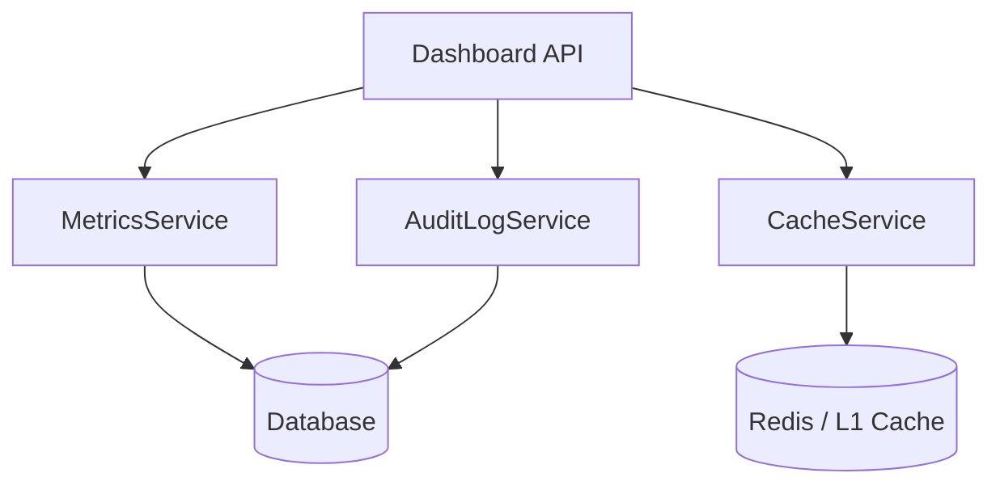

# Dashboard Reference (`dashboard.ts`)

The Dashboard API provides real-time visibility into the system's performance, health, and user activity. It is used to populate administrative monitoring interfaces and system health reports.

---

## ⚡ Quick Reference

| Feature              | HTTP Endpoint                     | Method | Permission Required |
| :------------------- | :-------------------------------- | :----- | :------------------ |
| **System Info**      | `/api/dashboard/system-info`      | `GET`  | `manage:system`     |
| **Active Sessions**  | `/api/dashboard/active-sessions`  | `GET`  | `manage:user`       |
| **Collection Stats** | `/api/dashboard/collection-stats` | `GET`  | `collection:read`   |
| **Audit Logs**       | `/api/dashboard/audit-logs`       | `GET`  | `manage:system`     |
| **Cache Metrics**    | `/api/dashboard/cache-health`     | `GET`  | `manage:system`     |

---

## 1. System Visibility

### System Information

Retrieve high-level environment details, including runtime version, operating system, and database connection state.

**Endpoint**: `GET /api/dashboard/system-info`

### Active Sessions

Monitor real-time user activity across the current tenant, identifying currently logged-in users and their session durations.

**Endpoint**: `GET /api/dashboard/active-sessions`

---

## 2. Analytics & Monitoring

### Content Statistics

Provides entry counts, growth trends, and storage usage metrics for all collections.

**Endpoint**: `GET /api/dashboard/collection-stats`

### Audit Logs (Tamper-Evident)

Access the cryptographically chained audit log to review administrative actions and system events.

**Endpoint**: `GET /api/dashboard/audit-logs`  
**Parameters**:

- `limit`: Number of log entries.
- `type`: Filter by event category (e.g., `AUTH`, `CONTENT`).

---

## 3. The Mechanics

### Data Aggregation

The Dashboard handler aggregates data from multiple internal services (MetricsService, AuditLogService, CacheService) to provide a unified snapshot of the system state.

### Performance Impact

Most dashboard endpoints utilize a **Read-Optimized Cache** (5-15 second TTL) to ensure that frequent monitoring requests do not impact the performance of production content traffic.

---

## Related Documents

- [System Reference (system.ts)](./system.mdx)
- [Content Reference (content.ts)](./content.mdx)
- [API Coverage Report](./api-coverage-report.mdx)
