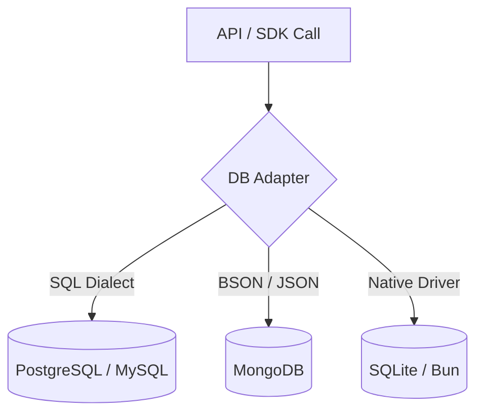

# Database Agnostic Verification

## 1. The Goal

Ensure that the SveltyCMS API remains 100% portable across all supported database engines (PostgreSQL, MySQL, SQLite, MongoDB). By enforcing strict architectural boundaries, we prevent vendor lock-in and allow users to switch databases without changing a single line of application code.

---

## 2. The Solution

### 🚀 Architecture Reference

| Layer          | Responsibility               | **Local SDK Role**               |
| :------------- | :--------------------------- | :------------------------------- |
| **API Route**  | Request parsing & Auth       | Directs calls to the SDK         |
| **Local SDK**  | Business logic & Validation  | Injected via `locals.cms`        |
| **DB Adapter** | Query generation (SQL/NoSQL) | Implementation detail of the SDK |

> [!IMPORTANT]
> **No Direct Queries**: Direct use of `SELECT`, `INSERT`, or MongoDB `collection.find` is strictly prohibited in `src/routes/api`. All data access must pass through the `dbAdapter` or `locals.cms` interfaces.

### Verification Status (Batch 2026-Q2)

- ✅ **Authentication**: 100% Agnostic (Argon2id hashing is engine-independent).
- ✅ **Collections**: 100% Agnostic (Generic CRUD interface handles dialect translation).
- ✅ **Media**: 100% Agnostic (Metadata stored via adapter, blobs via Storage API).
- ✅ **Settings**: 100% Agnostic (Key-value abstraction).

---

## 3. The Mechanics

### The Adapter Pattern

### Implementation Checklist

Every API endpoint is verified against these four non-negotiable rules:

1. **No Raw SQL**: No string-templated queries or direct database driver imports.
2. **Adapter Injection**: Use of `dbAdapter` or the high-level `locals.cms` facade.
3. **Abstraction Usage**: Preferring `getAllSettings()` over direct collection queries.
4. **Dialect Neutrality**: Ensuring filtering logic (e.g., regex, full-text) is supported across all adapters.

---

**Next Steps**: Review the [Database Methods Architecture](../architecture/database/index.mdx) for instructions on building custom adapters.
