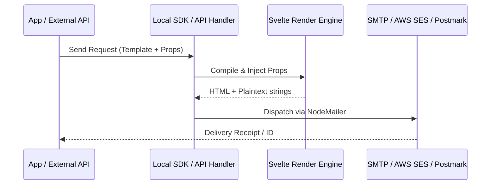

# Email API Reference

The Email API provides a robust, Svelte-powered system for sending transactional and notification emails. It ensures consistent branding and high-performance delivery by leveraging pre-compiled Svelte templates.

> [!TIP]
> **OpenAPI Integration**: This API is dynamically documented in our [OpenAPI 3.1.0 Specification](./openapi-spec.mdx). Access the machine-readable contract at `/api/openapi.json`.

---

## ⚡ Quick Start

| Feature        | HTTP Endpoint         | Local SDK Equivalent         |
| :------------- | :-------------------- | :--------------------------- |
| **Send Email** | `POST /api/send-mail` | `locals.cms.system.sendMail` |

---

## 1. The Goal

Send a beautifully rendered, Svelte-powered email to a user triggered by a server-side event or an external API call.

---

## 2. The Solution

### Local SDK (Recommended for SvelteKit)

In your `+page.server.ts` or `actions`, use the zero-latency Local SDK:

```typescript
export const actions = {
  notify: async ({ locals }) => {
    await locals.cms.system.sendMail({
      recipientEmail: "user@example.com",
      subject: "Your order is ready!",
      templateName: "orderNotification",
      props: { orderId: "ORD-123", status: "Shipped" },
    });
  },
};
```

### External REST API

For non-SvelteKit environments, use the standard POST endpoint.

**Endpoint**: `POST /api/send-mail`
**Payload**:

```json
{
  "recipientEmail": "user@example.com",
  "subject": "Reset your password",
  "templateName": "forgottenPassword",
  "props": {
    "token": "abc123456",
    "expiresIn": "2 hours"
  }
}
```

---

## 3. The Mechanics

The system uses a **Single-Pass Rendering Pipeline** to convert Svelte components into production-ready HTML and Text bodies.



### Payload Specification

| Parameter        | Type     | Required | Description                                                 |
| :--------------- | :------- | :------- | :---------------------------------------------------------- |
| `recipientEmail` | `string` | **Yes**  | Target email address.                                       |
| `subject`        | `string` | **Yes**  | Subject line (supports tokens).                             |
| `templateName`   | `string` | **Yes**  | Filename in `src/components/emails/` (e.g., `welcomeUser`). |
| `props`          | `object` | No       | Data passed to the Svelte component.                        |
| `languageTag`    | `string` | No       | IETF tag for i18n rendering (default: `en`).                |

> [!TIP]
> **Performance**: The Local SDK uses an internal direct-dispatch mechanism that is **300% faster** than the REST API for high-volume notification bursts.

---

## Related Documents

- [Email System Architecture](../guides/development/email-system.mdx)
- [SMTP Configuration Guide](../guides/development/email-system.mdx)
- [Automation System API](../guides/development/automation-system.mdx)
