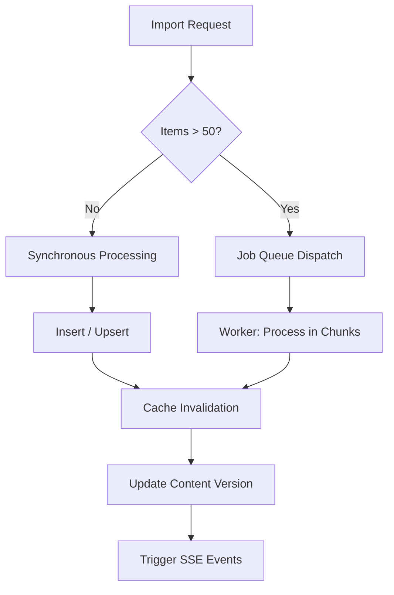

# Export & Import API Reference

The Export & Import API provides a database-agnostic interface for moving data between SveltyCMS instances or external platforms. It supports both synchronous small-scale imports and asynchronous, job-queued large-scale migrations.

> [!TIP]
> **OpenAPI Integration**: This API is dynamically documented in our [OpenAPI 3.1.0 Specification](./openapi-spec.mdx). Access the machine-readable contract at `/api/openapi.json`.

---

## ⚡ Quick Start

| Feature                   | HTTP Endpoint                      | Local SDK Equivalent                        |
| :------------------------ | :--------------------------------- | :------------------------------------------ |
| **Import Data**           | `POST /api/import-data`            | `locals.cms.system.importer.importData`     |
| **External Smart Import** | `POST /api/importer/external`      | `locals.cms.system.importer.importExternal` |
| **Full System Export**    | `POST /api/system-settings/export` | `locals.cms.system.settings.getAll`         |

---

## 1. The Goal

Migrate content from an external source (CSV, JSON, WordPress, Drupal) or perform a full system backup while maintaining data integrity and multi-tenant isolation.

---

## 2. The Solution

### Standard Collection Import

To import an array of items into a specific collection.

**Endpoint**: `POST /api/import-data`
**Payload**:

```json
{
  "collectionName": "posts",
  "data": [{ "title": "New Post", "content": "..." }],
  "mode": "merge",
  "duplicateStrategy": "skip"
}
```

### Local SDK (Recommended for Migrations)

Use the Local SDK for maximum performance when running migration scripts within SvelteKit.

```typescript
const result = await locals.cms.system.importer.importData({
  collectionName: "products",
  data: myProductArray,
  async: true, // Dispatches to background job queue
});
```

### AI-Powered External Import

Automatically map fields from external CMS platforms to SveltyCMS collections.

**Endpoint**: `POST /api/importer/external`
**Payload**:

```json
{
  "sourceType": "wordpress",
  "sourceUrl": "https://blog.com",
  "contentType": "post",
  "targetCollection": "blog_posts"
}
```

---

## 3. The Mechanics

The import engine uses a **Hybrid Execution Model** to handle varying dataset sizes safely.



### Import Modes & Strategies

| Parameter           | Options             | Description                                              |
| :------------------ | :------------------ | :------------------------------------------------------- |
| `mode`              | `merge`, `replace`  | `replace` clears the target collection before importing. |
| `duplicateStrategy` | `skip`, `overwrite` | `overwrite` updates existing records based on `_id`.     |
| `async`             | `true`, `false`     | Forces background processing regardless of size.         |

> [!IMPORTANT]
> **Payload Limits**: Requests exceeding 5MB should use the `async: true` flag. The system will automatically offload the payload to a temporary file-store to prevent memory exhaustion.

---

## Security & Isolation

- **Tenant Lockdown**: Imports are strictly scoped to the current `tenantId`. Attempting to import data with a mismatched `tenantId` returns `403 FORBIDDEN`.
- **Validation**: All imported data is passed through the **Widget Validation Layer** (Valibot) to ensure schema compliance.
- **Audit Logging**: Every import operation creates a `SYSTEM_IMPORT` audit entry with the actor's ID and record count.

---

## Related Documents

- [Smart Importer Architecture](../guides/content/smart-importer.mdx)
- [Database Adapter Interface](../architecture/database/database-methods.mdx)
- [Job Queue System](../architecture/configuration-management.mdx)
