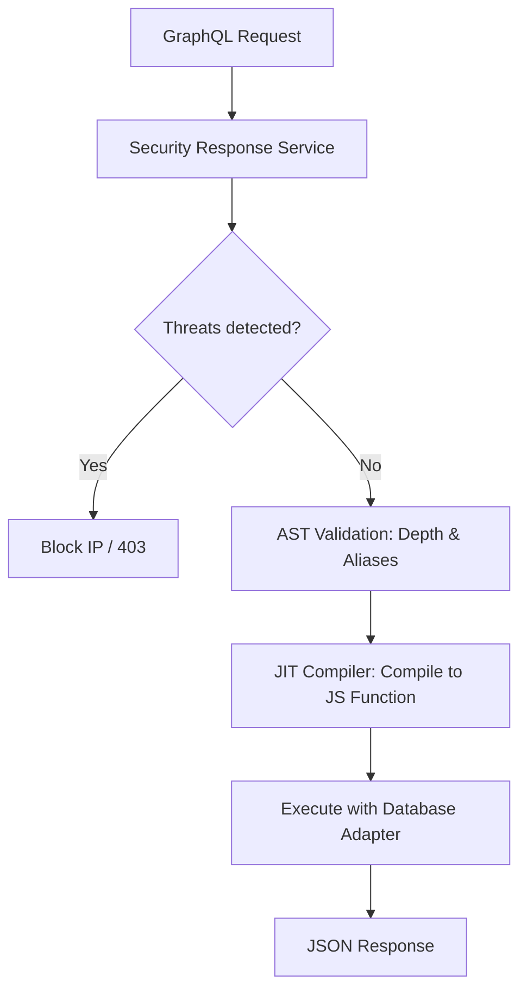

The GraphQL API provides a powerful, flexible query language for accessing and manipulating data in SveltyCMS. It features dynamic schema generation based on your collections, widgets, and content structure, optimized with a Just-In-Time (JIT) execution engine. Powered by **GraphQL Yoga 5.21.x**, it supports the latest incremental delivery standards and high-performance server-sent events.

---

## ⚡ Quick Reference

| Feature                     | HTTP Endpoint               | High-Performance Alternative                          |
| :-------------------------- | :-------------------------- | :---------------------------------------------------- |
| **Queries / Mutations**     | `POST /api/graphql`         | [**Local SDK QueryBuilder**](./local-vs-http-api.mdx) |
| **Real-Time Subscriptions** | `ws://[domain]/api/graphql` | [**Event Bus / SSE**](./real-time-events-api.mdx)     |
| **Playground**              | `/api/graphql` (GET)        | N/A (Dev only)                                        |

---

## 1. The Goal

Fetch complex, relational data structures in a single request while minimizing overfetching and maintaining strict type safety.

---

## 2. The Solution

### External Querying

Use standard GraphQL syntax to retrieve exactly the fields you need.

**Endpoint**: `POST /api/graphql`
**Example Query**:

```graphql
query GetPosts {
  posts(limit: 5, filter: { status: "published" }) {
    _id
    title
    author {
      username
      email
    }
  }
}
```

### Server-Side Alternative (Recommended)

In SvelteKit `+page.server.ts`, avoid the overhead of a GraphQL POST request. Use the **Local SDK QueryBuilder** for identical flexibility with **0ms network latency**.

```typescript
// Faster, typed, and direct
const posts = await locals.cms
  .queryBuilder("posts")
  .where({ status: "published" })
  .select(["title", "author"])
  .limit(5)
  .execute();
```

---

## 3. The Mechanics

SveltyCMS uses a **JIT (Just-In-Time) Execution Engine** to ensure your GraphQL queries run at native speeds.



### Security Throttling

- **Depth Limit**: Maximum 8 levels deep.
- **Alias Limit**: Maximum 15 aliases per query.
- **Payload Anomaly Detection**: Native recursive scanning for SQLi and XSS before execution.

---

## Real-Time Subscriptions

Subscribe to content changes via WebSockets (port 3001 in dev, standard port in prod).

```graphql
subscription OnPostAdded {
  postAdded {
    _id
    title
  }
}
```

> [!NOTE]
> For more details on WebSockets, see [GraphQL WebSocket Subscriptions](./graphql-websocket-subscriptions.mdx). Version 5.21.0+ includes major stability fixes for SSE and `@defer` streaming.

---

## Related Documents

- [Collection API](./collection-api.mdx)
- [Real-Time Events API](./real-time-events-api.mdx)
- [Local SDK vs HTTP API](./local-vs-http-api.mdx)
