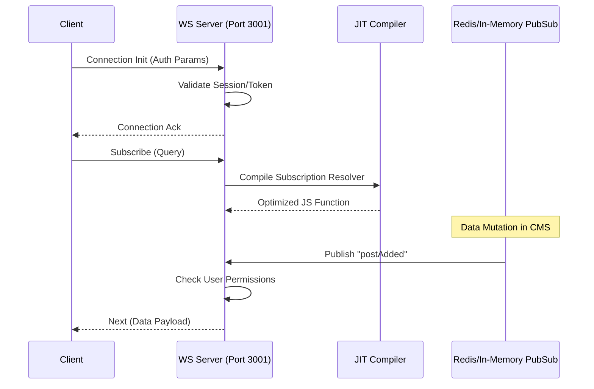

# GraphQL Subscriptions Reference

Real-time GraphQL subscriptions allow clients to receive instant updates when data changes. This guide covers the secure WebSocket implementation, JIT-optimized resolvers, and seamless Svelte 5 integration.

---

## ⚡ Quick Reference

| Feature                     | Details                                                                |
| :-------------------------- | :--------------------------------------------------------------------- |
| **Endpoint**                | `ws://[domain]:3001/api/graphql`                                       |
| **Protocol**                | `graphql-ws`                                                           |
| **Auth Methods**            | Session ID, Cookie, or Bearer Token                                    |
| **Server-Side Alternative** | [**Real-Time Events API (SSE)**](./content.mdx#3-real-time-events-sse) |

---

## 1. The Goal

Maintain a live, reactive UI (like a collaborative editor or a real-time dashboard) that updates instantly when content is modified by other users or background jobs. This provides a superior, type-safe alternative to traditional polling mechanisms.

---

## 2. Implementation Details

### Svelte 5 Integration (Client Side)

Using `graphql-ws` to create a reactive state from a subscription. This leverages Svelte 5's fine-grained reactivity to ensure only the necessary parts of the UI re-render.

```typescript
import { createClient } from "graphql-ws";
import { onMount, onDestroy } from "svelte";

let latestPost = $state(null);

onMount(() => {
  const client = createClient({
    url: "ws://localhost:3001/api/graphql",
    connectionParams: { cookie: document.cookie }, // Use cookies for auth
  });

  const unsubscribe = client.subscribe(
    { query: "subscription { postAdded { title } }" },
    { next: (res) => (latestPost = res.data.postAdded) },
  );

  return () => {
    unsubscribe();
    client.dispose();
  };
});
```

### Authentication and Connection

Client connections must pass authentication parameters to establish a secure stream.

```typescript
// Client-side Connection with Authorization Header
const client = createClient({
  url: "ws://localhost:3001/api/graphql",
  connectionParams: {
    authorization: "Bearer your-api-token-here",
  },
});
```

---

## 3. The Mechanics (Server-Side)

SveltyCMS utilizes a **Dual-Port Architecture** to separate high-frequency WebSocket traffic from standard HTTP requests, ensuring stability and security.



### Performance & Security

- **JIT Execution**: Subscription resolvers are compiled into optimized machine-ready code, ensuring the fastest possible broadcast performance.
- **Tenant Isolation**: Subscription streams are strictly filtered by `tenantId` at the PubSub layer.
- **Depth Limiting**: The native AST validator blocks subscriptions deeper than **8 levels** to prevent Denial of Service (DoS) attacks.

---

## Related Documents

- [GraphQL API Reference](./graphql.mdx)
- [Content, Search & Events Reference](./content.mdx)
- [Security Architecture](../architecture/security/index.mdx)
