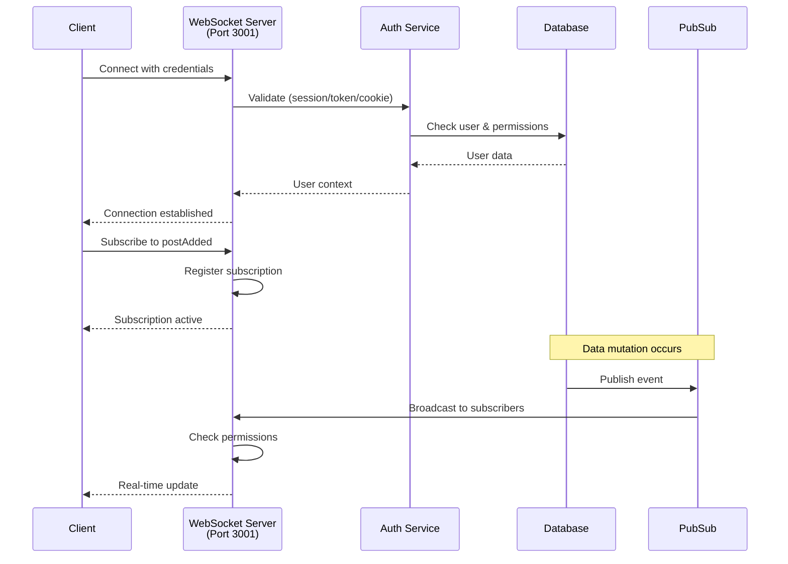

# GraphQL WebSocket Subscriptions

Real-time GraphQL subscriptions allow clients to receive instant updates when data changes. This guide covers WebSocket authentication and client integration.

---

## Architecture Overview



---

## Overview

The GraphQL WebSocket server runs on **port 3001** (`ws://localhost:3001/api/graphql`) and supports three secure authentication methods:

1. **Session ID** - Direct session identifier (server-side, native apps)
2. **Cookie String** - Browser cookie format (web clients)
3. **Bearer Token** - API access token (third-party integrations)

> **Security**: All authentication methods validate the user's session or token before establishing the WebSocket connection.

---

## Installation

Install the required GraphQL WebSocket client library:

```bash
bun add graphql-ws graphql
```

---

## Authentication Methods

### Method 1: Session ID Authentication

**Best for:** Server-side applications or when you have direct access to the session ID.

```typescript
import { createClient } from 'graphql-ws';

const client = createClient({
	url: 'ws://localhost:3001/api/graphql',
	connectionParams: {
		sessionId: 'your-session-id-here'
	}
});

// Subscribe to posts
const unsubscribe = client.subscribe(
	{
		query: `
      subscription {
        postAdded {
          _id
          title
          content
        }
      }
    `
	},
	{
		next: (data) => {
			console.log('New post:', data);
		},
		error: (error) => {
			console.error('Subscription error:', error);
		},
		complete: () => {
			console.log('Subscription complete');
		}
	}
);

// Cleanup when done
// unsubscribe();
```

---

### Method 2: Cookie Authentication

**Best for:** Browser clients that already have session cookies (most web applications).

```typescript
import { createClient } from 'graphql-ws';

// Extract cookies from document.cookie
const client = createClient({
	url: 'ws://localhost:3001/api/graphql',
	connectionParams: {
		cookie: document.cookie
	}
});

// Use same subscription as Method 1
```

---

### Method 3: Bearer Token Authentication

**Best for:** API integrations and third-party applications using access tokens.

```typescript
import { createClient } from 'graphql-ws';

const client = createClient({
	url: 'ws://localhost:3001/api/graphql',
	connectionParams: {
		authorization: 'Bearer your-api-token-here'
	}
});

// Use same subscription as Method 1
```

---

## Svelte Component Example

Complete example of a Svelte 5 component using real-time subscriptions:

```svelte
<script lang="ts">
	import { createClient } from 'graphql-ws';
	import { onMount, onDestroy } from 'svelte';

	let posts = $state([]);
	let client;
	let unsubscribe;

	onMount(() => {
		// Initialize WebSocket client
		client = createClient({
			url: 'ws://localhost:3001/api/graphql',
			connectionParams: {
				cookie: document.cookie
			}
		});

		// Subscribe to new posts
		unsubscribe = client.subscribe(
			{
				query: `
          subscription {
            postAdded {
              _id
              title
              content
              createdAt
            }
          }
        `
			},
			{
				next: (result) => {
					if (result.data?.postAdded) {
						posts = [...posts, result.data.postAdded];
					}
				},
				error: (error) => {
					console.error('Subscription error:', error);
				}
			}
		);
	});

	onDestroy(() => {
		// Cleanup subscription
		if (unsubscribe) unsubscribe();
		if (client) client.dispose();
	});
</script>

<div>
	<h2>Real-time Posts</h2>
	{#each posts as post (post._id)}
		<article>
			<h3>{post.title}</h3>
			<p>{post.content}</p>
			<time>{new Date(post.createdAt).toLocaleString()}</time>
		</article>
	{/each}
</div>
```

---

## Testing with GraphiQL

The HTTP GraphQL endpoint includes GraphiQL with built-in WebSocket support:

1. Navigate to: `http://localhost:5173/api/graphql`
2. Click the **"Subscribe"** button in the GraphiQL interface
3. Enter your subscription query
4. Authentication is handled automatically via session cookies

> **Note**: GraphiQL uses the same authentication context as your browser session.

---

## Security Best Practices

| Authentication Method | Security Considerations                                          |
| --------------------- | ---------------------------------------------------------------- |
| **Session ID**        | Only use over secure connections (WSS) in production             |
| **Cookies**           | Requires same-origin or proper CORS configuration                |
| **Bearer Tokens**     | Store securely, never expose in client-side code                 |
| **Unauthenticated**   | Connections without valid auth will have `user: null` in context |

> **Warning**: Always use WSS (secure WebSocket) in production environments.

---

## Error Handling

```typescript
const client = createClient({
	url: 'ws://localhost:3001/api/graphql',
	connectionParams: {
		sessionId: 'your-session-id'
	},
	on: {
		connected: () => console.log('Connected'),
		closed: () => console.log('Disconnected'),
		error: (error) => console.error('Connection error:', error)
	}
});
```

---

## Production Configuration

### Server-Side (WSS)

For production, configure the WebSocket server to use secure connections:

```typescript
// In src/routes/api/graphql/+server.ts
const wsServer = new WebSocketServer({
	port: 3001,
	path: '/api/graphql'
	// Add SSL configuration
	// server: httpsServer
});
```

And connect with:

```typescript
const client = createClient({
	url: 'wss://your-domain.com:3001/api/graphql'
	// ... connection params
});
```
