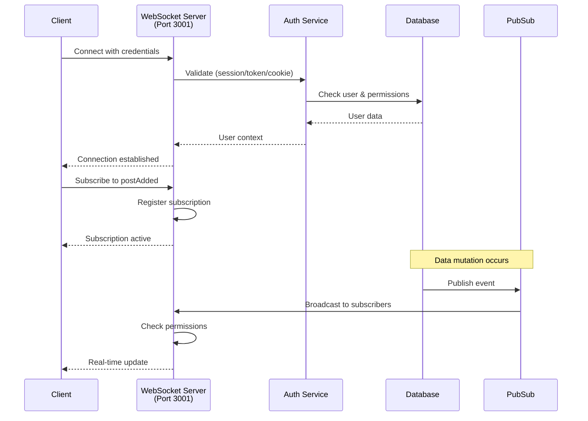

# GraphQL WebSocket Subscriptions

Real-time GraphQL subscriptions allow clients to receive instant updates when data changes. This guide covers WebSocket authentication, client integration, and testing.

**WebSocket Endpoint:** `ws://localhost:3001/api/graphql`  
**Protocol:** `graphql-ws`  
**Port:** 3001 (standalone WebSocket server)

---

## Architecture Overview



---

## Overview

The GraphQL WebSocket server runs independently on **port 3001** and supports three secure authentication methods:

1. **Session ID** - Direct session identifier (server-side, native apps)
2. **Cookie String** - Browser cookie format (web clients)
3. **Bearer Token** - API access token (third-party integrations)

**Key Features:**

- ✅ Real-time data updates via PubSub
- ✅ Secure authentication with multiple methods
- ✅ Multi-tenant support
- ✅ Permission-based subscription filtering
- ✅ Automatic reconnection handling
- ✅ GraphQL introspection support

> **Security**: All authentication methods validate the user's session or token before establishing the WebSocket connection. Unauthenticated connections have `user: null` in context.

---

## Installation

Install the required GraphQL WebSocket client library:

```bash
bun add graphql-ws graphql
```

---

## Authentication Methods

### Method 1: Session ID Authentication

**Best for:** Server-side applications or when you have direct access to the session ID.

```typescript
import { createClient } from 'graphql-ws';

const client = createClient({
	url: 'ws://localhost:3001/api/graphql',
	connectionParams: {
		sessionId: 'your-session-id-here'
	}
});

// Subscribe to posts
const unsubscribe = client.subscribe(
	{
		query: `
      subscription {
        postAdded {
          _id
          title
          content
        }
      }
    `
	},
	{
		next: (data) => {
			console.log('New post:', data);
		},
		error: (error) => {
			console.error('Subscription error:', error);
		},
		complete: () => {
			console.log('Subscription complete');
		}
	}
);

// Cleanup when done
// unsubscribe();
```

---

### Method 2: Cookie Authentication

**Best for:** Browser clients that already have session cookies (most web applications).

```typescript
import { createClient } from 'graphql-ws';

// Extract cookies from document.cookie
const client = createClient({
	url: 'ws://localhost:3001/api/graphql',
	connectionParams: {
		cookie: document.cookie
	}
});

// Use same subscription as Method 1
```

---

### Method 3: Bearer Token Authentication

**Best for:** API integrations and third-party applications using access tokens.

```typescript
import { createClient } from 'graphql-ws';

const client = createClient({
	url: 'ws://localhost:3001/api/graphql',
	connectionParams: {
		authorization: 'Bearer your-api-token-here'
	}
});

// Use same subscription as Method 1
```

---

## Svelte Component Example

Complete example of a Svelte 5 component using real-time subscriptions:

```svelte
<script lang="ts">
	import { createClient } from 'graphql-ws';
	import { onMount, onDestroy } from 'svelte';

	let posts = $state([]);
	let client;
	let unsubscribe;

	onMount(() => {
		// Initialize WebSocket client
		client = createClient({
			url: 'ws://localhost:3001/api/graphql',
			connectionParams: {
				cookie: document.cookie
			}
		});

		// Subscribe to new posts
		unsubscribe = client.subscribe(
			{
				query: `
          subscription {
            postAdded {
              _id
              title
              content
              createdAt
            }
          }
        `
			},
			{
				next: (result) => {
					if (result.data?.postAdded) {
						posts = [...posts, result.data.postAdded];
					}
				},
				error: (error) => {
					console.error('Subscription error:', error);
				}
			}
		);
	});

	onDestroy(() => {
		// Cleanup subscription
		if (unsubscribe) unsubscribe();
		if (client) client.dispose();
	});
</script>

<div>
	<h2>Real-time Posts</h2>
	{#each posts as post (post._id)}
		<article>
			<h3>{post.title}</h3>
			<p>{post.content}</p>
			<time>{new Date(post.createdAt).toLocaleString()}</time>
		</article>
	{/each}
</div>
```

---

## Testing with GraphiQL

The HTTP GraphQL endpoint includes GraphiQL with built-in WebSocket support:

1. Navigate to: `http://localhost:5173/api/graphql`
2. Click the **"Subscribe"** button in the GraphiQL interface
3. Enter your subscription query
4. Authentication is handled automatically via session cookies

> **Note**: GraphiQL uses the same authentication context as your browser session.

---

## Security Best Practices

| Authentication Method | Security Considerations                                          |
| --------------------- | ---------------------------------------------------------------- |
| **Session ID**        | Only use over secure connections (WSS) in production             |
| **Cookies**           | Requires same-origin or proper CORS configuration                |
| **Bearer Tokens**     | Store securely, never expose in client-side code                 |
| **Unauthenticated**   | Connections without valid auth will have `user: null` in context |

> **Warning**: Always use WSS (secure WebSocket) in production environments.

---

## Error Handling

```typescript
const client = createClient({
	url: 'ws://localhost:3001/api/graphql',
	connectionParams: {
		sessionId: 'your-session-id'
	},
	on: {
		connected: () => console.log('Connected'),
		closed: () => console.log('Disconnected'),
		error: (error) => console.error('Connection error:', error)
	}
});
```

---

## Production Configuration

### Server-Side (WSS)

For production, configure the WebSocket server to use secure connections:

```typescript
// In src/routes/api/graphql/+server.ts
const wsServer = new WebSocketServer({
	port: 3001,
	path: '/api/graphql'
	// Add SSL configuration for production
	// server: httpsServer
});
```

**Client Connection:**

```typescript
const client = createClient({
	url: 'wss://your-domain.com:3001/api/graphql',
	connectionParams: {
		cookie: document.cookie
	}
});
```

### Environment Variables

```bash
# .env
GRAPHQL_WS_PORT=3001
GRAPHQL_WS_PATH=/api/graphql
USE_WSS=true  # Enable secure WebSocket in production
```

---

## Testing WebSocket Subscriptions

### Manual Testing with wscat

Install wscat for command-line WebSocket testing:

```bash
npm install -g wscat
```

**Test Connection:**

```bash
# Connect to WebSocket server
wscat -c ws://localhost:3001/api/graphql -s graphql-ws

# Send connection init with authentication
{"type":"connection_init","payload":{"sessionId":"your-session-id"}}

# Subscribe to events
{"id":"1","type":"subscribe","payload":{"query":"subscription { postAdded { _id title } }"}}
```

### Testing with JavaScript

```javascript
// test-websocket.js
import { createClient } from 'graphql-ws';
import WebSocket from 'ws';

const client = createClient({
	url: 'ws://localhost:3001/api/graphql',
	webSocketImpl: WebSocket,
	connectionParams: {
		sessionId: 'your-session-id-here'
	}
});

console.log('Connecting to WebSocket server...');

const unsubscribe = client.subscribe(
	{
		query: `
      subscription {
        postAdded {
          _id
          title
          content
          createdAt
        }
      }
    `
	},
	{
		next: (data) => {
			console.log('✅ Received update:', JSON.stringify(data, null, 2));
		},
		error: (error) => {
			console.error('❌ Subscription error:', error);
		},
		complete: () => {
			console.log('✅ Subscription complete');
		}
	}
);

// Keep the script running
console.log('Waiting for events... (Press Ctrl+C to exit)');

// Cleanup on exit
process.on('SIGINT', () => {
	console.log('\nCleaning up...');
	unsubscribe();
	client.dispose();
	process.exit(0);
});
```

**Run Test:**

```bash
bun run test-websocket.js
```

### Integration Tests

Test WebSocket subscriptions in your test suite:

```typescript
// tests/bun/api/graphql-subscriptions.test.ts
import { describe, it, expect } from 'bun:test';
import { createClient } from 'graphql-ws';
import WebSocket from 'ws';

describe('GraphQL WebSocket Subscriptions', () => {
	it('should connect with session authentication', async () => {
		const client = createClient({
			url: 'ws://localhost:3001/api/graphql',
			webSocketImpl: WebSocket,
			connectionParams: {
				sessionId: 'test-session-id'
			}
		});

		let connected = false;

		client.on('connected', () => {
			connected = true;
		});

		// Wait for connection
		await new Promise((resolve) => setTimeout(resolve, 1000));

		expect(connected).toBe(true);

		client.dispose();
	});

	it('should receive subscription updates', async () => {
		const client = createClient({
			url: 'ws://localhost:3001/api/graphql',
			webSocketImpl: WebSocket,
			connectionParams: {
				cookie: 'session=test-cookie'
			}
		});

		const updates = [];

		const unsubscribe = client.subscribe(
			{
				query: `subscription { postAdded { _id title } }`
			},
			{
				next: (data) => {
					updates.push(data);
				}
			}
		);

		// Trigger a mutation that publishes to postAdded
		// ... create a post ...

		// Wait for update
		await new Promise((resolve) => setTimeout(resolve, 2000));

		expect(updates.length).toBeGreaterThan(0);

		unsubscribe();
		client.dispose();
	});
});
```

### Testing Authentication Methods

**Test Session ID:**

```typescript
const sessionClient = createClient({
	url: 'ws://localhost:3001/api/graphql',
	connectionParams: {
		sessionId: await getSessionId()
	}
});
```

**Test Cookie:**

```typescript
const cookieClient = createClient({
	url: 'ws://localhost:3001/api/graphql',
	connectionParams: {
		cookie: `session=${sessionCookie}`
	}
});
```

**Test Bearer Token:**

```typescript
const tokenClient = createClient({
	url: 'ws://localhost:3001/api/graphql',
	connectionParams: {
		authorization: `Bearer ${apiToken}`
	}
});
```

### Debugging Connection Issues

**Enable Debug Logging:**

```typescript
const client = createClient({
	url: 'ws://localhost:3001/api/graphql',
	connectionParams: {
		sessionId: 'your-session-id'
	},
	on: {
		connected: () => console.log('✅ Connected'),
		closed: (event) => console.log('❌ Closed:', event),
		error: (error) => console.error('❌ Error:', error),
		connecting: () => console.log('⏳ Connecting...'),
		ping: () => console.log('🏓 Ping'),
		pong: () => console.log('🏓 Pong')
	}
});
```

**Check Server Logs:**

```bash
# Server logs show authentication attempts
tail -f logs/app.log | grep WebSocket

# Expected output:
# WebSocket: Attempting auth via sessionId
# WebSocket: User authenticated via sessionId, userId: abc123
# GraphQL WebSocket Server initialized on port 3001
```

### Performance Testing

**Measure Latency:**

```typescript
const startTime = Date.now();

client.subscribe(
	{
		query: `subscription { postAdded { _id } }`
	},
	{
		next: (data) => {
			const latency = Date.now() - startTime;
			console.log(`Latency: ${latency}ms`);
		}
	}
);
```

**Load Testing:**

```typescript
// Create multiple concurrent subscriptions
const clients = [];

for (let i = 0; i < 100; i++) {
	const client = createClient({
		url: 'ws://localhost:3001/api/graphql',
		connectionParams: {
			sessionId: `test-session-${i}`
		}
	});

	clients.push(client);
}

// Monitor memory and CPU usage
```

---

## Troubleshooting

### Common Issues

**1. Connection Refused**

```
Error: connect ECONNREFUSED 127.0.0.1:3001
```

**Solution:** Ensure the WebSocket server is running. The server initializes automatically when the first GraphQL request is made to `/api/graphql`.

**2. Authentication Failed**

```
WebSocket: Authentication failed - no valid credentials provided
```

**Solution:** Verify you're providing valid credentials in `connectionParams`:

```typescript
// Check session is valid
connectionParams: {
	sessionId: 'valid-session-id'; // Must exist in database
}
```

**3. Subscription Not Receiving Updates**

**Solution:** Verify the PubSub is publishing events:

```typescript
// In your mutation resolver
await pubSub.publish('postAdded', newPost);
```

**4. Port Already in Use**

```
Error: listen EADDRINUSE: address already in use :::3001
```

**Solution:** Change the WebSocket port or stop the conflicting process:

```bash
# Find process using port 3001
lsof -i :3001

# Kill the process
kill -9 <PID>
```

---

## Implementation Reference

### Server Implementation

**Location:** `src/routes/api/graphql/+server.ts`

**Key Components:**

```typescript
// WebSocket server initialization
const wsServer = new WebSocketServer({
	port: 3001,
	path: '/api/graphql'
});

// GraphQL WS integration
useServer(
	{
		schema,
		context: async (ctx) => {
			// Extract auth from connection params
			const params = ctx.connectionParams;

			// Validate session/token/cookie
			// Return { user, tenantId, pubSub }
		}
	},
	wsServer
);
```

**Authentication Flow:**

1. Client connects with `connectionParams`
2. Server extracts credentials (sessionId, cookie, or authorization)
3. Auth service validates credentials
4. Database retrieves user data
5. Context created with `{ user, tenantId, pubSub }`
6. Subscription established

### Available Subscriptions

**Current Implementation:**

```graphql
type Subscription {
	postAdded: Post
}
```

**Future Subscriptions:**

```graphql
type Subscription {
	postAdded: Post
	postUpdated: Post
	postDeleted: ID
	userOnline: User
	mediaUploaded: Media
	commentAdded: Comment
}
```

---

## Related Documentation

- [GraphQL API](/docs/api/graphql-api.mdx) - Main GraphQL API reference
- [Authentication System](/docs/architecture/authentication-system.mdx) - Auth implementation details
- [Multi-Tenant Architecture](/docs/architecture/configuration-management.mdx) - Tenant isolation
- [Testing Guide](/docs/tests/) - Complete testing documentation

---

## Code Examples Repository

Find complete working examples in:

```
examples/
  graphql-subscriptions/
    browser-client.html
    node-client.js
    svelte-component.svelte
    test-suite.test.ts
```

---

## Summary

**WebSocket subscriptions provide:**

- ✅ Real-time data updates
- ✅ Secure multi-method authentication
- ✅ Multi-tenant support
- ✅ Permission-based filtering
- ✅ Comprehensive testing support
- ✅ Production-ready configuration

**Quick Start:**

```typescript
import { createClient } from 'graphql-ws';

const client = createClient({
	url: 'ws://localhost:3001/api/graphql',
	connectionParams: {
		cookie: document.cookie
	}
});

client.subscribe(
	{ query: 'subscription { postAdded { _id title } }' },
	{
		next: (data) => console.log('Update:', data),
		error: (err) => console.error('Error:', err)
	}
);
```

**Status:** 🚀 Production Ready
