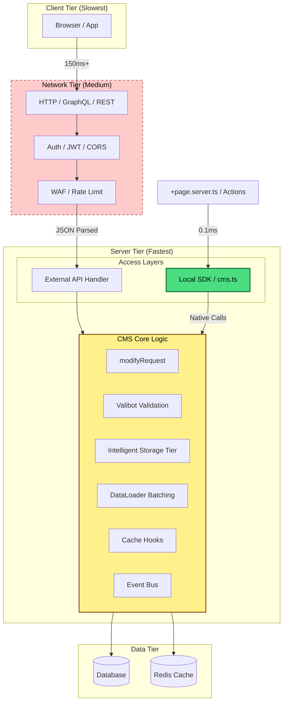

# Local SDK vs HTTP/GraphQL API

SveltyCMS offers two ways to interact with content:

- **External HTTP / GraphQL API** — The secure, public-facing interface with the full middleware stack (auth, rate limiting, CORS, etc.).
- **Internal Local SDK** — A zero-overhead, server-side-only API for maximum performance in your SvelteKit backend code.

**Recommendation**: In all server-side code (`+page.server.ts`, actions, hooks, etc.), **prefer the Local SDK** unless you have a specific reason to test the full HTTP stack.



---

## When to Use Which

| Context                                 | Recommended        | Latency    | Reason                                                         |
| :-------------------------------------- | :----------------- | :--------- | :------------------------------------------------------------- |
| **Client-side** (`.svelte`, `+page.ts`) | **HTTP / GraphQL** | 50–150 ms  | Browser environment; requires auth, CORS, and network.         |
| **Server-side** (`.server.ts`, actions) | **Local SDK**      | **0–5 ms** | Direct function calls; zero serialization or network overhead. |
| **Plugins / Background Jobs**           | **Local SDK**      | **0–5 ms** | Full access to core logic and security context.                |
| **External / Third-party**              | **HTTP / GraphQL** | 80–300+ ms | Needs API keys / JWT; works across network boundaries.         |

> [!TIP]
> **Rule of thumb**: If your code runs server-side (files ending in `.server.ts` or inside `+server.ts` routes), use the Local SDK.
> Only use `fetch('/api/...')` when you need to:
>
> - Call an external service
> - Intentionally test the full middleware stack (auth, rate limiting, logging)
> - Communicate between separate SvelteKit instances

---

## Why the Local SDK Exists

The Local SDK (`src/routes/api/cms.ts` or injected via `locals.cms`) is a high-performance facade that:

1. **Eliminates overhead**: No network stack, JSON parsing, or serialization.
2. **Bypasses external security**: Safely skips WAF and rate-limiting because it runs with server privileges.
3. **Calls Core Logic**: Executes the exact same `modifyRequest` pipeline as the HTTP layer.
4. **Maintains Consistency**: Automatically triggers cache invalidation and real-time events (SSE).

---

## Example: Data Loading in `+page.server.ts`

```typescript
import type { PageServerLoad } from "./$types";

export const load: PageServerLoad = async ({ locals }) => {
  // locals.cms is the recommended way (typed via App.Locals)
  const posts = await locals.cms.collections.find("posts", {
    limit: 10,
    filter: { status: "publish" },
    tenantId: locals.tenantId,
  });

  return { posts };
};
```

## Example: Bulk Creation

```typescript
// Create 1000 items in a single high-performance database call
const result = await locals.cms.bulkCreate("products", largeDataArray);
```

## Example: Database Transactions

```typescript
// Atomically update multiple collections
await locals.cms.transaction(async (tx) => {
  await tx.collections.update("orders", orderId, { status: "paid" });
  await tx.collections.create("audit_log", { event: "payment_received" });
});
```

---

## Technical Details

### Local SDK Guarantees

- Widget/request modification pipeline (`modifyRequest`) runs identically to HTTP requests.
- Cache hooks, invalidation, and version bumping happen automatically.
- Real-time updates (SSE / WebSocket) are triggered for connected clients.
- Multi-tenancy, user context, and permissions are applied consistently.

- **Media Intelligent Storage**: Shared deduplication and loop protection logic for all uploads.
- **Bulk operations**: `bulkCreate`, `bulkUpdate`, `bulkDelete` for high-throughput tasks.
- **DataLoader Batching**: `findById` calls are autonomously coalesced to reduce database I/O.
- **Transactions**: Full atomic transaction support (wrapped from database adapter).
- **Fluent Query Builder**: Native `queryBuilder` support for complex filtering and joins.
- **SDK Telemetry**: Automated performance metrics via `metricsService`.

### When You Might Still Use HTTP from Server Code

- Calling a completely external microservice or third-party API.
- Deliberately exercising the full external middleware (e.g., for testing or logging).
- Cross-origin or cross-instance communication.

---

## Best Practices

1. **Default to Local SDK** in every `.server.ts` file, server actions, and hooks.
2. **Avoid `fetch('/api/cms/...')`** inside server code — it adds unnecessary latency and stack depth.
3. **Use `locals.cms`** (injected via hooks) for clean, typed access throughout your app.
4. **Leverage `event.fetch`** only when you specifically need the full HTTP context of an internal route.
