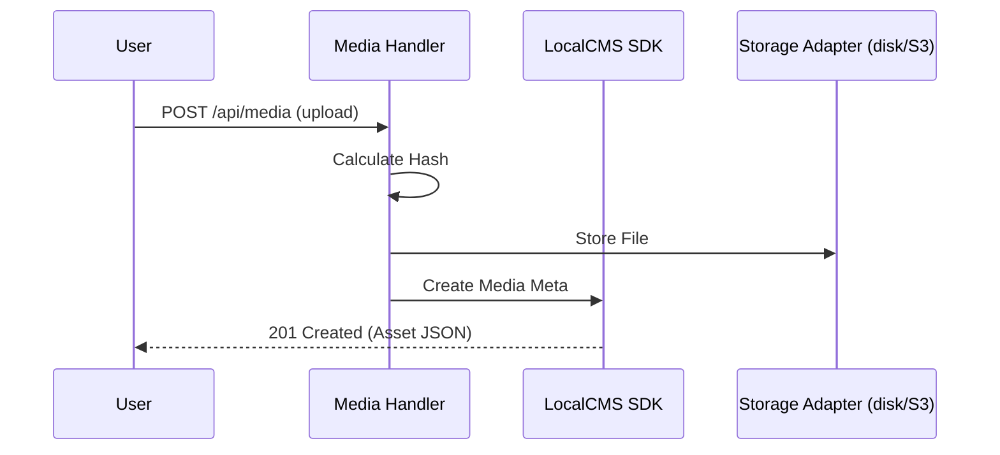

# Media Reference (`media.ts`)

The Media API provides a centralized interface for managing all assets within SveltyCMS. It handles multi-part uploads, intelligent deduplication, and folder-based organization.

---

## ⚡ Quick Reference

| Feature             | HTTP Endpoint        | Method   | Permission Required |
| :------------------ | :------------------- | :------- | :------------------ |
| **List Media**      | `/api/media`         | `GET`    | `media:read`        |
| **Get Manifest**    | `/api/media/{id}`    | `GET`    | `media:read`        |
| **Upload Media**    | `/api/media`         | `POST`   | `media:create`      |
| **Update Metadata** | `/api/media/{id}`    | `PATCH`  | `media:update`      |
| **Delete Media**    | `/api/media/{id}`    | `DELETE` | `media:delete`      |
| **Folders**         | `/api/media/folders` | `GET`    | `media:read`        |

---

## 1. Asset Management

### Uploading Assets

SveltyCMS supports single and bulk uploads via standard `multipart/form-data`.

**Endpoint**: `POST /api/media`  
**Payload**: `files` field (array or single stream).

### Folders & Structure

Virtual folders allow you to organize your asset library without relying on physical directory structures.

**Endpoint**: `GET /api/media/folders` — Returns the current folder hierarchy.

---

## 2. Media Processing

### Auto-Deduplication

The media engine calculates high-entropy hashes (SHA-256) for every upload. If an identical file already exists in the system, SveltyCMS will automatically link the new metadata to the existing physical file, saving storage space.

### Intelligent Resizing & Optimization

SveltyCMS employs a 2-tier optimization strategy for media delivery:

- **Parallel Multi-Size Processing**: Automated variant generation (sm, md, lg) happens in parallel using the `libvips` thread pool, resulting in ~70% faster response times during ingestion.
- **Instance Cloning**: Uses Sharp's memory-efficient `clone()` mechanism to generate all responsive sizes from a single header parse, minimizing CPU and RAM pressure.
- **Watermark Caching**: Pre-rendered watermark buffers are cached in-memory to avoid redundant re-scaling during bulk uploads.
- **Advanced Metadata Extraction**: Automatic extraction of `dominantColor` (hex) and `placeholder` (32px WebP base64) for progressive loading.
- **Next-Gen Formats**: Auto-generation of **WebP** and **AVIF** variants for all resized images.

### Image Manipulation API

SveltyCMS provides a dedicated endpoint for server-side image baking.

**Endpoint**: `POST /api/media/manipulate/{id}`  
**Payload**: JSON instructions for transformations.

```json
{
  "rotation": 90,
  "flipH": true,
  "crop": { "x": 10, "y": 10, "width": 500, "height": 500 },
  "filters": { "brightness": 10, "contrast": 5 },
  "focalPoint": { "x": 45, "y": 60 },
  "saveBehavior": "overwrite"
}
```

---

## 3. The Mechanics

### Storage Adapters

The Media API is storage-agnostic. It can be configured to use local disk storage, AWS S3, Google Cloud Storage, or Azure Blob Storage through the **MediaAdapter** interface.



---

## Related Documents

- [Collections Reference (collections.ts)](./collections.mdx)
- [System Reference (system.ts)](./system.mdx)
- [Secure Media Engine Guide](../architecture/security/widget-security.mdx)
