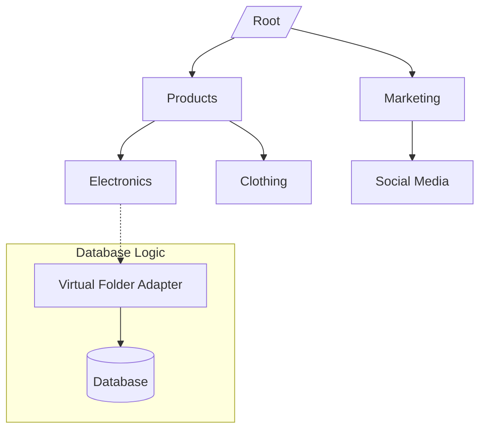

# System & Utilities API Reference

This reference covers the secondary system-level endpoints used for organizing media via virtual folders, managing global preferences, and accessing diagnostic information.

---

## ⚡ Quick Reference

| Feature             | HTTP Endpoint                    | Local SDK Equivalent               |
| :------------------ | :------------------------------- | :--------------------------------- |
| **Virtual Folders** | `GET /api/system-virtual-folder` | `locals.cms.system.folders`        |
| **Preferences**     | `GET /api/system-preferences`    | `locals.cms.system.getPreferences` |
| **Health Check**    | `GET /api/debug/basic`           | `locals.cms.system.getHealth`      |

---

## 1. The Goal

Organize system assets into logical hierarchies (Virtual Folders) and retrieve or update global CMS configuration (Preferences) programmatically.

---

## 2. The Solution

### Managing Virtual Folders

Virtual folders provide a database-level hierarchy for media that is independent of physical storage paths.

**Endpoint**: `POST /api/system-virtual-folder`
**Payload**:

```json
{
  "name": "Marketing Assets",
  "parentId": null
}
```

### Retrieving Preferences

**Local SDK Example**:

```typescript
const { siteName, timezone } = await locals.cms.system.getPreferences(["siteName", "timezone"]);
```

---

## 3. The Mechanics

### Virtual Folder Hierarchy

Virtual folders use a **Closure Table** or **Materialized Path** pattern (depending on the database adapter) to ensure high-performance recursive queries.



### Global Preferences

Preferences are stored in a specialized `system_preferences` collection with three scopes:

- `system`: Global settings available to all users.
- `user`: Per-user overrides (e.g., UI theme, language).
- `widget`: Configuration specific to individual widget instances.

---

## Related Documents

- [Email API Reference](./email-api.mdx)
- [Settings API Reference](./settings-api.mdx)
- [Media API Reference](./media-api.mdx)
