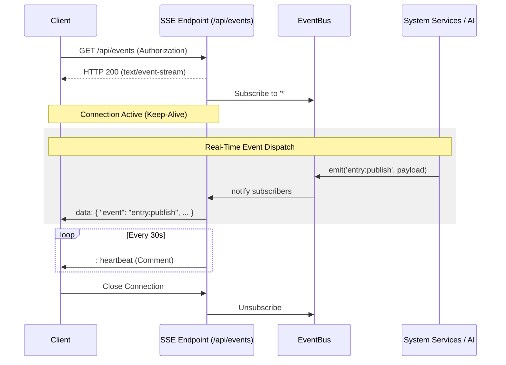

# Real-Time Events API

SveltyCMS provides a persistent, real-time event stream using **Server-Sent Events (SSE)**. This API enables live collaboration features, system-wide activity monitoring, and real-time AI assistant tokens.

## Endpoint

```http
GET /api/events
```

## Description

The `/api/events` endpoint establishes a long-lived HTTP connection. The server pushes updates to the client as they happen on the central `EventBus`.

### Event Flow Architecture



### Why SSE instead of WebSockets?

- **Edge Compatibility**: Works natively with SvelteKit and Edge functions without complex proxying.
- **Lower Overhead**: Uses standard HTTP/1.1 and HTTP/2 without the need for binary frame handling.
- **Auto-Reconnection**: Browsers automatically attempt to reconnect if the stream is interrupted.
- **Stateless Protocol**: Does not require sticky sessions on the load balancer.

---

## Authentication

Authentication is **mandatory**. Requests without a valid session or API token will be rejected with a `401 Unauthorized` status.

### Session Auth

The browser automatically sends session cookies when using `new EventSource('/api/events')`.

### Token Auth

API tokens can be passed via the `Authorization: Bearer <token>` header (though standard `EventSource` browser API does not support custom headers; a polyfill or library like `fetch-event-source` is recommended for token-based auth).

---

## Headers

To ensure reliable streaming, the following headers are used:

| Header              | Value                    | Description                                                 |
| :------------------ | :----------------------- | :---------------------------------------------------------- |
| `Content-Type`      | `text/event-stream`      | Required for SSE identification.                            |
| `Cache-Control`     | `no-cache, no-transform` | Prevents intermediaries from buffering or caching chunks.   |
| `Connection`        | `keep-alive`             | Instructs the server to keep the TCP connection open.       |
| `X-Accel-Buffering` | `no`                     | Bypasses Nginx proxy buffering (crucial for live delivery). |

---

## Event Message Format

Events are delivered as UTF-8 encoded JSON strings in the standard SSE format:

```text
data: {"event":"entry:publish","timestamp":"2026-02-16T14:30:00Z","user":{"id":"...","username":"admin"},"collection":"posts"}

: heartbeat
```

### Event Types

| Event             | Description                      | Payload Data                              |
| :---------------- | :------------------------------- | :---------------------------------------- |
| `connected`       | Initial connection confirmation. | `{ type: "connected", timestamp: "..." }` |
| `entry:create`    | A new entry was created.         | `{ collection: string, user: User }`      |
| `entry:publish`   | Content was published live.      | `{ collection: string, user: User }`      |
| `chat:message`    | A chat message was sent.         | `{ text: string, room: string \| null }`  |
| `ai:response`     | A chunk of AI-generated text.    | `{ text: string, done: boolean }`         |
| `webhook:failure` | An automated webhook failed.     | `{ collection: string, url: string }`     |

---

## Client Integration Example

Using the built-in `collaboration-store` (Svelte 5):

```typescript
import { collaboration } from '@stores/collaboration-store.svelte';

// Join a specific room (e.g. while editing a post)
collaboration.joinRoom('entry:123456');

// Send a message
await collaboration.sendMessage('Hey team, what do you think of this draft?');

// Access live activities
console.log(collaboration.activities);
```

---

## Heartbeat

To prevent connection timeouts by firewalls and load balancers, the server sends a `: heartbeat` comment every 30 seconds.

## Limits & Performance

- **Max Connections**: Limited by server resources and browser limits (usually 6-8 per domain).
- **Latency**: Sub-10ms delivery after the event is emitted on the server.
- **Buffering**: Up to 50 latest activities are buffered in the client-side store by default.
