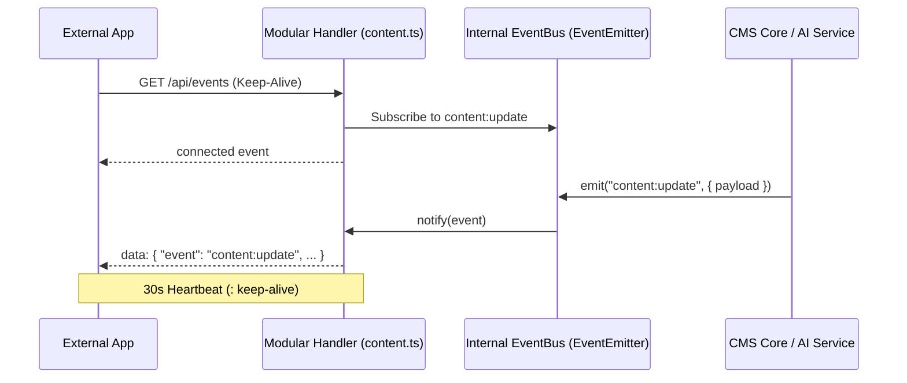

# Real-Time Events API Reference

SveltyCMS provides a persistent, real-time event stream using **Server-Sent Events (SSE)**. This API enables live collaboration features, system-wide activity monitoring, and real-time AI assistant tokens without the complexity of WebSockets.

---

## ⚡ Quick Reference

| Feature          | HTTP Endpoint       | Local SDK Equivalent                             |
| :--------------- | :------------------ | :----------------------------------------------- |
| **Event Stream** | `GET /api/events`   | `import { pubSub } from "@src/services/pub-sub"` |
| **Emit Event**   | N/A (Internal only) | `pubSub.publish(name, payload)`                  |

---

## 1. The Goal

Receive instantaneous updates about content changes, system health, or AI generation progress in a web browser or external application.

---

## 2. The Solution

### Browser Integration (EventSource)

Establish a native connection to the SSE stream.

```javascript
const evtSource = new EventSource("/api/events", { withCredentials: true });

evtSource.onmessage = (event) => {
  const data = JSON.parse(event.data);
  console.log(`Received ${data.event}:`, data.payload);
};

evtSource.addEventListener("entryUpdated", (e) => {
  const data = JSON.parse(e.data);
  alert(`Post "${data.collection}" was updated!`);
});
```

### Server-Side / Plugin Integration

Within the CMS (plugins, hooks, or the Local SDK), use the internal `pubSub` service to listen for or trigger events with **zero network overhead**.

```typescript
import { pubSub } from "@src/services/pub-sub";

// Listen for any entry update
pubSub.subscribe("entryUpdated", (event) => {
  console.log(`Entry ${event.id} in ${event.collection} changed.`);
});
```

---

## 3. The Mechanics

The Real-Time Events API acts as a **Unidirectional Bridge** between the internal **`EventBus`** (powering SSE) and the external HTTP world. While the **`pubSub`** service handles typed GraphQL subscriptions, the **`eventBus`** provides the high-concurrency backplane required for hundreds of persistent SSE connections.


```mermaid
sequenceDiagram
    participant App as External App
    participant SSE as Modular Handler (content.ts)
    participant Bus as Internal EventBus (EventEmitter)
    participant Core as CMS Core / AI Service

    App->>SSE: GET /api/events (Keep-Alive)
    SSE->>Bus: Subscribe to content:update
    SSE-->>App: connected event

    Core->>Bus: emit("content:update", { payload })
    Bus->>SSE: notify(event)
    SSE-->>App: data: { "event": "content:update", ... }

    Note over SSE, App: 30s Heartbeat (: keep-alive)
```

### Event Payload Structure

All events follow a consistent JSON envelope:

| Field       | Type     | Description                                               |
| :---------- | :------- | :-------------------------------------------------------- |
| `event`     | `string` | The unique event name (e.g., `entryUpdated`, `ai:token`). |
| `timestamp` | `string` | ISO-8601 timestamp of when the event was emitted.         |
| `payload`   | `object` | Event-specific data (IDs, snippets, user context).        |
| `tenantId`  | `string` | ID of the tenant where the event originated.              |

---

## Security & Performance

- **Automatic Cleanup**: Connections are strictly monitored. If a client disconnects, the server immediately unsubscribes from the internal bus to prevent memory leaks.
- **Tenant Isolation**: Users only receive events for the `tenantId` associated with their session/token.
- **WAF Friendly**: SSE uses standard HTTP/1.1 or HTTP/2, making it compatible with most Firewalls and Load Balancers that struggle with WebSockets.

---

## Related Documents

- [GraphQL Subscriptions](./graphql-websocket-subscriptions.mdx)
- [Audit Log Service](../architecture/admin-user-management.mdx)
- [Collaboration Store Reference](../architecture/state-management.mdx)
