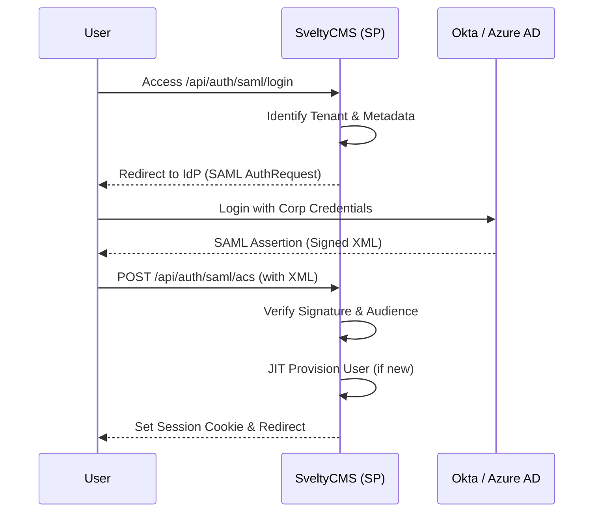

# SAML 2.0 / Enterprise SSO Reference

SveltyCMS provides enterprise-grade SAML 2.0 integration for identity providers like Okta, Azure AD (Entra ID), and PingIdentity. This system supports multi-tenant isolation and Just-In-Time (JIT) user provisioning.

---

## ⚡ Quick Reference

| Feature            | HTTP Endpoint                | Local SDK Equivalent             |
| :----------------- | :--------------------------- | :------------------------------- |
| **Configure IdP**  | `POST /api/auth/saml/config` | `locals.cms.auth.saml.configure` |
| **Initiate Login** | `GET /api/auth/saml/login`   | N/A (Redirect required)          |
| **ACS Callback**   | `POST /api/auth/saml/acs`    | N/A (IdP Triggered)              |

---

## 1. The Goal

Enable users to sign into SveltyCMS using their corporate credentials, ensuring that identity management remains centralized within the enterprise IdP.

---

## 2. The Solution

### Configuring a Connection (Local SDK)

For automated tenant provisioning, use the Local SDK to register IdP metadata.

```typescript
await locals.cms.auth.saml.configure({
  tenant: "acme-corp",
  product: "sveltycms",
  rawMetadata: "<XML_METADATA_FROM_OKTA>",
  defaultRedirectUrl: "https://cms.acme.com/en/dashboard",
});
```

### Initiating SSO Login

Redirect your users to the SSO entry point.

**URL**: `https://cms.yourdomain.com/api/auth/saml/login?tenant=acme-corp`

---

## 3. The Mechanics

SveltyCMS acts as the **Service Provider (SP)** and communicates with the **Identity Provider (IdP)** using standard XML-based assertions.



### Just-In-Time (JIT) Provisioning

If enabled, the system automatically creates a user record upon the first successful SAML login.

- **Identity Mapping**: Uses the `email` attribute from the SAML assertion.
- **Role Assignment**: New users are assigned the `VIEWER` role by default (configurable per tenant).
- **Tenant Lockdown**: Users are mathematically locked to the `tenantId` resolved from the SAML metadata.

---

## Related Documents

- [User Management API Reference](./user-management-api.mdx)
- [SCIM 2.0 Provisioning API](./scim-v2-api.mdx)
- [Multi-Tenant Architecture](../architecture/multi-tenancy.mdx)
