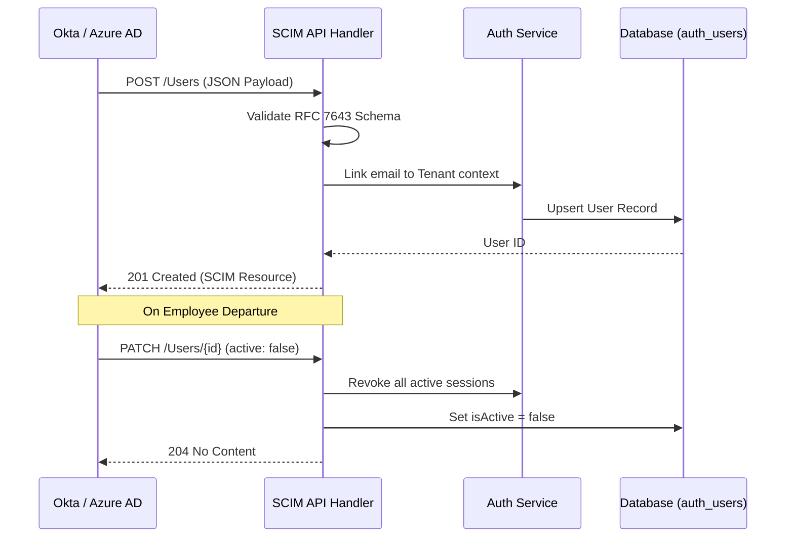

# SCIM v2.0 Provisioning Reference

SveltyCMS implements the **SCIM 2.0 (RFC 7643/7644)** protocol to enable automated user lifecycle management. This allows enterprise Identity Providers (IdPs) like Okta or Microsoft Entra ID to create, update, and deactivate users and roles automatically.

---

## ⚡ Quick Reference

| Feature              | Base Path                            | Local SDK Equivalent        |
| :------------------- | :----------------------------------- | :-------------------------- |
| **Users Management** | `/api/scim/v2/Users`                 | `locals.cms.auth.listUsers` |
| **Groups (Roles)**   | `/api/scim/v2/Groups`                | `locals.cms.auth.listRoles` |
| **Service Config**   | `/api/scim/v2/ServiceProviderConfig` | N/A (Static RFC)            |

---

## 1. The Goal

Automatically synchronize your corporate directory with SveltyCMS, ensuring that when an employee joins or leaves the company, their CMS access is instantly provisioned or revoked.

---

## 2. The Solution

### External Directory Sync

Configure your IdP (e.g., Okta) to point to the SveltyCMS SCIM endpoint using a dedicated SCIM Bearer Token.

**Base URL**: `https://cms.yourdomain.com/api/scim/v2`
**Authentication**: `Bearer <SCIM_TOKEN>`

### Local SDK (Audit & Verification)

While SCIM is primarily driven by the IdP, you can use the Local SDK to verify synchronization status.

```typescript
// List users created via SCIM sync
const scimUsers = await locals.cms.auth.listUsers({
  filter: { origin: "scim" },
});
```

---

## 3. The Mechanics

SveltyCMS acts as the **SCIM Service Provider**, mapping standard RFC attributes to internal CMS models.



### Attribute Mapping

| SCIM Attribute           | CMS Field  | Description                                     |
| :----------------------- | :--------- | :---------------------------------------------- |
| `userName`               | `username` | Unique identifier within the tenant.            |
| `emails[type eq "work"]` | `email`    | Primary identification key.                     |
| `active`                 | `isActive` | Controls login capability and session validity. |
| `groups`                 | `roles`    | Maps directory groups to CMS permission roles.  |

---

## Related Documents

- [User Management API Reference](./user-management-api.mdx)
- [SAML SSO Reference](./saml-sso-api.mdx)
- [Multi-Tenant Architecture](../architecture/multi-tenancy.mdx)
