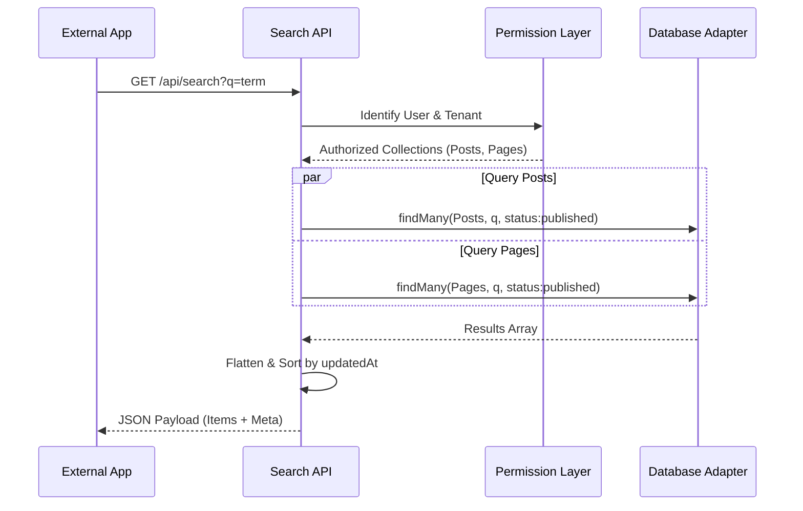

# Search API Reference

The Search API is the primary **Content Delivery** interface for headless implementations. It provides a single `GET` endpoint to query content across one or multiple collections with substring matching, field-level filtering, and permission-aware results.

---

## ⚡ Quick Start

| Feature             | HTTP Endpoint                  | Local SDK Equivalent          |
| :------------------ | :----------------------------- | :---------------------------- |
| **Global Search**   | `GET /api/search?q=...`        | `locals.cms.collections.find` |
| **Filtered Search** | `GET /api/search?filter={...}` | `locals.cms.queryBuilder`     |

---

## 1. The Goal

Find specific content across the entire CMS or a subset of collections using natural language terms or exact field filters.

---

## 2. The Solution

### External Headless Search

Ideal for search bars in React, Vue, or mobile applications.

**Endpoint**: `GET /api/search?q=svelte&collections=posts,pages`
**Response**:

```json
{
  "success": true,
  "data": {
    "items": [{ "_id": "123", "title": "Intro to Svelte", "collection": "posts" }],
    "total": 1
  }
}
```

### Local SDK (Recommended for SvelteKit)

In your `+page.server.ts`, use the Local SDK to query the database directly with **0ms network overhead**.

```typescript
export const load = async ({ locals, url }) => {
  const q = url.searchParams.get("q");

  // High-performance internal search
  const results = await locals.cms.collections.find("posts", {
    filter: { title: { $regex: q, $options: "i" } },
    limit: 10,
  });

  return { results };
};
```

---

## 3. The Mechanics

The Search API executes queries **in parallel** across all authorized collections, applying a strict "Status Gate" to protect non-public data.



### Status & Permission Gating

- **Public Users**: Are **always** restricted to `status: "published"`. Even if they pass `status: "draft"` in the URL, the system overrides it.
- **Admins**: Can query any status (`draft`, `archived`, `scheduled`).
- **Collection Access**: If a user lacks `read` permissions for a collection, that collection is silently excluded from the search results to prevent metadata leakage.

---

## Related Documents

- [Collection API Reference](./collection-api.mdx)
- [GraphQL API Reference](./graphql-api.mdx)
- [Local SDK vs HTTP API](./local-vs-http-api.mdx)
