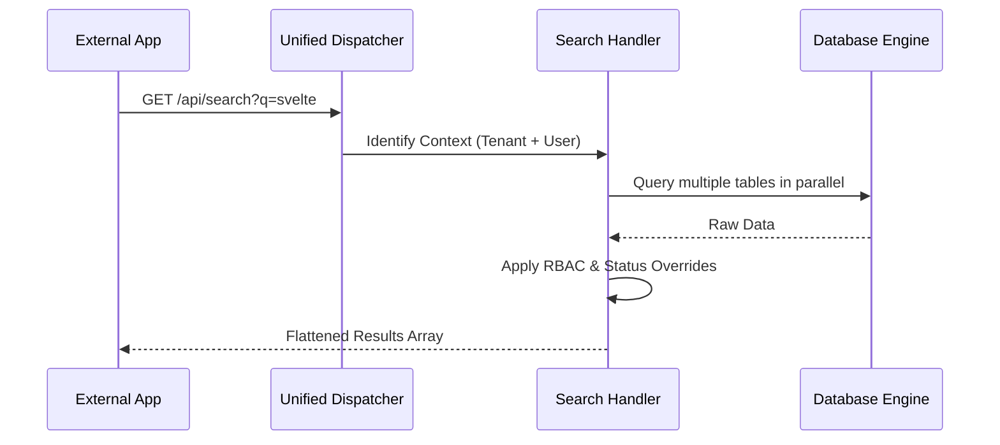

# Search API Reference

SveltyCMS provides two primary search patterns: **Global Search** for discovering content across all collections, and **Collection-Specific Search** for deep-filtering within a single resource. Both are integrated into the Unified Dispatcher.

> [!TIP]
> **OpenAPI Integration**: This API is dynamically documented in our [OpenAPI 3.1.0 Specification](./openapi-spec.mdx). Access the machine-readable contract at `/api/openapi.json`.

---

## ⚡ Quick Start

| Feature | HTTP Endpoint | Local SDK Equivalent |
| :--- | :--- | :--- |
| **Global Search** | `GET /api/search?q=...` | `locals.cms.collections.search` |
| **Collection Search** | `GET /api/collections/[id]/search` | `locals.cms.collections.find` |

---

## 1. Global Search (Cross-Collection)

The Global Search API executes parallel queries across all authorized collections. It is optimized for frontend search bars and headless content discovery.

**Endpoint**: `GET /api/search`

### Parameters

| Parameter | Type | Description |
| :--- | :--- | :--- |
| `q` | `string` | The search term (substring matching). |
| `type` | `string` | Comma-separated collection IDs (e.g., `posts,pages`). |
| `status` | `string` | `published` (default), `draft`, or `archived`. |
| `limit` | `number` | Number of results per page (default: 25). |

**Response**:

```json
{
  "items": [
    {
      "_id": "123",
      "title": "Intro to Svelte",
      "_collection": { "id": "posts", "name": "Posts" }
    }
  ],
  "total": 1,
  "page": 1
}
```

---

## 2. Deep Collection Search

When you need to perform more granular filtering (e.g., searching for users by role or posts by tag), use the dedicated collection search endpoint.

**Endpoint**: `GET /api/collections/[collection-id]/search`

### Advanced Filtering

You can pass complex filters as a JSON string via the `filter` parameter.

**Example**: `GET /api/collections/posts/search?filter={"authorId": "u1", "tags": {"$in": ["tech"]}}`

---

## 3. The Mechanics

The Search Engine uses a **Status Gate** and **RBAC Isolation** to ensure users only see content they are authorized to view.



### Security & Performance

- **Substring Matching**: Uses indexed substring or full-text search depending on the database adapter.
- **Fail-Closed RBAC**: If a user lacks `read` access to a collection, it is excluded from global results without throwing an error.
- **Status Override**: Unauthenticated requests are strictly forced to `status: "published"`.

---

## Related Documents

- [Collection API Reference](./collection-api.mdx)
- [GraphQL API Reference](./graphql-api.mdx)
- [System Utilities API](./system-utilities-api.mdx)
