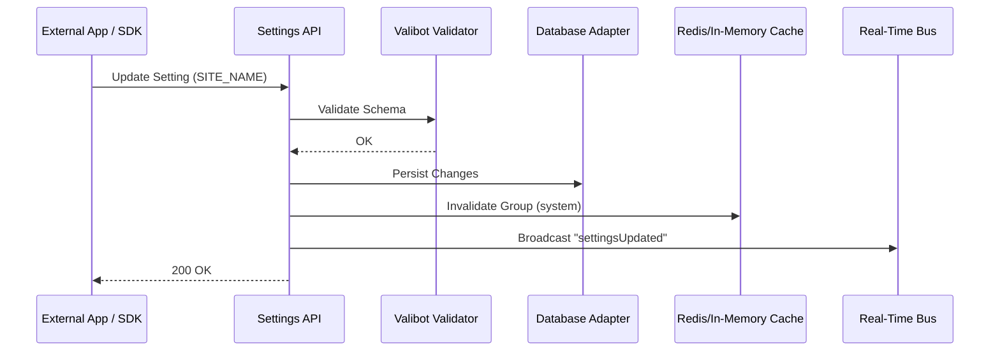

# Settings API Reference

The Settings API provides a centralized interface for managing global and tenant-specific configuration. It ensures that changes are validated, persisted across database adapters, and immediately reflected across the system via automated cache invalidation.

> [!TIP]
> **OpenAPI Integration**: This API is dynamically documented in our [OpenAPI 3.1.0 Specification](./openapi-spec.mdx). Access the machine-readable contract at `/api/openapi.json`.

---

## ⚡ Quick Start

| Feature             | HTTP Endpoint               | Permission        | Local SDK Equivalent                |
| :------------------ | :-------------------------- | :---------------- | :---------------------------------- |
| **Get Settings**    | `GET /api/settings/[group]` | `system:read`     | `locals.cms.system.getPreferences`  |
| **Update Settings** | `POST /api/settings/update` | `system:settings` | `locals.cms.system.setPreference`   |
| **List All**        | `GET /api/settings/all`     | `system:settings` | `locals.cms.system.settings.getAll` |

---

## 1. The Goal

Retrieve or modify system configuration (e.g., Site Name, SMTP settings, Security policies) programmatically while ensuring data consistency and audit trail generation.

---

## 2. The Solution

### Local SDK (Recommended)

In SvelteKit `+page.server.ts` or `hooks`, use the Local SDK for typed, zero-latency access.

```typescript
// Get specific keys
const { siteName } = await locals.cms.system.getPreferences(["siteName"]);

// Update a preference
await locals.cms.system.setPreference("siteName", "My Awesome CMS");
```

### External REST API

For external integrations or CLI tools.

**Endpoint**: `POST /api/settings/update`
**Payload**:

```json
{
  "SITE_NAME": "Updated Site Name",
  "SITE_URL": "https://newdomain.com"
}
```

---

## 3. The Mechanics

The Settings API follows a **Strict Validation & Broadcast** pattern to maintain system stability.



### Configuration Scopes

Settings are categorized into logical groups to simplify permission management:

| Group      | Description                                    | Sensitive?   |
| :--------- | :--------------------------------------------- | :----------- |
| `system`   | Core site identity, URL, and default language. | No           |
| `security` | Session TTL, 2FA status, and Rate Limiting.    | Yes          |
| `email`    | SMTP host, port, and credentials.              | Yes          |
| `database` | Connection strings and pool settings.          | **Critical** |

> [!IMPORTANT]
> **Environment Precedence**: Settings defined in `.env` (e.g., `DATABASE_URL`) take absolute precedence. If a setting is defined via an environment variable, it becomes **read-only** in the API and UI to prevent configuration drift.

---

## Related Documents

- [Multi-Tenant Isolation](../architecture/multi-tenancy.mdx)
- [Security Architecture](../architecture/security/index.mdx)
- [Local SDK vs HTTP API](./local-vs-http-api.mdx)
