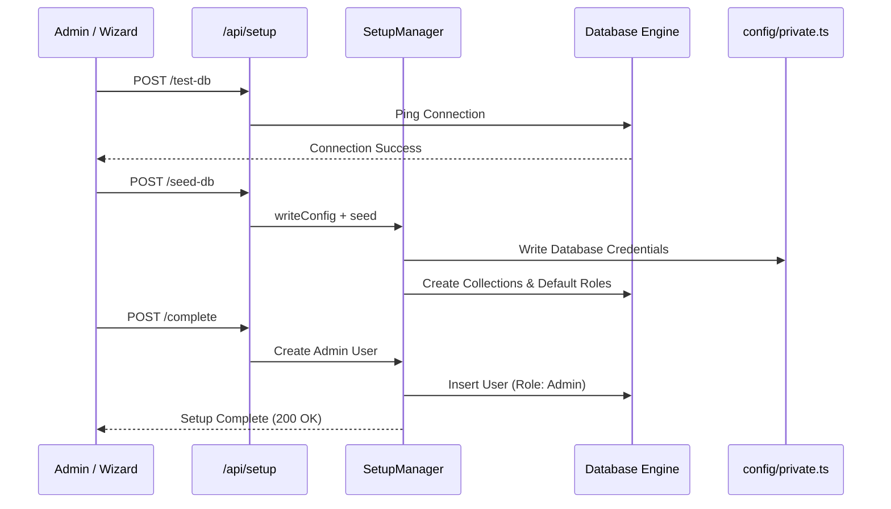

# Setup & Provisioning API Reference

The Setup API handles the critical first-run experience of SveltyCMS. It provides RESTful endpoints to securely manage database connectivity, schema seeding, and initial admin account creation.

---

## ⚡ Quick Reference

| Feature | HTTP Endpoint | Description |
| :--- | :--- | :--- |
| **Status Check** | `GET /api/setup/status` | Returns whether the system is initialized. |
| **Test DB** | `POST /api/setup/test-db` | Verifies database credentials and connectivity. |
| **Seed DB** | `POST /api/setup/seed-db` | Writes config and triggers initial schema seeding. |
| **Finalize** | `POST /api/setup/complete` | Creates the first admin and enables the CMS. |
| **Reinitialize** | `POST /api/setup/reinitialize` | Triggers a full system crawl and reconciliation. |

---

## 1. The Goal

Initialize a fresh SveltyCMS instance by connecting to a database, seeding the required schema, and provisioning the primary administrative user.

---

## 2. The Solution

### Initial Setup Flow

The setup process is typically handled by the built-in wizard at `/setup`. Each step interacts with the Setup API to progress the system state.

**Example: Testing Database Connection**

```json
{
  "type": "sqlite",
  "name": "cms_data",
  "host": "localhost"
}
```

### Post-Setup Verification (Local SDK)

Once setup is complete, use the Local SDK to verify system health.

```typescript
// Check if the system is ready for traffic
const health = await locals.cms.system.getHealth();
console.log(`System Status: ${health.state}`);
```

---

## 3. The Mechanics

The Setup Engine operates in a **Pre-Boot State**, allowing it to run before the primary database adapter is fully initialized.



### Security Guardrails

- **One-Time Execution**: Once the admin user is created and the system is marked as `ready`, the `/setup` endpoints (except `status`) are strictly protected or disabled.
- **Credential Safety**: Database passwords are never exposed in the response payloads.
- **Fail-Closed**: If a database connection fails during setup, the process halts to prevent partial initialization.

---

## Related Documents

- [Installation Guide](../getting-started.mdx)
- [Database Adapter Architecture](../architecture/database/database-methods.mdx)
- [System Utilities API](./system-utilities-api.mdx)
