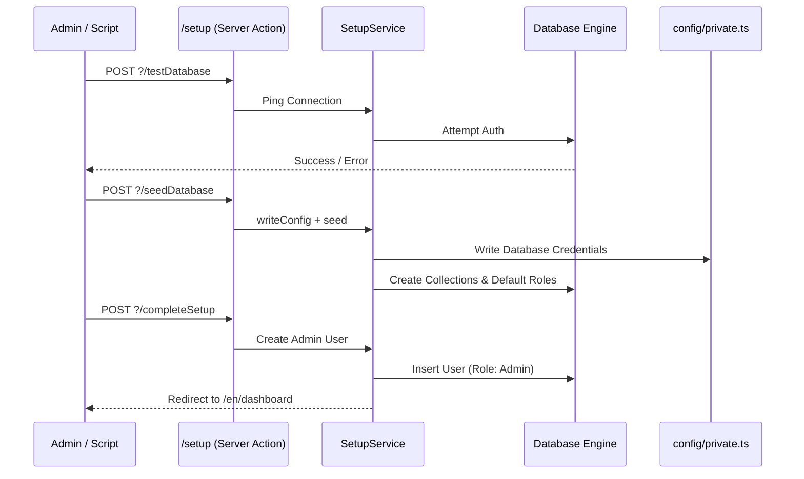

# Setup & Provisioning API Reference

The Setup API handles the critical first-run experience of SveltyCMS. Unlike the standard REST/GraphQL APIs, it uses **SvelteKit Server Actions** to securely manage database connectivity, schema seeding, and initial admin account creation before the full CMS engine is fully "hot."

---

## ⚡ Quick Reference

| Action       | Form Action Path  | Description                                  |
| :----------- | :---------------- | :------------------------------------------- |
| **Test DB**  | `?/testDatabase`  | Verifies credentials and connectivity.       |
| **Seed DB**  | `?/seedDatabase`  | Creates core tables/collections and roles.   |
| **Finalize** | `?/completeSetup` | Creates the first admin and enables the CMS. |

---

## 1. The Goal

Initialize a fresh SveltyCMS instance by connecting to a database, seeding the required schema, and provisioning the primary administrative user.

---

## 2. The Solution

### Initial Setup Wizard

The setup process is typically handled by the built-in wizard at `/setup`. However, it can be triggered programmatically via form actions.

**Example: Completing Setup**

```html
<form method="POST" action="/setup?/completeSetup">
  <input
    type="hidden"
    name="data"
    value='{"admin": {"email": "admin@test.com", "password": "..."}}'
  />
  <button>Finish Setup</button>
</form>
```

### Post-Setup Verification (Local SDK)

Once setup is complete, use the Local SDK to verify system health.

```typescript
// Check if the system is ready for traffic
const health = await locals.cms.system.getHealth();
console.log(`System Status: ${health.state}`);
```

---

## 3. The Mechanics

The Setup Engine operates in a **Pre-Boot State**, where it has minimal dependencies to ensure it can run even if the database is not yet configured.



### Security Guardrails

- **Setup Lock**: Once the admin user is created and `config/private.ts` exists, the `/setup` route is **automatically disabled** and redirects to the login page.
- **Credential Masking**: Database passwords are never echoed back in the action response.
- **CSRF Protection**: Native SvelteKit form action tokens prevent unauthorized remote execution.

---

## Related Documents

- [Installation Guide](../getting-started.mdx)
- [Database Adapter Architecture](../architecture/database/database-methods.mdx)
- [Multi-Tenant Provisioning](../architecture/multi-tenancy.mdx)
