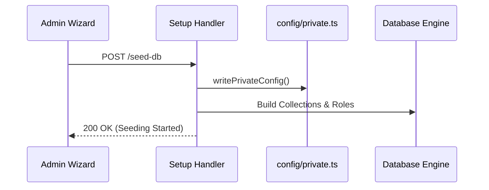

# Setup & Provisioning Reference (`setup.ts`)

The Setup API manages the critical initialization phase of SveltyCMS. It handles database configuration, system seeding, and the creation of the primary administrative account.

---

## ⚡ Quick Reference

| Feature | HTTP Endpoint | Method | Permission Required |
| :--- | :--- | :--- | :--- |
| **Status Check** | `/api/setup/status` | `GET` | **Public** |
| **Test Connection**| `/api/setup/test-db` | `POST` | **Public** |
| **Seed Database** | `/api/setup/seed-db` | `POST` | **Public** |
| **Complete Setup** | `/api/setup/complete` | `POST` | **Public** |
| **Reinitialize** | `/api/setup/reinitialize`| `POST` | `manage:system` |

---

## 1. The Goal

Safely transition a fresh SveltyCMS installation from an unconfigured state to a production-ready environment by establishing a database connection and provisioning the first user.

---

## 2. The Solution

### Pre-flight Verification
Before persisting the configuration, the system validates the provided database credentials.

**Endpoint**: `POST /api/setup/test-db`

### Schema Provisioning
Triggers the creation of system collections, default roles, and internal configuration entries.

**Endpoint**: `POST /api/setup/seed-db`

### Finalization
The setup process concludes by creating the admin user and establishing their first session. Once successful, the system is marked as `ready`, and the setup endpoints (except `status`) are strictly protected.

---

## 3. The Mechanics

### Pre-Boot Architecture
The `setup.ts` handler operates in a standalone mode, allowing it to function before the primary database adapter and middleware are fully initialized.

---

## Related Documents

- [Installation Guide](../getting-started.mdx)
- [System Reference (system.ts)](./system.mdx)
- [Authentication & Identity (auth.ts)](./auth.mdx)
