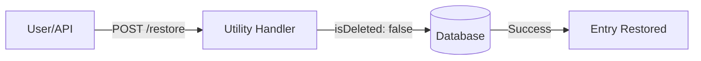

# System & Utilities API Reference

The System & Utilities API provides endpoints for managing the CMS infrastructure, recovering deleted content, and accessing diagnostic data. These endpoints are consolidated under the **Unified Dispatcher** for high-performance management.

> [!TIP]
> **OpenAPI Integration**: This API is dynamically documented in our [OpenAPI 3.1.0 Specification](./openapi-spec.mdx). Access the machine-readable contract at `/api/openapi.json`.

---

## ⚡ Quick Reference

| Feature | HTTP Endpoint | Description |
| :--- | :--- | :--- |
| **OpenAPI Spec** | `GET /api/openapi.json` | Returns the dynamic OpenAPI 3.1.0 definition. |
| **Cache Clear** | `POST /api/cache/clear` | Programmatically invalidates the Redis/Memory cache. |
| **Trash List** | `GET /api/trash` | Lists soft-deleted items across all collections. |
| **Trash Restore** | `POST /api/trash/restore` | Restores a soft-deleted entry to its original collection. |
| **Version Check** | `GET /api/version-check` | Compares local version with the upstream registry. |
| **Diagnostics** | `GET /api/debug` | Returns server uptime, environment, and tenant info. |
| **Health Check** | `GET /api/system/health` | High-frequency endpoint for load balancer pings. |

---

## 1. Content Recovery (Trash API)

SveltyCMS uses a "Soft-Delete" pattern. Items deleted via the standard Collection API are moved to the Trash rather than being permanently destroyed.

**Endpoint**: `GET /api/trash?limit=50`
**Restoring an Item**:

```json
{
  "collectionId": "posts",
  "entryId": "12345"
}
```

### Trash Recovery Flow



---

## 2. Infrastructure Management

### Cache Invalidation

Used by CI/CD pipelines or external automation to ensure fresh data after a bulk import.

**Endpoint**: `POST /api/cache/clear`
**Payload**:

```json
{
  "type": "content"
}
```

### Version & Updates

The `version-check` endpoint helps keep your SveltyCMS instance secure and up-to-date.

**Endpoint**: `GET /api/version-check?checkUpdates=true`
**Response**:

```json
{
  "current": "0.5.0",
  "latest": "0.5.1",
  "needsUpdate": true
}
```

---

## 3. Diagnostics & Health

### Debug Info

Provides essential context for troubleshooting multi-tenant or environment-specific issues.

**Endpoint**: `GET /api/debug`

```json
{
  "timestamp": "2026-04-11T12:00:00Z",
  "env": "production",
  "version": "0.5.0",
  "uptime": 86400,
  "tenantId": "t1",
  "user": "admin@example.com"
}
```

### High-Frequency Health Check

Optimized for 0ms overhead, this endpoint avoids full database reconciliation and is ideal for uptime monitors.

**Endpoint**: `GET /api/system/health`

---

## Related Documents

- [OpenAPI Specification](./openapi-spec.mdx)
- [Settings API Reference](./settings-api.mdx)
- [Dashboard API Reference](./dashboard-api.mdx)
