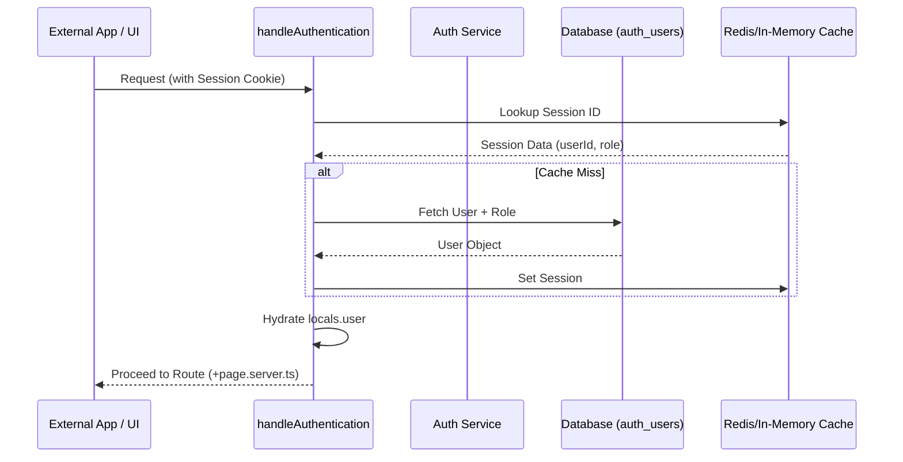

# User Management API Reference

The User Management API is the core identity layer of SveltyCMS. It handles user authentication, profile management, role-based access control, and multi-tenant isolation.

---

## ⚡ Quick Start

| Feature            | HTTP Endpoint                            | Permission    | Local SDK Equivalent         |
| :----------------- | :--------------------------------------- | :------------ | :--------------------------- |
| **Login**          | `POST /api/user/login`                   | **Public**    | `locals.cms.auth.login`      |
| **Get User**       | `GET /api/user/[id]`                     | `user:read`   | `locals.cms.auth.getUser`    |
| **Update Profile** | `PATCH /api/user/update-user-attributes` | `user:update` | `locals.cms.auth.updateUser` |
| **List Users**     | `GET /api/user`                          | `user:read`   | `locals.cms.auth.listUsers`  |

---

## 1. The Goal

Manage the complete lifecycle of a user identity—from initial invitation and login to profile updates and account deactivation.

---

## 2. The Solution

### User Authentication (Login)

**Endpoint**: `POST /api/user/login`
**Payload**:

```json
{ "email": "admin@example.com", "password": "..." }
```

### Local SDK (Recommended for Hooks/Server)

Use the Local SDK to manage users directly within your SvelteKit backend.

```typescript
// Update a user's role (Admin only)
await locals.cms.auth.updateUser(targetUserId, { role: "editor" });

// Check if a password is valid
const isValid = await locals.cms.auth.verifyPassword(userId, password);
```

### Batch User Operations

**Endpoint**: `POST /api/user/batch`
**Payload**:

```json
{
  "userIds": ["user1", "user2"],
  "action": "block"
}
```

---

## 3. The Mechanics

SveltyCMS uses an **Identity-at-the-Edge** pattern, where user sessions are hydrated by the `handleAuthentication` middleware before reaching your route logic.



### Password Security (Argon2id)

All passwords are hashed using **Argon2id**, the winner of the Password Hashing Competition. It is specifically designed to resist both GPU-based brute force and side-channel attacks.

| Parameter       | Value | Rationale                                 |
| :-------------- | :---- | :---------------------------------------- |
| **Memory Cost** | 64 MB | Defeats parallel ASIC/GPU attacks.        |
| **Iterations**  | 3     | Balances safety with login latency.       |
| **Parallelism** | 4     | Optimizes for multi-core server hardware. |

---

## Security & Isolation

- **Tenant Scope**: User lists and management actions are strictly scoped to the current `tenantId`.
- **Self-Action Prevention**: Users are blocked from performing destructive actions (delete, block) on their own accounts via the API.
- **Role Hierarchy**: Only users with the `admin` role can modify the roles or status of other users.

---

## Related Documents

- [Auth Token API Reference](./api-access-tokens.mdx)
- [Multi-Tenant Architecture](../architecture/multi-tenancy.mdx)
- [SAML SSO Integration](../guides/configuration/access-management.mdx)
