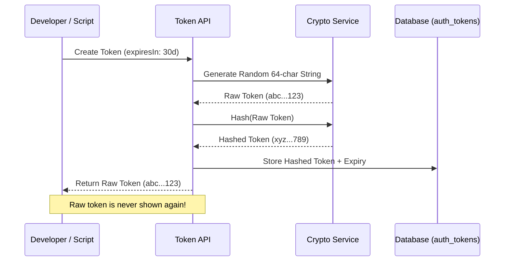

# Programmatic Token API Reference

Programmatic tokens (also known as API Keys or Bearer Tokens) allow external scripts, CI/CD pipelines, and headless frontends to authenticate with SveltyCMS without a browser-based session.

---

## ⚡ Quick Start

| Feature          | HTTP Endpoint                  | Permission    | Local SDK Equivalent          |
| :--------------- | :----------------------------- | :------------ | :---------------------------- |
| **Create Token** | `POST /api/token/create-token` | `user:manage` | `locals.cms.auth.createToken` |
| **List Tokens**  | `GET /api/token`               | `api:user`    | `locals.cms.auth.listTokens`  |
| **Revoke Token** | `DELETE /api/token/[id]`       | `user:manage` | `locals.cms.auth.revokeToken` |

---

## 1. The Goal

Generate a secure, long-lived access token for a specific user or service account to enable headless API interactions.

---

## 2. The Solution

### Creating a Developer Token

**Endpoint**: `POST /api/token/create-token`
**Payload**:

```json
{
  "name": "Production Frontend",
  "role": "editor",
  "expiresIn": "90 days"
}
```

### Local SDK (Recommended for Automation)

Use the Local SDK to programmatically rotate tokens in background jobs or CLI tools.

```typescript
// Create a temporary 1-hour token for a migration task
const token = await locals.cms.auth.createToken({
  name: "Migration Runner",
  role: "admin",
  expiresIn: "1 hour",
});

console.log(`Your Bearer Token: ${token.value}`);
```

---

## 3. The Mechanics

Tokens use a **Hashed-at-Rest** storage pattern to ensure that even a database leak does not expose active API keys.



### Token Resolution Flow

When a request arrives with `Authorization: Bearer <token>`, the `handleTokenResolution` middleware:

1. Hashes the incoming token string.
2. Performs a constant-time comparison against the `auth_tokens` collection.
3. Checks for expiry and tenant isolation.
4. Hydrates `locals.user` with the token's associated identity and permissions.

---

## Security & Best Practices

- **Least Privilege**: Always assign the most restrictive role possible to a programmatic token.
- **Rotation**: Revoke and re-generate tokens every 90 days to minimize risk.
- **Exposure**: Never check raw token values into version control. Use environment variables (e.g., `SVELTY_API_TOKEN`).

---

## Related Documents

- [User Management API Reference](./user-management-api.mdx)
- [Invitation Tokens Guide](./api-access-tokens.mdx)
- [Security Middleware Architecture](../architecture/security-plugin.mdx)
