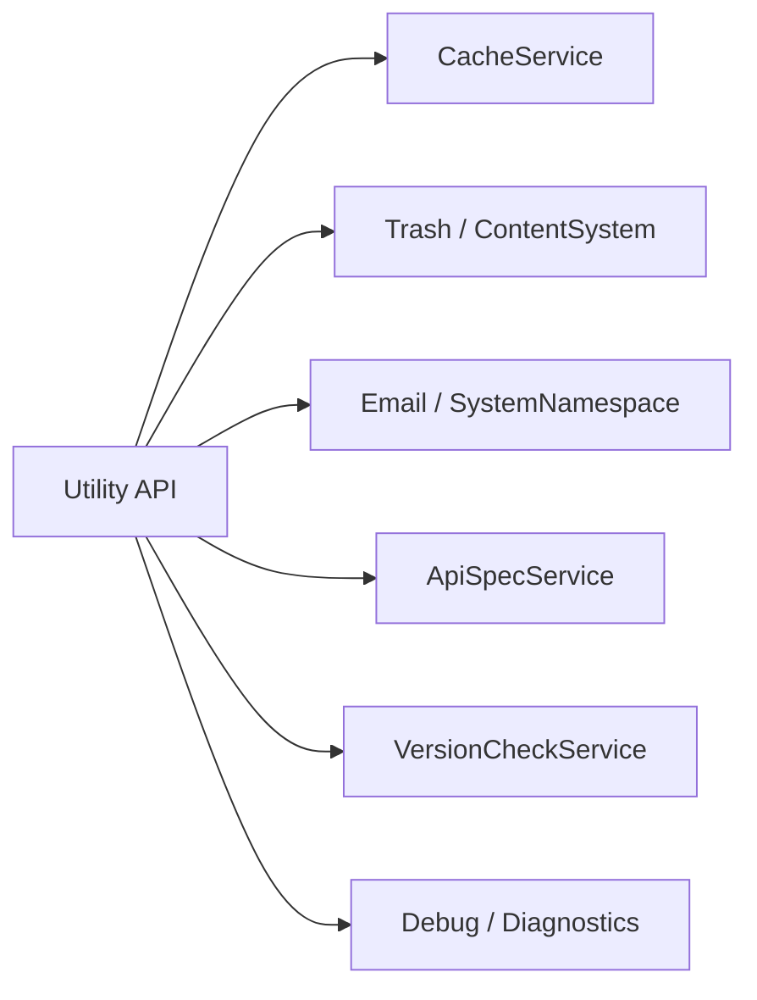

# Utilities Reference (`utility.ts`)

The Utilities API provides a set of essential maintenance and support services that keep the SveltyCMS environment healthy and performant. It manages cache invalidation, recoverable data via the Trash, transactional email, API documentation, version checking, and diagnostics.

> [!IMPORTANT]
> All utility endpoints are **admin-gated**. Unmapped namespaces fail-closed via the dispatcher's `ENDPOINT_PERMISSIONS` mapping, and individual handlers perform defense-in-depth `isAdmin` checks. Non-admin users receive `403 Forbidden`.

---

## ⚡ Quick Reference

| Feature                 | HTTP Endpoint        | Method | Admin Only |
| :---------------------- | :------------------- | :----- | :--------: |
| **OpenAPI Spec**        | `/api/openapi.json`  | `GET`  |     ✅     |
| **Swagger UI**          | `/api/docs`          | `GET`  |     —      |
| **Cache Clear**         | `/api/cache/clear`   | `POST` |     ✅     |
| **Cache Stats**         | `/api/cache/stats`   | `GET`  |     ✅     |
| **Trash List**          | `/api/trash`         | `GET`  |     ✅     |
| **Restore Entry**       | `/api/trash/restore` | `POST` |     ✅     |
| **Send Email**          | `/api/send-mail`     | `POST` |     ✅     |
| **Version Check**       | `/api/version-check` | `GET`  |     ✅     |
| **Config Sync**         | `/api/config_sync`   | `GET`  |     ✅     |
| **Debug / Diagnostics** | `/api/debug`         | `GET`  |     ✅     |
| **Marketplace**         | `/api/marketplace`   | `GET`  |     ✅     |

---

## 1. OpenAPI & API Documentation

### OpenAPI 3.1.0 Specification

Generates the full OpenAPI 3.1.0 specification dynamically. **Admin-gated** to prevent AI reconnaissance blinding.

**Endpoint**: `GET /api/openapi.json`

### Swagger UI Documentation Browser

Serves an interactive Swagger UI that loads the spec from `/api/openapi.json`.

**Endpoint**: `GET /api/docs`

---

## 2. Maintenance & Cache

### Clear System Cache

Invalidates the entire cache for the current tenant.

**Endpoint**: `POST /api/cache/clear`  
**Payload**: `{}` (optional — the `category` field is accepted but the implementation currently clears all categories regardless)

### Cache Statistics

Returns live cache metrics including hit rates, size, and eviction counts.

**Endpoint**: `GET /api/cache/stats`

---

## 3. Recovery (The Trash)

SveltyCMS implements a "Soft Delete" pattern. Deleted entries are moved to the Trash before being permanently purged.

- **List Trash**: `GET /api/trash` — Returns a paginated list of items currently in the trash for the current tenant. Accepts `?limit=` query param (default 50, max 200).
- **Restore**: `POST /api/trash/restore` — Returns an item to its original collection and restores its original status.
  - **Payload**: `{ "collectionId": "...", "entryId": "..." }`
- **Empty Trash**: Not currently implemented via the API.

---

## 4. Communication

### Transactional Email

Send emails directly via the API using the system mail service.

**Endpoint**: `POST /api/send-mail`  
**Payload**:

```json
{
  "to": "user@example.com",
  "subject": "System Alert",
  "templateName": "alert",
  "props": { "message": "High CPU usage" },
  "languageTag": "en"
}
```

| Field          | Type     | Required | Description                             |
| :------------- | :------- | :------- | :-------------------------------------- |
| `to`           | `string` | ✅       | Recipient email address                 |
| `subject`      | `string` | ✅       | Email subject line                      |
| `templateName` | `string` | —        | Template to render (default: `generic`) |
| `props`        | `object` | —        | Template variables                      |
| `languageTag`  | `string` | —        | Locale for rendering (default: `en`)    |

---

## 5. System Diagnostics

### Version Check

Checks for available updates.

**Endpoint**: `GET /api/version-check?checkUpdates=true`

### Configuration Sync

Triggers a configuration synchronization.

**Endpoint**: `GET /api/config_sync`

### Debug / Diagnostics

Returns system diagnostics including uptime, memory usage, and environment info. **Admin-only**.

**Endpoint**: `GET /api/debug`

### Marketplace

Placeholder endpoint for the extensions marketplace.

**Endpoint**: `GET /api/marketplace`

---

## 6. The Mechanics

### Utility Dispatcher

The `utility.ts` handler manages a wide range of disparate system helper tasks. It acts as the primary interface for scheduled maintenance jobs and cross-system communication.



### Access Control

All utility namespaces are absent from the `ENDPOINT_PERMISSIONS` mapping in the API dispatcher, causing the framework to **fail-closed**: non-admin users receive `403 Forbidden`. Individual handlers (e.g., OpenAPI, Debug) perform additional defense-in-depth `isAdmin` checks.

---

## Related Documents

- [System Reference (system.ts)](./system.mdx)
- [Content Reference (content.ts)](./content.mdx)
- [API Coverage Report](./api-coverage-report.mdx)
