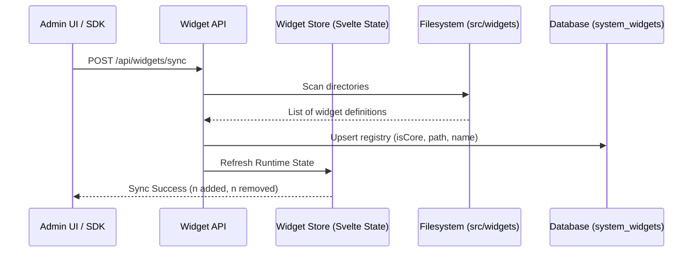

# Widget Management API Reference

The Widget API manages the lifecycle and availability of SveltyCMS extensions. Unlike standard content collections, widgets follow a strict **3-Pillar Architecture** (Definition, Input, Display) and are registered in a global runtime store.

---

## ⚡ Quick Start

| Feature               | HTTP Endpoint              | Local SDK Equivalent            |
| :-------------------- | :------------------------- | :------------------------------ |
| **List All Widgets**  | `GET /api/widgets/list`    | `locals.cms.widgets.list`       |
| **Activate Widget**   | `POST /api/widgets/status` | `locals.cms.widgets.activate`   |
| **Deactivate Widget** | `POST /api/widgets/status` | `locals.cms.widgets.deactivate` |

---

## 1. The Goal

Discover available field types (widgets), enable or disable them for specific tenants, and ensure the system registry is in sync with the physical files on disk.

---

## 2. The Solution

### Discovering Field Types

To see which widgets are available for building a new collection.

**Endpoint**: `GET /api/widgets/active`
**Response**:

```json
{
  "success": true,
  "data": {
    "widgets": [{ "name": "Text", "icon": "mdi:text", "isCore": true }]
  }
}
```

### Local SDK (Recommended for Setup Scripts)

Use the Local SDK to programmatically enable custom widgets during tenant provisioning.

```typescript
// Enable a specialized SEO widget for a new tenant
await locals.cms.widgets.activate("seoAnalyzer");
```

---

## 3. The Mechanics

SveltyCMS widgets are registered in a **Singleton Runtime Store** that bridges the gap between the filesystem (`src/widgets/`) and the database configuration.



### The 3-Pillar Requirement

Every widget must provide three distinct "pillars" to be considered valid by the API:

1. **Definition**: The JSON schema and metadata (`index.ts`).
2. **Input**: The Svelte 5 component used for editing content.
3. **Display**: The Svelte 5 component used for viewing content in tables/lists.

> [!IMPORTANT]
> **Core Protection**: Foundation widgets (Text, Number, Relation, etc.) are marked as `isCore: true` and **cannot be deactivated**. Any attempt to disable a core widget via the API will return `403 FORBIDDEN`.

---

## Related Documents

- [Widget Development Guide](../guides/development/widgets/index.mdx)
- [Collection API Reference](./collection-api.mdx)
- [3-Pillar Architecture Overview](../architecture/widgets/architecture.mdx)
