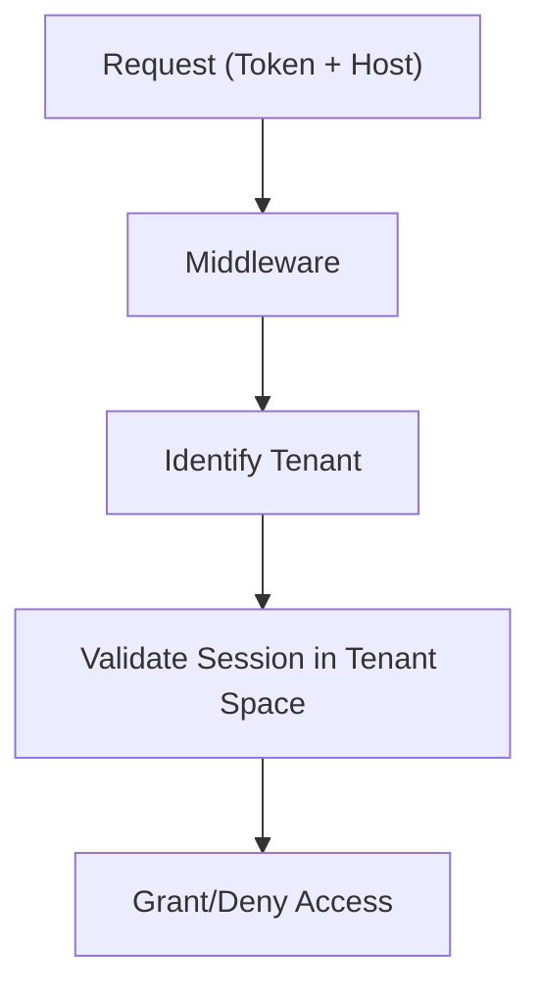

# Authentication & Authorization System

## Overview

SveltyCMS implements a defense-in-depth security model combining 3-layer session caching, automatic rotation, Role-Based Access Control (RBAC), and enterprise-grade identity features (2FA, OAuth, SAML 2.0).

## 1. 3-Layer Session Caching

To achieve sub-millisecond authentication checks on every request, SveltyCMS uses a hierarchical caching strategy:

1.  **Memory Layer (L0)**: Uses the `SessionManager`'s local `Map` with `WeakRef` for ultra-fast, garbage-collection-aware lookups.
2.  **Redis Layer (L1)**: Distributed in-memory cache for fast session retrieval across load-balanced instances.
3.  **Database Layer (L2)**: Persistent storage (MongoDB, MariaDB, etc.) as the authoritative session record.

---

## 2. Session Architecture

### Session ID & Generation

SveltyCMS uses high-entropy, cryptographically secure random tokens for session IDs. These IDs are:

- **64 characters long** (hex-encoded)
- **Hashed (SHA-256)** before storage in the database
- **Rotated automatically** on sensitive actions (login, password change)

### Multi-Tenancy 2.0

Sessions are isolated by `tenantId`. A user's session is only valid for the tenant it was created for, preventing cross-tenant access even if a session ID were compromised.

---

## 3. Core Components

### AuthService (`auth/index.ts`)

The central API for user authentication (login, register, logout, password reset).

### SessionManager (`auth/sessionManager.ts`)

Orchestrates the 3-layer cache and manages the session lifecycle (create, validate, refresh, invalidate).

### RBAC & Permissions (`auth/permissions.ts`)

Implements complex permission checks against roles and explicit user permissions.

- **Admin Bypass**: Users with the `ADMIN` role bypass all permission checks.
- **Isomorphic Guards**: Same logic runs on both client and server.

---

## 4. Advanced Security Features

### Two-Factor Authentication (2FA)

- **TOTP-based**: Compatible with Google Authenticator, Authy, etc.
- **Backup Codes**: Secure recovery via high-entropy backup codes.
- **Forced Admin 2FA**: Configuration option to require 2FA for all administrative accounts.

### Enterprise SSO (SAML 2.0)

Integrated via **BoxyHQ Jackson**, supporting:

- **JIT (Just-In-Time) Provisioning**: Automatic user creation on first login.
- **Multiple IdPs**: Okta, Azure AD, Auth0, etc.
- **Certificate Management**: Automated handling of SAML assertions.

### OAuth 2.0 / OpenID Connect

OOTB support for **Google** and **GitHub** authentication.

---

## 5. Performance Benchmarks

| Operation            | Cache Layer  | Latency | Status              |
| :------------------- | :----------- | :------ | :------------------ |
| **Validate Session** | Memory (L0)  | < 0.1ms | **Instant**         |
| **Validate Session** | Redis (L1)   | 0.8ms   | **Sub-ms**          |
| **Validate Session** | MongoDB (L2) | 15ms    | **Persistent Sync** |
| **Check Permission** | Cached       | < 0.5ms | **Optimized**       |

## 6. Security Standards & Compliance

SveltyCMS follows industry best practices:

1.  **PBKDF2/Bcrypt** password hashing.
2.  **ASR Threat Detection**: Real-time analysis for injection attacks.
3.  **Crypto-Chained Audit Logs**: Tamper-evident trail for all auth events.
4.  **Secure Headers**: Automatic HSTS, CSP, and X-Frame-Options.

---

## Related Documentation

- [Cache System Architecture](./cache-system.mdx)
- [Multi-Tenant Isolation](./multi-tenancy.mdx)
- [Audit Logging & Compliance](../guides/audit-logs.mdx)
- [Access Management API](../api/access-management.mdx)
