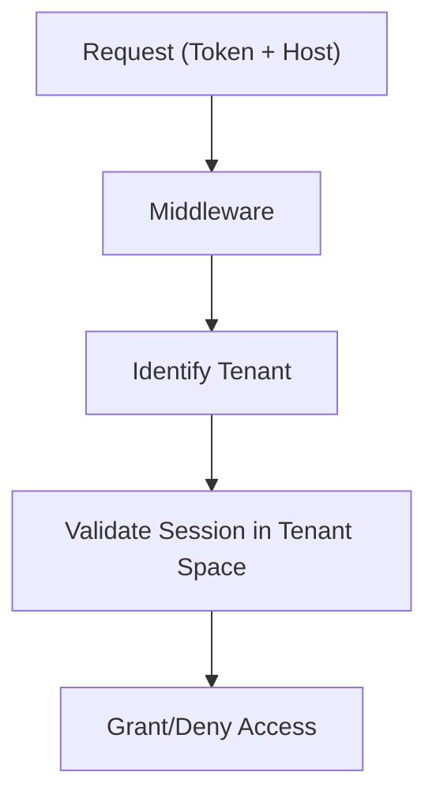

# Authentication & Authorization System

## Overview

SveltyCMS implements a defense-in-depth security model combining 3-layer session caching, automatic rotation, Role-Based Access Control (RBAC), and enterprise-grade identity features (2FA, OAuth, SAML 2.0).

## 1. 3-Layer Session Caching

To achieve sub-millisecond authentication checks on every request, SveltyCMS uses a hierarchical caching strategy:

1.  **Memory Layer (L0)**: Uses the `SessionManager`'s local `Map` with `WeakRef` for ultra-fast, garbage-collection-aware lookups.
2.  **Redis Layer (L1)**: Distributed in-memory cache for fast session retrieval across load-balanced instances.
3.  **Database Layer (L2)**: Persistent storage (MongoDB, MariaDB, etc.) as the authoritative session record.

---

## 2. Session Architecture

### Session ID & Generation

SveltyCMS uses high-entropy, cryptographically secure random tokens for session IDs. These IDs are:

- **32 characters** (alphanumeric), generated via `generateRandomToken()` using `crypto.getRandomValues()`
- **Stored directly** in cookies and database — no additional hashing required due to CSPRNG source
- **Rotated automatically** on login. On password change, all other active sessions across all devices are immediately invalidated.

### Multi-Tenancy 2.0

Sessions are isolated by `tenantId`. A user's session is only valid for the tenant it was created for, preventing cross-tenant access even if a session ID were compromised.

---

## 3. Core Components

### AuthService (`auth/index.ts`)

The central API for user authentication (login, register, logout, password reset). Uses **Argon2id** for password hashing with a 64MB memory cost for quantum resistance.

### SessionManager (`auth/session-manager.ts`)

Orchestrates the 3-layer cache and manages the session lifecycle (create, validate, refresh, invalidate).

### RBAC & Permissions (`auth/permissions.ts`)

Implements complex permission checks against roles and explicit user permissions.

- **Admin Bypass**: Users with the `ADMIN` role bypass all permission checks.
- **Isomorphic Guards**: Same logic runs on both client and server.

---

## 4. Advanced Security Features

### Two-Factor Authentication (2FA)

- **TOTP-based**: Compatible with Google Authenticator, Authy, etc.
- **Backup Codes**: Secure recovery via high-entropy backup codes.
- **Forced Admin 2FA**: Configuration option to require 2FA for all administrative accounts.

### Enterprise SSO (SAML 2.0)

Integrated via **BoxyHQ Jackson (latest)**, supporting:

- **JIT (Just-In-Time) Provisioning**: Automatic user creation on first login.
- **Multiple IdPs**: Okta, Azure AD, Auth0, etc.
- **Certificate Management**: Automated handling of SAML assertions.

### OAuth 2.0 / OpenID Connect

OOTB support for **Google** and **GitHub** authentication.

---

## 5. Performance Benchmarks

| Operation            | Cache Layer  | Latency | Status              |
| :------------------- | :----------- | :------ | :------------------ |
| **Validate Session** | Memory (L0)  | < 0.1ms | **Instant**         |
| **Validate Session** | Redis (L1)   | 0.8ms   | **Sub-ms**          |
| **Validate Session** | MongoDB (L2) | 15ms    | **Persistent Sync** |
| **Check Permission** | Cached       | < 0.5ms | **Optimized**       |

## 6. Security Standards & Compliance

SveltyCMS follows industry best practices:

1.  **Argon2id** password hashing with 64MB memory cost — resistant to GPU/ASIC/quantum speedup.
2.  **Rate Limiting & Firewall**: Real-time analysis for injection attacks via `handle-security.ts`.
3.  **Crypto-Chained Audit Logs**: Tamper-evident SHA-256 chaining for all auth events.
4.  **Secure Headers**: Automatic HSTS, CSP, and X-Frame-Options via `handle-security-headers.ts`.

---

## 7. Data Integrity & Lifecycle

### Cascading User Deletion

To ensure comprehensive access termination and prevent orphaned data, SveltyCMS implements cascading logic during user deletion:

- **Session Invalidation**: All active sessions (L0, L1, and L2) are immediately purged from memory, Redis, and the database.
- **Token Cleanup**: All pending cryptographic tokens (invites, resets, API keys) associated with the user are permanently deleted to prevent unauthorized reuse.

### Cascading Password Change

When a user changes their password, all active sessions (L0, L1, and L2) except the current one are immediately purged to terminate any potentially compromised sessions. This ensures that if an attacker had a valid session cookie, they are immediately logged out upon password change.

- **3-Layer Purge**: Sessions are removed from in-memory cache, Redis, and the database.
- **Turbo Auth Invalidation**: Any cached auth contexts in the Turbo GET fast-path are also cleared.
- **Current Session Preserved**: The session making the password change remains active so the legitimate user stays logged in.

### Hardened Token Validation

The token validation system enforces strict metadata checks to prevent exploitation:

- **Purpose Mapping**: Tokens are validated against their intended `type` (e.g., `invite-token` vs `reset`).
- **Consumption State**: Tokens marked as `consumed` are rejected even if they are within their expiry window.
- **Atomic Retrieval**: Retrieval via API is gated by a full validation check, preventing metadata leakage for invalid or expired tokens.

---

## Related Documentation

- [Login Security](./security/login-security.mdx) — Session & device tracking, 2FA accessibility, OAuth hardening
- [Cache System Architecture](./cache-system.mdx)
- [Multi-Tenant Isolation](./multi-tenancy.mdx)
- [Audit Logging & Compliance](./user-management-overview.mdx)
- [Authentication API Reference](../api/auth.mdx)
- [Login Security](./security/login-security.mdx)
