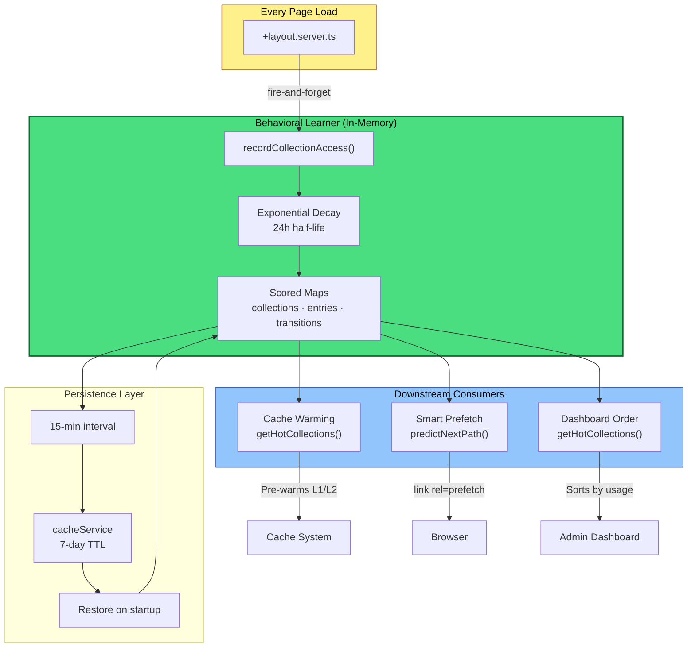
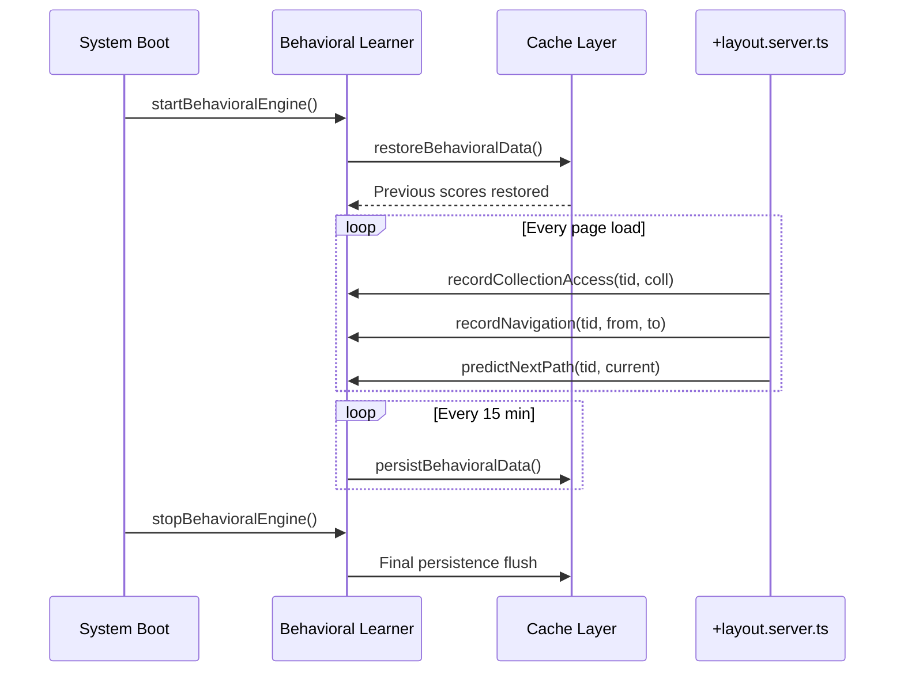
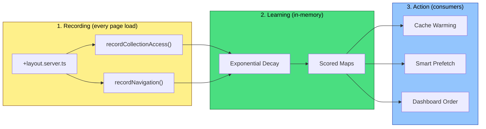

# Behavioral Learning Engine

SveltyCMS includes a lightweight server-side behavioral learning engine that tracks access patterns to make the CMS smarter over time — without any client-side JavaScript, without collecting any personal data, and with zero latency impact.

## Architecture



---

## Design Principles

| Principle                | Implementation                                                                             |
| ------------------------ | ------------------------------------------------------------------------------------------ |
| **Zero client overhead** | All tracking happens in `+layout.server.ts` — no browser JS, no cookies, no fingerprinting |
| **Privacy-first**        | Tenant-scoped, no PII, data never leaves the server, no external analytics services        |
| **Decay-weighted**       | Exponential decay with 24h half-life — recent activity counts more than stale data         |
| **Sub-microsecond**      | In-memory `Map` operations only — no per-request I/O, no database queries                  |
| **Self-pruning**         | Scores below 0.01 are filtered out — dead entries don't accumulate                         |
| **Survives restarts**    | Auto-persisted to cache layer every 15 minutes, restored on startup                        |

---

## What It Tracks

```
Every page load in +layout.server.ts
         │
         ▼
┌─────────────────────────────────────┐
│  URL: /en/posts/my-article          │
│                                     │
│  → recordCollectionAccess("posts")  │  ← Which collections are used most
│  → recordEntryAccess("posts", "id") │  ← Which entries are viewed/edited most
│  → recordNavigation(from, to)       │  ← Which page transitions are common
└─────────────────────────────────────┘
```

## Scoring Model

Uses exponential decay for time-weighted relevance:

```
score *= e^(-λ × elapsed)
where λ = ln(2) / 24h  →  half-life = 24 hours
```

This means:

- An access 24 hours ago counts as 0.5 points
- An access 48 hours ago counts as 0.25 points
- After ~7 days, the score effectively reaches zero

---

## Public API

### Recording

```typescript
import {
  recordCollectionAccess,
  recordEntryAccess,
  recordNavigation,
} from "@src/services/intelligence/behavioral-learner";

// Record a collection being accessed
recordCollectionAccess("tenant-1", "posts");

// Record a specific entry being viewed/edited
recordEntryAccess("tenant-1", "posts", "entry-abc123");

// Record a navigation transition (for prefetch prediction)
recordNavigation("tenant-1", "/en/posts", "/en/posts/abc123/edit");
```

### Querying

```typescript
import {
  getHotCollections,
  getHotEntries,
  predictNextPath,
} from "@src/services/intelligence/behavioral-learner";

// Top 10 most-accessed collections
const hot = getHotCollections("tenant-1", 10);
// → [{ id: "posts", score: 47.2 }, { id: "pages", score: 12.1 }, ...]

// Top 20 most-accessed entries across all collections
const hotEntries = getHotEntries("tenant-1", 20);
// → [{ collectionId: "posts", entryId: "welcome", score: 8.3 }, ...]

// Predict most likely next page from current path
const next = predictNextPath("tenant-1", "/en/posts");
// → "/en/posts/welcome" (most common transition from /en/posts)
```

---

## Integrations

### 1. Adaptive Cache Warming (Active)

On server startup, the engine queries `getHotCollections()` and `getHotEntries()` to pre-warm the cache for the most frequently accessed content — no need to wait for the first user.

```typescript
// In cache warming service:
const hotCollections = getHotCollections(tenantId, 10);
for (const { id } of hotCollections) {
  await cacheService.getOrSetSWR(
    `collection:${id}:list`,
    () => db.crud.findMany(id, {}, { limit: 20 }),
    300_000,
    1_800_000,
  );
}
```

### 2. Smart Prefetch Hints (Active ✅)

The layout server uses `predictNextPath()` to pre-compute the most likely next page from real navigation data. The `+layout.svelte` template renders `<link rel="prefetch">` tags for predicted paths, making cross-page navigation feel instant.

### 3. Dashboard Widget Reordering (Active ✅)

The dashboard reorders widgets by actual usage frequency via `getHotCollections()` — frequently used collections bubble to the top. Zero configuration; the CMS learns from real editor behavior.

---

## Lifecycle

The behavioral engine starts automatically when the system reaches `READY` state (via `db.ts` `ensureFullInitialization()`) and stops on `shutdownSystem()`. No manual wiring required.



```typescript
// Manual control (if needed):
import {
  startBehavioralEngine,
  stopBehavioralEngine,
} from "@src/services/intelligence/behavioral-learner";

startBehavioralEngine(); // Restores data + starts 15-min persistence timer
stopBehavioralEngine(); // Final persistence flush
```

---

## Performance Impact

| Operation                  | Latency                             |
| -------------------------- | ----------------------------------- |
| `recordCollectionAccess()` | < 0.001ms (Map get/set)             |
| `getHotCollections(10)`    | < 0.05ms (iterate + sort scored)    |
| `persistBehavioralData()`  | ~1ms (async, runs every 15 min)     |
| Layout load overhead       | 0ms (fire-and-forget, non-blocking) |

The behavioral learner adds **zero measurable latency** to page loads. The tracking call is wrapped in try/catch and never blocks the response.

---

## Privacy & Security

- **Tenant-isolated**: Each tenant's data is stored separately — no cross-tenant leakage
- **No PII**: Only collection IDs and entry IDs are tracked — no user identities, IPs, or emails
- **Server-only**: No data is sent to the browser — fully server-side
- **No external services**: Data stays in the CMS cache layer, never exported
- **Configurable**: Call `stopBehavioralEngine()` to disable entirely

---

---

## How Data Flows Through the System



## Related

- [Cache System](./cache-system.mdx) — Dual-layer caching with SWR and stampede protection that the behavioral engine pre-warms
- [Hover Preloading](./hover-preloading.mdx) — Client-side speculative loading; the behavioral engine provides server-side predictions
- [State Management](./state-management.mdx) — System lifecycle and self-healing; the behavioral engine starts/stops with server lifecycle
- [Access Management](./admin-user-management.mdx) — User roles and tenant isolation; the behavioral engine respects tenant boundaries
- [AI Integration](../guides/development/ai-integration.mdx) — AI widget scaffolder and hosted MCP knowledge core
- [Marketplace System](./marketplace.mdx) — Plugin ecosystem; the behavioral engine can surface popular plugin categories
- [API Security & Token Hardening](./api-security.mdx) — Security model the behavioral engine operates within
- [Core Database Infrastructure](./database/core-infrastructure.mdx) — The adapter layer that serves the pre-warmed cache
