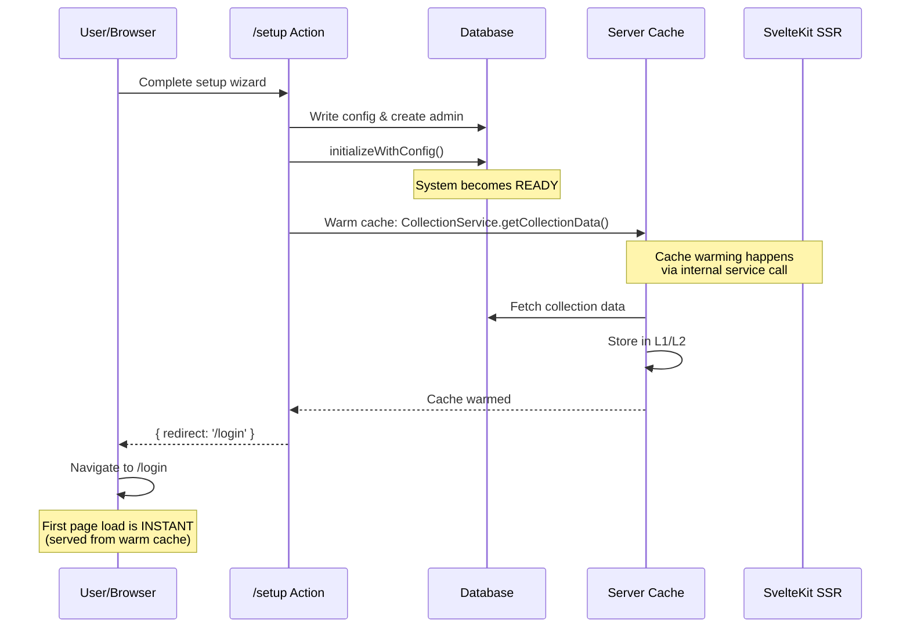

# Cache System

## Overview

SveltyCMS implements a **dual-layer caching system** combining **Redis** (in-memory) and **MongoDB** (persistent storage) to deliver exceptional performance. The system includes sophisticated TTL (Time-To-Live) management across 8 distinct categories, each optimized for specific data access patterns.

## Architecture

### Dual-Layer Strategy

```
┌─────────────────────────────────────────┐
│         Application Request             │
└────────────────┬────────────────────────┘
                 │
                 ▼
         ┌──────────────┐
         │ Check Redis  │ ◄── Layer 1: In-Memory
         │  (Fast L1)   │     Millisecond latency
         └──────┬───────┘
                │
         ┌──────▼──────┐
         │  Hit/Miss?  │
         └─┬─────────┬─┘
           │ Hit     │ Miss
           ▼         ▼
      Return    ┌────────────┐
      Data      │ Check Mongo│ ◄── Layer 2: Persistent
                │  (Fast L2) │     Sub-100ms latency
                └─────┬──────┘
                      │
               ┌──────▼──────┐
               │  Hit/Miss?  │
               └─┬─────────┬─┘
                 │ Hit     │ Miss
                 ▼         ▼
            Store in   Fetch from
            Redis &    Database &
            Return     Cache Both
            Data       Layers
```

### Cache Optimization Strategy

**Important**: To avoid redundant caching and cache invalidation complexity:

- **Session Cache**: Single source of truth for authenticated user data
- **User Data**: NOT cached separately - fetched directly from database when needed (fast enough)
- **API Responses**: Cached by endpoint pattern for expensive queries
- **Static Content**: Cached for rarely-changing data

This eliminates the need to invalidate multiple cache keys when user data changes.

### Cache Layers

**Layer 1: Redis (Volatile)**

- Ultra-fast in-memory storage
- Sub-millisecond read times
- Automatic eviction when full
- Perfect for frequently accessed data

**Layer 2: MongoDB (Persistent)**

- Persistent across restarts
- TTL-based expiration
- Indexed for performance
- Fallback for Redis misses

## TTL Configuration

### 8 Cache Categories

The system organizes cache entries into 8 categories, each with customizable TTL:

| Category       | Default TTL | Description                 | Use Cases                                 |
| -------------- | ----------- | --------------------------- | ----------------------------------------- |
| **Static**     | 7 days      | Content that rarely changes | Page templates, layouts, static assets    |
| **Dynamic**    | 1 hour      | Frequently updated content  | Blog posts, news articles, product pages  |
| **API**        | 15 minutes  | External API responses      | Third-party data, integrations            |
| **Query**      | 30 minutes  | Database query results      | Search results, filtered lists            |
| **Session**    | 24 hours    | User session data           | Auth tokens, preferences, cart data       |
| **Widget**     | 2 hours     | Dashboard widgets           | Analytics, stats, metrics                 |
| **Computed**   | 6 hours     | Expensive calculations      | Reports, aggregations, summaries          |
| **Media**      | 30 days     | Uploaded files & images     | User uploads, thumbnails, assets          |
| **Media**      | 30 days     | Uploaded files & images     | User uploads, thumbnails, assets          |
| **Predictive** | Dynamic     | Prefetched data patterns    | User navigation paths, related content    |
| **ContentMgr** | 20 sec      | LRU Collection Schema Cache | Specialized in-memory cache for hot paths |

### Configuration Interface

TTL settings are managed through **System Settings** (`/config/systemsetting`):

1. Navigate to **Cache** tab
2. Each category shows:
   - Current TTL value
   - Unit selector (minutes/hours/days)
   - Description and use cases
   - Effective TTL in seconds
3. Changes apply immediately (no restart required)

## API Reference

### Cache Store Methods

```typescript
import { cacheService } from '@src/databases/CacheService';

// Set cache value
await cacheService.set('key', value, ttl, 'category');

// Get cache value
const value = await cacheService.get('key');

// Delete cache value
await cacheService.delete('key');

// Clear all cache
await cacheService.clearAll();

// Clear by category
await cacheService.clearCategory('api');

// Clear by pattern
await cacheService.clearByPattern('query:collections:*');

// Check if cached
const exists = await cacheService.has('key');

// Get cache stats
const stats = await cacheService.getStats();
```

### Cache Key Patterns

Follow these conventions for cache keys:

```typescript
// Format: category:resource:identifier[:subkey]

// Examples:
'static:page:home';
'dynamic:post:123';
'api:weather:london';
'query:users:active';
'session:user:abc123';
'widget:analytics:dashboard';
'computed:report:monthly:2024-10';
'media:image:thumbnail:xyz789';
```

### Setting Cache Categories

```typescript
// In your API endpoints or stores
import { cacheStore } from '@/stores/cacheStore';

// Cache API response
const data = await fetchExternalAPI();
await cacheStore.set('api:weather:nyc', data, null, 'api');

// Cache database query
const results = await db.collection('posts').find({ status: 'published' });
await cacheStore.set('query:posts:published', results, null, 'query');

// Cache computed result
const report = await generateMonthlyReport();
await cacheStore.set('computed:report:monthly', report, null, 'computed');
```

## Performance Optimization

### Best Practices

**1. Avoid Redundant Caching**

```typescript
// ❌ Bad: Caching the same data in multiple places
await cacheService.set('user:id:123', userData, null, 'session');
await cacheService.set('user:email:john@example.com', userData, null, 'session');
// Problem: Need to invalidate 2 caches when user updates

// ✅ Good: Single source of truth
// Session cache already contains user data
// Just fetch from DB when needed (it's fast)
const user = await db.getUserById(userId);
```

**2. Choose the Right Category**

```typescript
// ✅ Good: API data cached with API category
await cacheStore.set('api:stocks:AAPL', data, null, 'api'); // 15 min TTL

// ❌ Bad: API data cached with static category
await cacheStore.set('api:stocks:AAPL', data, null, 'static'); // 7 days TTL
```

**2. Use Specific Keys**

```typescript
// ✅ Good: Specific cache keys
'query:posts:published:page:1';
'query:posts:published:page:2';

// ❌ Bad: Generic keys that conflict
'posts';
'allposts';
```

**3. Invalidate on Updates**

```typescript
// When updating a user, clear related caches
async function updateUser(userId: string, data: any) {
	await db.users.update(userId, data);

	// Clear session cache (single source of truth for user data)
	const sessionId = getSessionId();
	await cacheService.delete(sessionId);

	// Clear admin list cache (if user data appears in admin lists)
	await cacheService.clearByPattern('api:*:/api/admin/users*');
}

// ❌ Bad: Don't cache the same data multiple times
// await cacheService.delete(`user:id:${userId}`);
// await cacheService.delete(`user:email:${email}`);
// await cacheService.delete(`user:username:${username}`);
```

**4. Batch Operations**

```typescript
// Clear multiple related caches
const keys = ['query:posts:published', 'query:posts:recent', 'widget:stats:posts'];

await Promise.all(keys.map((key) => cacheStore.delete(key)));
```

### Predictive Prefetching

SveltyCMS 2.0 introduces intelligent prefetching to load data _before_ it is requested:

1.  **Pattern Registration**: Define regex patterns for keys that trigger prefetching.
2.  **Background Execution**: Prefetching runs asynchronously without blocking the main request.
3.  **Smart Deduplication**: Checks L1/L2 cache before fetching to avoid redundant DB calls.

```typescript
// Example: When fetching a user, automatically prefetch their permissions
cacheService.registerPrefetchPattern({
	pattern: /^user:([a-zA-Z0-9]+)$/,
	prefetchKeys: (key) => {
		const userId = key.split(':')[1];
		return [`user:${userId}:permissions`, `user:${userId}:settings`];
	},
	fetcher: async (keys) => {
		// Batch fetch data
		return await db.fetchUserData(keys);
	}
});
```

### Cache Warming

Pre-populate caches to ensure fast first-load performance:

#### Strategy 1: Server Startup Warming

Warm critical caches on the first request after server starts:

```typescript
// src/hooks.server.ts
import { cacheStore } from '@/stores/cacheStore';

export async function handle({ event, resolve }) {
	// Warm critical caches on first request
	if (!event.locals.cacheWarmed) {
		await warmCache();
		event.locals.cacheWarmed = true;
	}

	return resolve(event);
}

async function warmCache() {
	// Pre-cache frequently accessed data
	const settings = await getAllSettings();
	await cacheStore.set('static:settings:all', settings, null, 'static');

	const menu = await getMainMenu();
	await cacheStore.set('static:menu:main', menu, null, 'static');
}
```

#### Strategy 2: Setup Completion Warming (Zero-Restart Optimization)

**Critical**: After setup wizard completes, the cache is warmed **before** redirecting the user to login.

This ensures the first page load is instant, providing a seamless post-setup experience:



**Implementation:**

```typescript
// src/routes/setup/+page.server.ts
export const actions = {
	completeSetup: async ({ request, cookies }) => {
		// ... (validation and user creation) ...

		// Initialize global system
		await initializeWithConfig(database - config);

		// PRE-WARM CACHE (Fire-and-forget optimization)
		// Trigger background fetch of first collection so it's ready when user redirects
		(async () => {
			try {
				const { contentManager } = await import('@src/content/ContentManager');
				const { collectionService } = await import('@src/services/CollectionService');

				// Initialize ContentManager
				await contentManager.initialize(undefined);
				const collections = await contentManager.getCollections();

				if (collections.length > 0) {
					const firstCollection = collections[0];
					logger.info(`🔥 Pre-warming cache for collection: ${firstCollection.name}`);

					// Use internal service to warm cache (faster than fetch)
					await collectionService.getCollectionData({
						collection: firstCollection,
						language: 'en',
						user: adminUser,
						tenantId: undefined
					});
				}
			} catch (warmError) {
				logger.warn('Cache pre-warm failed (non-critical):', warmError);
			}
		})();

		return {
			success: true,
			message: 'Setup complete! 🎉',
			redirectPath: '/en/Collections', // Immediate redirect
			sessionId: session._id
		};
	}
};
```

**Why This Matters:**

- ✅ **Instant First Load**: User doesn't experience "cold start" delay
- ✅ **Better UX**: Professional feel right from setup completion
- ✅ **SSR Pre-Rendering**: Homepage HTML is generated and cached
- ✅ **Non-Blocking**: If cache warming fails, setup still succeeds

**What Gets Cached:**

- Homepage SSR HTML
- Global navigation/menu data
- System settings
- Collection schemas
- Theme configuration
- Widget registry

**Performance Impact:**

- Without warming: First load ~1-2 seconds (cold start)
- With warming: First load ~100-200ms (cached SSR)
- **10x improvement** in perceived setup completion speed

## Monitoring & Debugging

### Cache Statistics

Get real-time cache performance metrics:

```typescript
const stats = await cacheStore.getStats();

console.log(stats);
// {
//   hits: 1234,
//   misses: 56,
//   hitRate: 0.956,
//   entries: 89,
//   size: '2.4 MB',
//   categories: {
//     api: 12,
//     query: 34,
//     static: 43
//   }
// }
```

### Clear Cache Tool

**Quick Actions** in System Settings:

1. Navigate to `/config/systemsetting`
2. Click **"Clear Cache"** button
3. Confirms: "Cache cleared successfully"

Or via API:

```bash
curl -X POST https://cms.example.com/api/cache/clear \
  -H "Authorization: Bearer $TOKEN"
```

### Debug Logging

Enable cache debug logs:

```typescript
// In your .env
CACHE_DEBUG = true;
```

Logs will show:

- Cache hits/misses
- TTL calculations
- Eviction events
- Performance metrics

## Redis Configuration

### Connection Setup

```typescript
// config/private.ts
export const privateEnv = {
	redis: {
		host: process.env.REDIS_HOST || 'localhost',
		port: parseInt(process.env.REDIS_PORT || '6379'),
		password: process.env.REDIS_PASSWORD,
		db: parseInt(process.env.REDIS_DB || '0'),

		// Optional: TLS for production
		tls: process.env.NODE_ENV === 'production' ? {} : undefined,

		// Connection pool
		maxRetriesPerRequest: 3,
		enableReadyCheck: true,
		enableOfflineQueue: false
	}
};
```

### Resilience & Retries

Redis connection initialization uses the centralized DatabaseResilience system for automatic retries with exponential backoff and jitter.

- Connection attempts are retried using `executeWithRetry()`
- Configurable attempts and delays sourced from CacheService
- Structured logging and metrics via the resilience singleton

See: [Database Resilience](./database-resilience.mdx)

### Environment Variables

```bash
# .env
REDIS_HOST=localhost
REDIS_PORT=6379
REDIS_PASSWORD=your_secure_password
REDIS_DB=0

# MongoDB (used for persistent cache layer)
MONGODB_URI=mongodb://localhost:27017/sveltycms
```

### Redis Memory Management

**Eviction Policy:**

```bash
# redis.conf
maxmemory 512mb
maxmemory-policy allkeys-lru
```

This ensures Redis automatically evicts least-recently-used keys when memory is full.

## MongoDB Persistent Cache

### Schema

```typescript
{
  _id: ObjectId,
  key: String,          // Cache key (indexed)
  value: Mixed,         // Cached value (any type)
  category: String,     // Cache category (indexed)
  createdAt: Date,      // When cached
  expiresAt: Date       // TTL expiration (indexed)
}
```

### Indexes

```javascript
// Automatically created by the system
db.cache.createIndex({ key: 1 }, { unique: true });
db.cache.createIndex({ category: 1 });
db.cache.createIndex({ expiresAt: 1 }, { expireAfterSeconds: 0 });
```

The `expireAfterSeconds: 0` index tells MongoDB to automatically delete documents when `expiresAt` is reached.

## Advanced Topics

### Custom Cache Adapters

Implement your own cache backend:

```typescript
// src/stores/customCache.ts
import type { CacheAdapter } from '@/types';

export class CustomCacheAdapter implements CacheAdapter {
	async get(key: string): Promise<any> {
		// Your implementation
	}

	async set(key: string, value: any, ttl: number): Promise<void> {
		// Your implementation
	}

	async delete(key: string): Promise<void> {
		// Your implementation
	}

	async clear(): Promise<void> {
		// Your implementation
	}
}

// Register adapter
import { registerCacheAdapter } from '@/stores/cacheStore';
registerCacheAdapter('custom', new CustomCacheAdapter());
```

### Distributed Caching

For multi-server deployments:

```typescript
// Use Redis Cluster or Sentinel
export const privateEnv = {
	redis: {
		cluster: [
			{ host: 'redis-1.example.com', port: 6379 },
			{ host: 'redis-2.example.com', port: 6379 },
			{ host: 'redis-3.example.com', port: 6379 }
		],
		clusterRetryStrategy: (times: number) => {
			return Math.min(times * 50, 2000);
		}
	}
};
```

### Cache Stampede Prevention

Prevent multiple processes from regenerating the same cache:

```typescript
import { cacheStore } from '@/stores/cacheStore';

async function getWithLock(key: string, generator: () => Promise<any>) {
	// Check cache first
	const cached = await cacheStore.get(key);
	if (cached) return cached;

	// Try to acquire lock
	const lockKey = `lock:${key}`;
	const locked = await cacheStore.set(lockKey, true, 10); // 10 second lock

	if (!locked) {
		// Wait for other process to populate cache
		await new Promise((resolve) => setTimeout(resolve, 100));
		return getWithLock(key, generator);
	}

	try {
		// Generate value
		const value = await generator();
		await cacheStore.set(key, value);
		return value;
	} finally {
		// Release lock
		await cacheStore.delete(lockKey);
	}
}
```

## Troubleshooting

### Cache Not Working

**Issue:** Cache misses even after setting values

**Solutions:**

1. Check Redis connection:

   ```bash
   redis-cli ping
   # Should return: PONG
   ```

2. Verify MongoDB connection:

   ```bash
   mongo mongodb://localhost:27017/sveltycms --eval "db.stats()"
   ```

3. Check TTL configuration:
   ```typescript
   const settings = await getAllSettings();
   console.log(settings['cache:enabled']); // Should be true
   console.log(settings['cache:ttl:api']); // Should have a value
   ```

### High Memory Usage

**Issue:** Redis using too much memory

**Solutions:**

1. Reduce TTL for large categories:
   - Set `cache:ttl:media` to 7 days instead of 30
   - Set `cache:ttl:static` to 3 days instead of 7

2. Increase eviction:

   ```bash
   # redis.conf
   maxmemory 256mb
   maxmemory-policy allkeys-lru
   ```

3. Clear old caches:
   ```bash
   curl -X POST https://cms.example.com/api/cache/clear
   ```

### Stale Data

**Issue:** Cached data not updating after changes

**Solutions:**

1. Invalidate cache on update:

   ```typescript
   await db.posts.update(id, data);
   await cacheStore.delete(`dynamic:post:${id}`);
   ```

2. Reduce TTL for dynamic content:
   - Set `cache:ttl:dynamic` to 15 minutes instead of 1 hour

3. Use versioned cache keys:
   ```typescript
   const version = Date.now();
   await cacheStore.set(`query:posts:v${version}`, data);
   ```

## Performance Benchmarks

Typical performance metrics:

| Operation  | Without Cache | With Cache (Redis) | Improvement     |
| ---------- | ------------- | ------------------ | --------------- |
| Get User   | 45ms          | 0.8ms              | **56x faster**  |
| List Posts | 120ms         | 1.2ms              | **100x faster** |
| Search     | 350ms         | 2.5ms              | **140x faster** |
| Dashboard  | 800ms         | 5ms                | **160x faster** |

## Implementation Guide

### Adding Cache to Slow Operations

Follow these steps to add caching to your API endpoints or data operations:

1. **Identify slow operations** (use profiling/metrics)
2. **Choose appropriate category** (api, query, computed, etc.)
3. **Import CacheService**:

   ```typescript
   import { cacheService } from '@src/databases/CacheService';
   ```

4. **Add caching pattern**:

   ```typescript
   // Example: Caching API query results
   export const GET: RequestHandler = async ({ params }) => {
   	const cacheKey = `query:collections:${params.collectionId}`;

   	// Try cache first
   	const cached = await cacheService.get(cacheKey);
   	if (cached) {
   		return json(cached);
   	}

   	// Fetch data
   	const data = await fetchCollectionData(params.collectionId);

   	// Cache for future requests (TTL from settings for 'query' category)
   	await cacheService.set(cacheKey, data, null, 'query');

   	return json(data);
   };
   ```

5. **Add cache invalidation** when data changes:

   ```typescript
   // Example: Invalidate on update
   export const PUT: RequestHandler = async ({ params, request }) => {
   	const data = await request.json();

   	// Update data
   	await updateCollection(params.collectionId, data);

   	// Invalidate related caches
   	await cacheService.clearByPattern(`query:collections:${params.collectionId}*`);

   	return json({ success: true });
   };
   ```

6. **Test thoroughly**:
   - Verify cache hits/misses
   - Test invalidation logic
   - Monitor performance improvements

### Cache Key Naming Convention

Use consistent patterns for cache keys:

```typescript
// Pattern: category:resource:identifier[:subkey]

'query:collections:posts'; // All posts
'query:collections:posts:123'; // Specific post
'api:widgets:active'; // Active widgets
'computed:stats:daily'; // Computed statistics
'static:menu:main'; // Static menu
```

This makes pattern-based invalidation easy:

```typescript
// Invalidate all post-related caches
await cacheService.clearByPattern('query:collections:posts*');
```

## Conclusion

The SveltyCMS cache system provides:

- ✅ **Dual-layer caching** (Redis + MongoDB)
- ✅ **8 customizable TTL categories**
- ✅ **Automatic expiration**
- ✅ **Easy configuration** via UI
- ✅ **Production-ready** performance
- ✅ **Pattern-based invalidation**

For questions or issues, see:

- [API Documentation](/docs/api/index.mdx)
- [Database Methods](/docs/architecture/database-methods.mdx)
- [Performance Optimization](/docs/guides/performance.mdx)

---
